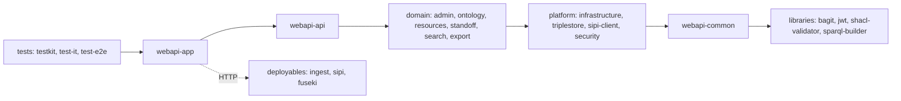

# dsp-api architecture map

## Overview

dsp-api is the Scala 3 / ZIO / Tapir backend of the DaSCH Virtual Research Environment, serving semantic
research data over an Apache Jena Fuseki triplestore with Sipi and dsp-ingest handling media assets. The repo
is one Bazel monorepo: `modules/webapi` is still a single compilation target that holds every VRE domain, next
to separate deployables (`modules/ingest`, `modules/sipi`, `modules/fuseki`), leaf libraries
(`modules/bagit`, `modules/jwt`, `modules/shacl-validator`, `modules/sparql-builder`) and three test modules.
Because webapi is one target with public visibility, nearly every boundary rule below is enforced at `review`
or `docs-only` rather than structurally. Bounded-context vocabulary lives in [`CONTEXT.md`](./CONTEXT.md) and
the per-context files under `docs/contexts/*/CONTEXT.md`; the target module structure and its sequencing live
in [`MODULARIZATION-PLAN.md`](./MODULARIZATION-PLAN.md).

Staleness: run `/dune:map check` to diff every component's globs against `last_verified_commit`.

## Components

### webapi-app

- **Paths**:
    - `modules/webapi/src/main/scala/org/knora/webapi/Main.scala`
    - `modules/webapi/src/main/scala/org/knora/webapi/core/**`
    - `modules/webapi/src/main/scala/org/knora/webapi/config/**`
    - `modules/webapi/src/main/resources/application.conf`
    - `modules/webapi/src/test/scala/org/knora/webapi/core/**`
    - `modules/webapi/src/test/scala/org/knora/webapi/config/**`
    - `modules/webapi/BUILD.bazel`
    - `modules/webapi/.gitignore`
    - `modules/webapi/scripts/**`
    - `docker-compose.yml`
    - `app-config.dev.json`
- **Purpose**: Application composition and process lifecycle. Assembles every slice's ZIO layers into one
    runnable program, loads and validates typed configuration, runs the triplestore-upgrade and
    ontology-cache bootstrap, serves HTTP plus metrics, and defines the Bazel targets that produce the
    `knora-api` image.
- **Key entities**: `Main`, `LayersLive`, `DspApiServer`, `Db`, `State`, `AppState`, `AppConfig`,
    `AppConfig.AppConfigurations`, `KnoraApi`, `Sipi`, `Triplestore`, `JwtConfig`, `DspIngestConfig`,
    `GraphRoute`, `Resources`, `InstrumentationServerConfig`, `Features`, `MetricsServer`
- **Public interface**: `Main.run`; `LayersLive.bootstrap` / `LayersLive.remainingLayer`;
    `DspApiServer.layer` / `DspApiServer.startup`; `Db.init` / `Db.initWithTestData`; `State`
    (`getAppState` / `set`); `AppConfig.layer` and the individual config case classes that other slices
    import for their own `Dependencies` types.
- **Local-context kit**:
    - `modules/webapi/src/main/scala/org/knora/webapi/core/LayersLive.scala`
    - `modules/webapi/src/main/scala/org/knora/webapi/Main.scala`
    - `modules/webapi/src/main/scala/org/knora/webapi/core/DspApiServer.scala`
    - `modules/webapi/src/main/scala/org/knora/webapi/core/Db.scala`
    - `modules/webapi/src/main/scala/org/knora/webapi/config/AppConfig.scala`
    - `modules/webapi/src/main/resources/application.conf`
    - `modules/webapi/BUILD.bazel`
- **Depends on**: webapi-api, webapi-common, webapi-security, webapi-infrastructure, webapi-triplestore,
    webapi-sipi-client, webapi-admin, webapi-ontology, webapi-resources, webapi-standoff, webapi-search,
    webapi-export (all in-process ZLayer composition); ingest (remote-owned, `DspIngestClient` config lives
    here); sipi, fuseki (remote-owned, `docker-compose.yml` dev stack); build-toolchain.
- **Used by**: webapi-api, webapi-common, webapi-security, webapi-infrastructure, webapi-triplestore,
    webapi-admin, webapi-ontology, webapi-resources, webapi-standoff, webapi-search, webapi-export, testkit,
    test-it, test-e2e. About 60 main-source files import `org.knora.webapi.config`, 40 of them under
    `slice/`; the store adapter for the media server is the one slice importing none of it.
- **Boundary rules**:
    - New service layers are registered in `LayersLive.Environment` / `LayersLive.remainingLayer`, not wired
        ad hoc elsewhere - enforcement: review.
    - Slices read runtime configuration through the typed case classes (`JwtConfig`, `Triplestore`, and the
        rest), never by re-parsing `application.conf` - enforcement: docs-only.
    - Config range and consistency checks (for example `search-timeout <= gravsearch-timeout`) belong in
        `AppConfig.config`'s `.validate(...)` chain, not in consuming slices - enforcement: review.
    - `docker-compose.yml` and `app-config.dev.json` are dev-stack wiring only; production deployment lives
        in ops-deploy - enforcement: docs-only.
    - Wiring: shared inventory. `LayersLive.scala` is the one file every slice's `*Module.layer` is added to,
        and `AppConfig.AppConfigurations` is the one place a new config section is projected. `Main.bootstrap`
        composes `LayersLive.bootstrap >+> ApiModule.layer`, so `ApiModule` (webapi-api) is a second adjacent
        inventory a new slice usually registers in too.
- **Durable state**: `State`, an in-memory `Ref[AppState]`, single writer `Db` via `setState` during boot.
    Process-local, not persisted. Triplestore and ontology-cache writes belong to webapi-triplestore and
    webapi-ontology; `Db.init` only orchestrates the sequence.
    - `modules/webapi/BUILD.bazel` defines the `webapi` library, the `app` binary, the `test` junit target
        and the `image_amd64` / `image_arm64` / `index` / `load` / `push` targets for `daschswiss/knora-api`.

### webapi-api

- **Paths**:
    - `modules/webapi/src/main/scala/org/knora/webapi/slice/api/**`
    - `modules/webapi/src/test/scala/org/knora/webapi/slice/api/**`
    - `modules/webapi/src/test/scala/org/knora/webapi/slice/resourceinfo/**`
- **Purpose**: The HTTP delivery technical module. Tapir endpoint definitions, server-endpoint wiring and
    `*RestService` handlers for the admin, v2, v3 and management APIs, aggregated into one `Endpoints` list
    the zio-http server consumes. It hosts no domain of its own but delivers every bounded context.
- **Key entities**: `ApiModule`, `Endpoints`, `AdminApiModule`, `AdminApiServerEndpoints`, `ApiV2Module`,
    `ApiV2ServerEndpoints`, `ApiV3Module`, `ApiV3ServerEndpoints`, `ManagementServerEndpoints`,
    `OntologyApiModule`, `V3BaseEndpoint`, `V3ErrorInfo`, `V3ErrorCode`, `V3Authorizer`, `PageAndSize`,
    `PagedResponse`, `AdminPathVariables`, `SparqlPassthroughEndpoints`, `SparqlPassthroughAudit`, `Codecs`
- **Public interface**: `ApiModule.layer`; `Endpoints.serverEndpoints`; the four `*RestService`s re-exported
    by `AdminApiModule.Provided` (`GroupRestService`, `PermissionRestService`, `ProjectRestService`,
    `UserRestService`, exposed for the integration tests); `SparqlPassthroughEndpoints.isPassthroughRoute` /
    `routeMarker`; `ApiV2.Headers`, `ApiV2.QueryParams`, `ApiV3.basePath`; `PageAndSize` / `PagedResponse`;
    and, de facto, the DTO and codec objects `Codecs.TapirCodec`, `Codecs.ZioJsonCodec`, `admin.model.Project`,
    `admin.model.MaintenanceRequests`, `v2.ontologies.LastModificationDate`.
- **Local-context kit**:
    - `CONVENTIONS.md`
    - `modules/webapi/src/main/scala/org/knora/webapi/slice/api/ApiModule.scala`
    - `modules/webapi/src/main/scala/org/knora/webapi/slice/api/Endpoints.scala`
    - `modules/webapi/src/main/scala/org/knora/webapi/slice/api/admin/AdminApiModule.scala`
    - `modules/webapi/src/main/scala/org/knora/webapi/slice/api/admin/AdminApiServerEndpoints.scala`
    - `modules/webapi/src/main/scala/org/knora/webapi/slice/common/api/BaseEndpoints.scala`
    - `modules/webapi/src/main/scala/org/knora/webapi/slice/api/v3/V3BaseEndpoint.scala`
    - Sufficiency gap: the v2 and v3 aggregators (`ApiV2ServerEndpoints`, `ApiV3ServerEndpoints`,
        `ApiV2Module`, `ApiV3Module`) plus `docs/development/dsp-api-v3-iri-handling.md` are also required
        when the change touches v2 or v3 rather than admin.
- **Depends on**: webapi-common (`BaseEndpoints`, `AuthorizationRestService`, `KnoraResponseRenderer`,
    `IriConverter`, `KnoraIris`, `dsp.errors.*`), webapi-admin, webapi-ontology, webapi-resources,
    webapi-search, webapi-standoff, webapi-export, webapi-security (`Authenticator`), webapi-infrastructure
    (`CacheManager`, `CsvService`), webapi-triplestore (`TriplestoreService`, `Sparql*` errors), webapi-app
    (`AppConfig`), build-toolchain.
- **Used by**: webapi-app, webapi-infrastructure (`DocsServer` builds the OpenAPI and Swagger UI from
    `Endpoints.serverEndpoints`), webapi-admin (inverted), webapi-ontology (inverted), webapi-resources
    (inverted), webapi-export (inverted), webapi-common (inverted), webapi-sipi-client (inverted), testkit,
    test-it, test-e2e.
- **Boundary rules**:
    - Every route is the three-tier triad `*Endpoints.scala` for the Tapir definition, `*ServerEndpoints.scala`
        for wiring, `*RestService.scala` for auth check then service then `format.toExternal`
        (`CONVENTIONS.md` lines 28-33) - enforcement: review. Currently violated by
        `admin/FilesServerEndpoints.scala`, which has no `FilesRestService` and wires
        `getAdminFilesShortcodeFileIri` straight onto `responders.admin.AssetPermissionsCache`.
    - A new endpoint is live only once registered in its aggregator (`AdminApiServerEndpoints`,
        `ApiV2ServerEndpoints`, `ApiV3ServerEndpoints`, `ManagementServerEndpoints`) and its layer added to
        the matching `*Module` - enforcement: structure for the layer (`Endpoints.layer` is `private[api]` and
        an unregistered `*ServerEndpoints` fails ZLayer construction), review for the aggregator list.
    - Never add a variant to the shared `BaseEndpoints.errorOutputs`; declare route-specific variants with
        `errorOutVariantsPrepend`, precedent `V3BaseEndpoint` - enforcement: review (`CONVENTIONS.md` line 52).
    - Domain slices must not import `org.knora.webapi.slice.api.*`; DTOs, Tapir and zio-json codecs and
        pagination types belong above the domain - enforcement: docs-only. Currently violated broadly: about
        30 main-source files outside `slice/api` import it. In `slice/admin/domain/model`:
        `KnoraProject`, `KnoraGroup`, `User`, `ListProperties`, `PermissionIri`, `InternalFilename`,
        `LegalInfoModel`. In `slice/admin/domain/service`: `KnoraUserService`, `KnoraProjectService`,
        `KnoraGroupService`, `GroupService`, `ProjectService`, `LegalInfoService`, `ViewRestrictionsService`,
        `ViewRestrictionsByPropertyService`, `DspIngestClient`. Also `slice/admin/repo/ViewRestrictionsRepo.scala`,
        `responders/v2/OntologyResponderV2.scala` (17 request DTOs),
        `responders/v2/ResourcesResponderV2.scala`, the four files under `responders/admin`
        (`ListsResponder`, `PermissionsResponder`, `AssetPermissionsResponder`, `AssetPermissionsCache`),
        the three under `store/iiif` (`api/SipiService`, `impl/SipiServiceLive`, `impl/SipiServiceMock`),
        and `slice/common/QueryBuilderHelper.scala` plus
        `slice/common/ApiComplexV2JsonLdRequestParser.scala`.
    - RestServices go through domain services, not repos - enforcement: docs-only. Currently violated by
        `v3/resources/ResourcesRestServiceV3.scala` and `ApiV3Module`, which import
        `slice.resources.repo.service.ResourcesRepo` and `ValueRepo`,
        and by `v2/ontologies/*` plus `v3/ontology/*` (`slice.ontology.repo.service.OntologyCache`,
        `slice.ontology.repo.{AddMappingQuery, RemoveMappingQuery, MappingPredicate}`).
    - `POST /admin/sparql/query` is the only surface forwarding a client-supplied SPARQL string unparsed; no
        other endpoint may accept raw SPARQL - enforcement: review (`CONVENTIONS.md` line 69).
    - No `unsafeFrom` and no `.die` on IRI conversion in a RestService; a malformed client IRI is a 400 -
        enforcement: review (`CONVENTIONS.md` lines 45-47).
    - Wiring: shared inventory, two levels. Register the new `*ServerEndpoints` in its API aggregator, then
        add its layers to the matching module, which `slice/api/ApiModule.scala` composes into `Endpoints`.
    - Package and directory disagree for `slice/export/api/{ExportService,FindResourcesService,ExportedResource}.scala`,
        which declare `package org.knora.webapi.slice.api.v3.export_` while living under the webapi-export
        glob, hiding a cross-component edge - enforcement: docs-only.
- **Durable state**: none owned. In-memory only: `SparqlPassthroughRestService.inFlight: Ref[Int]`, the
    concurrency gate for the passthrough route, single writer.
    - `StoreRestService` writes other components' state: the test-only `/admin/store/ResetTriplestoreContent`
        route resets triplestore content (webapi-triplestore) and flushes `CacheManager`
        (webapi-infrastructure), making it a second writer of both.

### webapi-common

- **Paths**:
    - `modules/webapi/src/main/scala/org/knora/webapi/slice/common/**`
    - `modules/webapi/src/main/scala/dsp/**`
    - `modules/webapi/src/main/scala/org/knora/webapi/package.scala`
    - `modules/webapi/src/main/scala/org/knora/webapi/messages/StringFormatter.scala`
    - `modules/webapi/src/main/scala/org/knora/webapi/messages/OntologyConstants.scala`
    - `modules/webapi/src/main/scala/org/knora/webapi/messages/ValuesValidator.scala`
    - `modules/webapi/src/main/scala/org/knora/webapi/messages/util/*.scala`
    - `modules/webapi/src/main/scala/org/knora/webapi/messages/util/rdf/**`
    - `modules/webapi/src/main/scala/org/knora/webapi/responders/IriLocker.scala`
    - `modules/webapi/src/main/scala/org/knora/webapi/responders/IriService.scala`
    - `modules/webapi/src/main/scala/org/knora/webapi/util/Base64UrlCheckDigit.scala`
    - `modules/webapi/src/main/scala/org/knora/webapi/util/EitherUtil.scala`
    - `modules/webapi/src/main/scala/org/knora/webapi/util/FileUtil.scala`
    - `modules/webapi/src/main/scala/org/knora/webapi/util/JavaUtil.scala`
    - `modules/webapi/src/main/scala/org/knora/webapi/util/Logger.scala`
    - `modules/webapi/src/main/scala/org/knora/webapi/util/WithAsIs.scala`
    - `modules/webapi/src/main/scala/org/knora/webapi/util/ZScopedJavaIoStreams.scala`
    - `modules/webapi/src/test/scala/dsp/**`
    - `modules/webapi/src/test/scala/org/knora/webapi/*.scala`
    - `modules/webapi/src/test/scala/org/knora/webapi/slice/common/**`
    - `modules/webapi/src/test/scala/org/knora/webapi/messages/*.scala`
    - `modules/webapi/src/test/scala/org/knora/webapi/messages/util/*.scala`
    - `modules/webapi/src/test/scala/org/knora/webapi/messages/util/rdf/**`
    - `modules/webapi/src/test/scala/org/knora/webapi/responders/IriLockerSpec.scala`
    - `modules/webapi/src/test/scala/org/knora/webapi/util/Base64UrlCheckDigitZSpec.scala`
    - `modules/webapi/src/test/scala/org/knora/webapi/util/JsonHelper.scala`
    - `modules/webapi/src/test/scala/org/knora/webapi/util/StringLiteralSequenceV2Spec.scala`
- **Purpose**: The shared kernel every other webapi component imports: IRI parsing and schema conversion
    (`SmartIri`), the exception hierarchy, RDF vocabulary constants, JSON-LD and Jena plumbing, the Tapir
    endpoint base, and the JVM-wide IRI write lock. Nominally Foundation primitives plus RDF platform, in
    practice it also carries Permission policy, HTTP delivery, Identity and Access and parts of Data Model
    and Resources and Values. This is the "false foundation" that MODULARIZATION-PLAN.md Phase 1 dissolves.
- **Key entities**: `SmartIri`, `StringFormatter`, `OntologyConstants`, `KnoraIris`, `ResourceIri`,
    `ValueIri`, `StandoffMappingIri`, `IriConverter`, `InternalIri`, `Value`, `StringValue`, `WithFrom`,
    `LanguageCode`, `BaseEndpoints`, `AuthorizationRestService`, `KnoraResponseRenderer`, `Vocabulary`,
    `PredicateObjectMapper`, `Repository`, `CrudRepository`, `IriLocker`, `IriService`,
    `KnoraSystemInstances`, `PermissionUtilADM`, `JsonLDUtil`, `RdfFormatUtil`, `SparqlSelectResult`,
    `ModelOps`, `ResourceOps`, `StatementOps`, `ConstructResponseUtilV2`, `ApiComplexV2JsonLdRequestParser`,
    `QueryBuilderHelper`, `SalsahGui`, `UuidUtil`, `BadRequestException`, `NotFoundException`,
    `ForbiddenException`
- **Public interface**: `CommonModule.layer` (provides `IriConverter & StringFormatter & TriplestoreService`);
    `StringFormatter.live`; `IriConverter`; `BaseEndpoints.{publicEndpoint,securedEndpoint,withUserEndpoint}`;
    `AuthorizationRestService.ensure*`; `KnoraResponseRenderer`; value-type companions via `WithFrom.from` and
    `unsafeFrom`; `Repository` / `CrudRepository`; `IriLocker.runWithIriLock`; `IriService`;
    `Vocabulary.{KnoraBase,KnoraAdmin,SalsahGui}`; the `dsp.errors.*` hierarchy; `JsonLDUtil` /
    `RdfFormatUtil`; the Jena `ModelOps` / `ResourceOps` / `StatementOps` / `DatasetOps` extension syntax.
- **Local-context kit**:
    - `modules/webapi/src/main/scala/org/knora/webapi/slice/common/CommonModule.scala`
    - `modules/webapi/src/main/scala/org/knora/webapi/messages/StringFormatter.scala`
    - `modules/webapi/src/main/scala/org/knora/webapi/slice/common/KnoraIris.scala`
    - `modules/webapi/src/main/scala/org/knora/webapi/slice/common/api/BaseEndpoints.scala`
    - `modules/webapi/src/main/scala/dsp/errors/Errors.scala`
    - `docs/development/dsp-api-iri-handling.md`
    - `CONVENTIONS.md`
    - Sufficiency gap: `docs/development/dsp-api-value-types.md` and
        `docs/development/dsp-api-error-handling.md` are also load-bearing, and
        `slice/common/ValueTypes.scala` defines the `Value[A]` / `WithFrom` shape every new value type follows.
- **Depends on**: webapi-admin (upward), webapi-ontology (upward), webapi-resources (upward),
    webapi-standoff (upward), webapi-security (upward), webapi-triplestore (upward), webapi-sipi-client
    (upward), webapi-api (inverted), webapi-app (`config.AppConfig`, `config.Sipi`), build-toolchain.
- **Used by**: webapi-app, webapi-api, webapi-admin, webapi-ontology, webapi-resources, webapi-standoff,
    webapi-search, webapi-export, webapi-infrastructure, webapi-triplestore, testkit, test-it, test-e2e.
    The authentication slice and the store adapter for the media server are the two whose main sources
    import none of it. Import counts: `SmartIri` 195 files, `dsp.errors` 190,
    `StringFormatter` 184, `OntologyConstants` 144, `KnoraIris` 121, `dsp.valueobjects` 81, `Vocabulary` 67,
    `InternalIri` 66, `IriConverter` 63, `LanguageCode` 61.
- **Boundary rules**:
    - The foundation must not import Projects, Identity and Access, Data Model, Resources, HTTP delivery,
        responders or application composition (MODULARIZATION-PLAN.md Phase 1 gate) - enforcement: docs-only.
        Currently violated by `dsp/errors/Errors.scala`, which imports `GroupIri`, `PermissionIri`,
        `KnoraProject.ProjectIri` and `KnoraProject.Shortcode` from `slice.admin.domain.model`
        plus `KnoraUserService.Errors.UserServiceError`; also `messages/OntologyConstants.scala`
        (`KnoraProject.ProjectIri`), `messages/StringFormatter.scala` (`config.AppConfig`,
        `messages.store.triplestoremessages.*`, `messages.v2.responder.KnoraContentV2`,
        `slice.ontology.domain.model.OntologyName`, `KnoraProject.Shortcode`), `slice/common/KnoraIris.scala`
        and `slice/common/Iris.scala`, the three files under `slice/common/api` (`BaseEndpoints`,
        `AuthorizationRestService`, `KnoraResponseRenderer`),
        `slice/common/repo/rdf/Vocabulary.scala` (`slice.admin.AdminConstants`),
        `slice/common/CommonModule.scala` (`store.triplestore.impl.TriplestoreServiceLive`) and
        `slice/common/QueryBuilderHelper.scala`.
    - `messages/util/ConstructResponseUtilV2.scala` is a responder-level orchestrator sitting in the
        foundation; it imports `responders.admin.ListsResponder`, `slice.admin.domain.service.ProjectService`,
        `slice.standoff.service.StandoffMappingService`, `slice.resources.IiifImageRequestUrl`,
        `store.iiif.errors.SipiException` and the v2 resource, value and standoff message models. It belongs
        in webapi-resources - enforcement: docs-only.
    - `messages/util/PermissionUtilADM.scala` and `messages/util/KnoraSystemInstances.scala` encode Permission
        policy and Identity and Access (`KnoraUserRepo.builtIn`, `KnoraGroupRepo`, `GroupService`,
        `PermissionADM`) and belong to webapi-admin - enforcement: docs-only.
    - `responders/IriService.scala` reaches into webapi-ontology's repo layer (`CheckIriExistsQuery`,
        `IsClassUsedInDataQuery`, `IsEntityUsedQuery`), a foundation file bypassing another component's
        public surface - enforcement: docs-only.
    - Never add a variant to `BaseEndpoints.errorOutputs`; it is attached to every endpoint and a typed
        variant serializes the exception `message` verbatim on unauthenticated routes. Declare variants on the
        producing endpoint with `errorOutVariantsPrepend` - enforcement: review (`CONVENTIONS.md` line 52,
        `REVIEW.md` line 36).
    - Never call `unsafeFrom` in responders or RestServices, and never `.die` on an IRI conversion failure -
        enforcement: review (`docs/development/dsp-api-iri-handling.md`).
    - New value types extend `Value[A]` with a `WithFrom` or `StringValueCompanion` companion rather than a
        raw `String` - enforcement: review (`docs/development/dsp-api-value-types.md`).
    - Wiring: shared inventory. `CommonModule.layer` is registered in `core/LayersLive.scala` and its
        `Provided` type appears in the aggregate environment; new foundation services are added to
        `CommonModule.{Dependencies,Provided,layer}`.
- **Durable state**:
    - `IriLocker.lockMap`, a JVM-global `ConcurrentHashMap[IRI, IriLock]`, single writer
        `IriLocker.runWithIriLock` but eight call-site owners across webapi-admin (`PermissionsResponder`,
        `ListsResponder`), webapi-ontology (`OntologyResponderV2`, `OntologyMappingRestService`),
        webapi-resources (`ResourcesResponderV2`, `ValuesResponderV2`, `CreateResourceV2Handler`) and
        webapi-standoff (`StandoffResponderV2`). Keys are ad hoc (`ONTOLOGY_CACHE_LOCK_IRI`,
        `LISTS_GLOBAL_LOCK_IRI`, `PERMISSIONS_GLOBAL_LOCK_IRI`, resource IRIs, `"<projectIri>/mappings"`)
        with no shared key registry. Single-JVM only.
    - `StringFormatter.generalInstance`, a global `private var`, has two writers: `StringFormatter.live` and
        `initForTest`, which can race in the same JVM.
    - `StringFormatter.smartIriCache`, single writer `getOrCacheSmartIri`.
    - No Fuseki named graph is owned here; `IriService` only reads, and `FileUtil` writes caller-supplied
        paths.
    - `OntologyConstants` (1092 lines) mixes generic vocabulary (`Rdf`, `Rdfs`, `Owl`, `Xsd`, `SchemaOrg`)
        with context-owned vocabulary (`KnoraBase`, `KnoraAdmin`, `KnoraApiV2Complex`, `KnoraApiV2Simple`,
        `Standoff`, `NamedGraphs`, `Fuseki`) and duplicates much of `slice/common/repo/rdf/Vocabulary.scala`.
    - `modules/webapi/BUILD.bazel` builds one `scala_library` covering all of webapi, so no Bazel visibility
        can enforce any rule above until Phase 1 splits targets.

### webapi-security

- **Paths**:
    - `modules/webapi/src/main/scala/org/knora/webapi/slice/security/**`
    - `modules/webapi/src/test/scala/org/knora/webapi/slice/security/**`
- **Purpose**: Authentication decisions and authorization-scope derivation. Verifies credentials, issues and
    invalidates sessions via JWT, and resolves a user's permissions into the `Scope` embedded in their token.
    Hosts the Authentication bounded context; the JWT mechanics live in webapi-infrastructure.
- **Key entities**: `Authenticator`, `AuthenticatorLive`, `AuthenticatorError`, `ScopeResolver`,
    `CredentialsIdentifier`, `KnoraCredentialsV2`, `SecurityModule`
- **Public interface**: the `Authenticator` trait (`calculateCookieName`, `invalidateToken`, `parseToken`,
    `authenticate` overloads for `UserIri` / `Username` / `Email` plus password and for a bare JWT string);
    `ScopeResolver.resolve(user): UIO[Scope]`; `SecurityModule.layer` / `.Provided` / `.Dependencies`;
    the `AuthenticatorError` enum.
- **Local-context kit**:
    - `modules/webapi/src/main/scala/org/knora/webapi/slice/security/SecurityModule.scala`
    - `modules/webapi/src/main/scala/org/knora/webapi/slice/security/Authenticator.scala`
    - `modules/webapi/src/main/scala/org/knora/webapi/slice/security/ScopeResolver.scala`
    - `modules/webapi/src/main/scala/org/knora/webapi/slice/common/api/BaseEndpoints.scala`
    - `modules/webapi/src/main/scala/org/knora/webapi/slice/api/v2/authentication/AuthenticationRestService.scala`
    - `modules/webapi/src/main/scala/org/knora/webapi/core/LayersLive.scala`
- **Depends on**: webapi-infrastructure (`JwtService`, `InvalidTokenCache`, `Scope` / `ScopeValue`),
    webapi-admin (`KnoraProjectService`, `PasswordService`, `UserService`, `KnoraUserRepo.builtIn`, and the
    domain models `User`, `UserIri`, `Username`, `Email`, `Permission`), webapi-app (`AppConfig`, only for
    `knoraApi.externalKnoraApiHostPort` in the cookie name), build-toolchain.
- **Used by**: webapi-common (`BaseEndpoints` builds `securedEndpoint` / `withUserEndpoint` from
    `Authenticator`), webapi-api (`AuthenticationRestService`, `AuthenticationEndpointsV2`, `ApiV2Module`,
    `V3BaseEndpoint`, `ApiV3Module`), webapi-app, testkit, test-it, test-e2e.
- **Boundary rules**:
    - Authenticated routes obtain the current user through `BaseEndpoints`' `securedEndpoint` /
        `withUserEndpoint`, never by re-deriving credentials from headers or cookies in a rest service -
        enforcement: review.
    - A logged-out token is checked against `InvalidTokenCache` before being honored;
        `Authenticator.parseToken` and `authenticate` do this on every call, and a new authentication path
        skipping the `invalidTokens.contains` check would silently accept revoked tokens - enforcement:
        docs-only.
    - `ScopeResolver` is the only place administrative permissions become a `Scope`; JWT-embedded
        authorization originates here - enforcement: docs-only.
    - No reach-ins observed: nothing imports `AuthenticatorLive` or `ScopeResolver` internals; consumption is
        through `SecurityModule.Provided`.
    - Wiring: shared inventory. `SecurityModule.layer` (`ScopeResolver.layer >+> AuthenticatorLive.layer`) is
        registered once in `core/LayersLive.scala`; there is no reserved-path mechanism.
- **Durable state**: none owned. It writes through webapi-infrastructure's `InvalidTokenCache` (single writer
    `Authenticator.invalidateToken`) and only reads user and project state owned by webapi-admin.
    - `Authenticator.authenticate(jwtToken)` re-derives the `User` via `getUserByIri` rather than trusting a
        cached principal, so every authenticated request re-reads the user from webapi-admin.
    - Only `AuthenticatorLiveSpec` exists for this slice; `ScopeResolver` has no dedicated spec.

### webapi-infrastructure

- **Paths**:
    - `modules/webapi/src/main/scala/org/knora/webapi/slice/infrastructure/**`
    - `modules/webapi/src/test/scala/org/knora/webapi/slice/infrastructure/**`
- **Purpose**: Cross-cutting technical services with no domain knowledge: JWT issuing and parsing, an
    in-memory Ehcache cache manager and the caches built on it, CSV writing, OpenTelemetry setup and
    span-sanitization helpers, a traced HTTP client backend, and the metrics and docs HTTP server.
- **Key entities**: `JwtService`, `JwtServiceLive`, `Jwt`, `InvalidTokenCache`, `CacheManager`, `EhCache`,
    `CsvService`, `Scope`, `ScopeValue`, `MetricsServer`, `PrometheusRoutes`, `OtelSetup`, `SanitizedSpan`,
    `TracingHttpClient`, `InfrastructureModule`
- **Public interface**: `JwtService` (`createJwt`, `createJwtForDspIngest`, `parseToken`,
    `extractUserIriFromToken`); `InvalidTokenCache` (`put` / `contains`); `CacheManager` (`createCache`,
    `clearAll`) and `EhCache[K,V]`; `Scope` / `ScopeValue`; `CsvService`; the `SanitizedSpan` helpers;
    `TracingHttpClient.layer`; `MetricsServer.make` / `MetricsServerEnv`; `InfrastructureModule.layer` /
    `.Provided` / `.Dependencies`.
- **Local-context kit**:
    - `modules/webapi/src/main/scala/org/knora/webapi/slice/infrastructure/InfrastructureModule.scala`
    - `modules/webapi/src/main/scala/org/knora/webapi/slice/infrastructure/JwtService.scala`
    - `modules/webapi/src/main/scala/org/knora/webapi/slice/infrastructure/CacheManager.scala`
    - `modules/webapi/src/main/scala/org/knora/webapi/slice/infrastructure/InvalidTokenCache.scala`
    - `modules/webapi/src/main/scala/org/knora/webapi/slice/infrastructure/Scope.scala`
    - `modules/webapi/src/main/scala/org/knora/webapi/core/LayersLive.scala`
    - `docs/observability/instrumentation-recipe.md`
- **Depends on**: webapi-app (`DspIngestConfig`, `JwtConfig` via `org.knora.webapi.config`), webapi-admin
    (`Scope.scala` imports `KnoraProject.Shortcode` to key project-scoped scopes), webapi-common
    (`dsp.errors.BadCredentialsException`, `dsp.valueobjects.Iri` / `UuidUtil`), webapi-api (inverted:
    `MetricsServer` and `DocsServer` read `Endpoints.serverEndpoints` to build the OpenAPI and Swagger UI),
    jwt, build-toolchain.
- **Used by**: webapi-security, webapi-admin (`CacheManager` in `AdminModule`, `AdminRepoModule`,
    `AdminDomainModule`, `EntityCache`, `ViewRestrictionsRepo`), webapi-api (`CacheManager` in
    `AdminApiModule` and `StoreRestService`, `CsvService` in `MetadataServerEndpoints` /
    `MetadataRestService`), webapi-standoff (`CacheManager` in `StandoffMappingService`), webapi-export
    (`CsvService`), webapi-search (`SanitizedSpan` in `SearchResponderV2`), webapi-triplestore and
    webapi-sipi-client (`TracingHttpClient`), webapi-app (`SanitizedSpan`, `OtelSetup`, `MetricsServer`),
    testkit, test-it, test-e2e.
- **Boundary rules**:
    - New per-slice caches are created via `CacheManager.createCache`, not by instantiating Ehcache directly -
        enforcement: docs-only.
    - `TracingHttpClient` and `OtelSetup` are consumed as bare `ZLayer` values by their callers
        (`DspIngestClient`, `TriplestoreServiceLive`, `SipiServiceLive`, `LayersLive`) rather than through
        `InfrastructureModule.Provided`. They are layer factories, not shared singletons, so
        `InfrastructureModule` is not the complete public surface of this slice - enforcement: docs-only.
    - Span status and description sanitization for user-supplied-text code paths goes through `SanitizedSpan`
        per `docs/observability/instrumentation-recipe.md` - enforcement: review.
    - No reach-ins observed: nothing outside `slice/infrastructure/**` imports an internal `*Live` or private
        constructor.
    - Wiring: shared inventory. New services are added to `InfrastructureModule.Provided` / `.layer`, which is
        registered once in `core/LayersLive.scala`; `TracingHttpClient` and `OtelSetup` are the exception.
- **Durable state**: in-memory only, process-local, lost on restart. The underlying `org.ehcache.CacheManager`
    has a single writer, created and closed by `CacheManager.layer` as a `ZLayer.scoped` acquire and release.
    `InvalidTokenCache`'s backing `EhCache` has one writer path, `Authenticator.invalidateToken` on logout;
    `contains` is read-only.
    - `MetricsServer` also serves the OpenAPI and Swagger docs UI on the same port as `/metrics`.

### webapi-triplestore

- **Paths**:
    - `modules/webapi/src/main/scala/org/knora/webapi/store/triplestore/**`
    - `modules/webapi/src/main/scala/org/knora/webapi/messages/store/**`
    - `modules/webapi/src/test/scala/org/knora/webapi/store/**`
    - `modules/webapi/src/test/scala/org/knora/webapi/messages/store/**`
- **Purpose**: The RDF platform technical module and sole in-process gateway to the Fuseki triplestore: typed
    SPARQL query and update, raw passthrough, graph and repository dump and restore, compaction, health
    check, plus the repository schema-upgrade machinery that migrates data across `knora-base` versions on
    startup.
- **Key entities**: `TriplestoreService`, `TriplestoreServiceLive`, `FusekiTriplestore`, `FusekiPaths`,
    `TriplestoreStatus`, `DefaultRdfData`, `RepositoryUpdater`, `RepositoryUpdatePlan`, `UpgradePlugin`,
    `GraphsForMigration`, `MigrateOnlyBuiltInGraphs`, `SparqlSelectRequest`, `StringLiteralV2`,
    `RdfDataObject`, `SparqlPassthroughException`, `TriplestoreException`
- **Public interface**: the `TriplestoreService` trait (`query(Ask|Select|Construct|Update)`, `queryRdf`,
    `queryRdfModel`, `rawQuery`, `queryToFile`, `downloadGraph`, `downloadRepository`, `uploadRepository`,
    `uploadNQuads`, `resetTripleStoreContent`, `insertDataIntoTriplestore`, `checkTriplestore`, `dropGraph`,
    `dropGraphByIri`, `dropDataGraphByGraph`, `compact`); `TriplestoreService.Queries.*` including the
    `SparqlTimeout` tiers; `RepositoryUpdater.maybeUpgradeRepository`; the `TriplestoreMessages` types.
- **Local-context kit**:
    - `modules/webapi/src/main/scala/org/knora/webapi/store/triplestore/api/TriplestoreService.scala`
    - `modules/webapi/src/main/scala/org/knora/webapi/store/triplestore/impl/TriplestoreServiceLive.scala`
    - `modules/webapi/src/main/scala/org/knora/webapi/store/triplestore/upgrade/RepositoryUpdatePlan.scala`
    - `modules/webapi/src/main/scala/org/knora/webapi/store/triplestore/upgrade/RepositoryUpdater.scala`
    - `modules/webapi/src/main/scala/org/knora/webapi/slice/common/CommonModule.scala`
    - `modules/webapi/src/main/scala/org/knora/webapi/core/LayersLive.scala`
    - `docs/development/dsp-api-fuseki-query-execution.md`
- **Depends on**: webapi-common (`QueryBuilderHelper`, `InternalIri`, `RdfModel`, `messages/util/rdf/*`),
    webapi-infrastructure (`TracingHttpClient`), webapi-admin (seven upgrade plugins import
    `slice.admin.*`), webapi-app (`config.Triplestore`, `config.Fuseki`), fuseki (remote-owned),
    build-toolchain.
- **Used by**: webapi-ontology (30 importers, the largest consumer), webapi-resources (18), webapi-admin,
    webapi-export, webapi-common, webapi-api, webapi-standoff, webapi-search, webapi-app
    (`core/Db.scala`, `core/LayersLive.scala`), testkit, test-it, test-e2e. Every webapi component is in
    effect an RDF-platform user; this is the intrinsic-dependency hub of the module.
- **Boundary rules**:
    - Callers go through `TriplestoreService`'s typed `query` / `rawQuery` API, never constructing SPARQL
        HTTP calls themselves - enforcement: review.
    - `store.triplestore.impl.*` is private wiring detail; only `CommonModule` references
        `TriplestoreServiceLive` directly - enforcement: docs-only. Currently violated by
        `slice/api/admin/service/AuthorizationRestServiceSpec.scala`, which imports the `Live` class instead
        of the mockable trait.
    - `upgrade/RepositoryUpdatePlan.builtInNamedGraphs` and `upgrade.GraphsForMigration` are reached into by
        export and migration tests (`ExportServiceSpec`, `ProjectMigrationImportServiceSpec`,
        `ProjectMigrationExportServiceSpec`, `SparqlPassthroughTestEnv`, `ReadResourcesServiceLiveSpec`); no
        export-facing accessor for the built-in graph set exists yet - enforcement: docs-only.
    - New SPARQL query sites use the `sparql"..."` interpolator, not RDF4J SparqlBuilder or string
        concatenation - enforcement: review (`docs/development/dsp-api-sparql-queries.md`).
    - Wiring: shared inventory. New upgrade plugins are registered in
        `RepositoryUpdatePlan.makePluginsForVersions`; the service itself is one
        `TriplestoreServiceLive.layer` in `CommonModule.scala`.
- **Durable state**: the Fuseki-hosted RDF dataset and all its named graphs. `TriplestoreServiceLive` is the
    only code path issuing HTTP writes, but every domain slice calling `query(Update)`, `insert` or
    `dropGraph` is a logical writer of its own graphs, so multi-writer risk is per graph, not per component.
    No cache sits in front of Fuseki here.
    - `docs/05-internals/design/principles/store-module.md` is stale: it describes a pre-ZIO `StoreManager`
        actor hierarchy that no longer exists.
    - The test-only `TriplestoreServiceInMemory` lets most unit specs avoid a live Fuseki;
        `TriplestoreServiceLive` behavior is exercised only by test-it.
    - The `SparqlTimeout` tiers (Standard, Maintenance, Gravsearch, Search, SearchProbe, ViewRestrictions,
        added in DEV-6864) are a load-bearing budget scheme; a new caller picks a tier deliberately.

### webapi-sipi-client

- **Paths**:
    - `modules/webapi/src/main/scala/org/knora/webapi/store/iiif/**`
    - `modules/webapi/src/main/scala/org/knora/webapi/util/SipiUtil.scala`
- **Purpose**: The Assets-context adapter to the Sipi media server for the two things nothing else does:
    fetching Sipi-derived file metadata via dsp-ingest, and fetching plain-text files Sipi serves, used for
    standoff mapping and XSLT lookups. It does no asset ingest, export or erase; that is `DspIngestClient` in
    webapi-admin.
- **Key entities**: `SipiService`, `SipiServiceLive`, `SipiServiceMock`, `SipiMockMethodName`,
    `SipiException`, `FileMetadataSipiResponse`, `SipiUtil`, `getSipiErrorMessage`
- **Public interface**: the `SipiService` trait (`getFileMetadataFromDspIngest(shortcode, assetId)`,
    `getTextFileRequest(fileUrl, senderName)`); `FileMetadataSipiResponse`; `SipiServiceMock` as the test
    double (`setReturnValue`, `assertNoInteraction`); `SipiUtil.getSipiErrorMessage`.
- **Local-context kit**:
    - `modules/webapi/src/main/scala/org/knora/webapi/store/iiif/api/SipiService.scala`
    - `modules/webapi/src/main/scala/org/knora/webapi/store/iiif/impl/SipiServiceLive.scala`
    - `modules/webapi/src/main/scala/org/knora/webapi/store/iiif/impl/SipiServiceMock.scala`
    - `modules/webapi/src/main/scala/org/knora/webapi/store/iiif/errors/SipiException.scala`
    - `modules/webapi/src/main/scala/org/knora/webapi/util/SipiUtil.scala`
    - `modules/webapi/src/main/scala/org/knora/webapi/slice/admin/domain/service/DspIngestClient.scala`
    - `modules/webapi/src/main/scala/org/knora/webapi/core/LayersLive.scala`
- **Depends on**: webapi-admin (`DspIngestClient`, `KnoraProject.Shortcode`,
    `MaintenanceRequests.AssetId`), webapi-infrastructure (`TracingHttpClient`), webapi-api (inverted, the
    three `store/iiif` files import `slice.api.*`), sipi (remote-owned), ingest (remote-owned, transitively
    through `DspIngestClient`), build-toolchain.
- **Used by**: webapi-resources (`ResourcesResponderV2`, `ResourceUtilV2`), webapi-common
    (`ApiComplexV2JsonLdRequestParser`, `ConstructResponseUtilV2`), webapi-ontology (`OntologyTransformer`),
    webapi-standoff (`StandoffMappingService`), webapi-app, testkit, test-it, test-e2e. No responder or
    slice calls Sipi's HTTP API outside this component.
- **Boundary rules**:
    - Only `SipiServiceLive` and `SipiServiceMock` implement `SipiService`; other callers depend on the
        trait - enforcement: review (no sealed or private constraint in code).
    - `store.iiif.impl.SipiServiceMock` is a test double living under `main`, so it is importable without a
        test-scope boundary. Three specs (`OntologyTransformerSpec`, `ApiComplexV2JsonLdRequestParserSpec`,
        `ValueOrderingSpec`) import it directly, which is intended usage, but the component has no
        structural test and main separation for its mock - enforcement: docs-only.
    - `getTextFileRequest` is documented as internal, not for arbitrary external URLs - enforcement:
        docs-only (a method comment, no runtime check).
    - Wiring: shared inventory. `SipiServiceLive.layer` is the sole `SipiService` binding, registered once in
        `core/LayersLive.scala`.
- **Durable state**: none owned. This component is stateless; durable asset bytes and metadata live in Sipi's
    file store and are fetched fresh through `DspIngestClient`, which is the only reader and writer of asset
    info. `SipiServiceLive` only reads.
    - No integration test targets `SipiServiceLive` itself. Live Sipi behavior is exercised indirectly by
        `test-it`'s `SipiIT.scala` and `test-e2e`'s `KnoraSipiIntegrationV2ITSpec`, a coverage gap if the
        error-mapping logic changes.
    - `SipiService` predates and is narrower than `DspIngestClient`; the two are layered, not duplicates.

### webapi-admin

- **Paths**:
    - `modules/webapi/src/main/scala/org/knora/webapi/slice/admin/**`
    - `modules/webapi/src/main/scala/org/knora/webapi/messages/admin/**`
    - `modules/webapi/src/main/scala/org/knora/webapi/responders/admin/**`
    - `modules/webapi/src/test/scala/org/knora/webapi/slice/admin/**`
    - `modules/webapi/src/test/scala/org/knora/webapi/messages/admin/**`
    - `modules/webapi/src/test/scala/org/knora/webapi/responders/admin/**`
    - `modules/webapi/src/test/resources/org/knora/webapi/slice/admin/**`
- **Purpose**: Domain and persistence for the Projects and Identity and Access bounded contexts: projects,
    users, groups, passwords, licences and legal info, restricted view. It also straddles Permission policy,
    the Lists part of Data Model via the legacy `ListsResponder`, and Operations via maintenance actions and
    project erase and export. HTTP endpoints for all of it live in webapi-api.
- **Key entities**: `AdminModule`, `AdminDomainModule`, `AdminRepoModule`, `AdminConstants`, `KnoraProject`,
    `KnoraUser`, `KnoraGroup`, `KnoraProjectRepo`, `KnoraUserRepo`, `KnoraGroupRepo`, `KnoraProjectService`,
    `KnoraUserService`, `UserService`, `ProjectService`, `ProjectEraseService`, `ProjectExportService`,
    `AdministrativePermissionRepo`, `DefaultObjectAccessPermissionRepo`, `PermissionIri`, `RestrictedView`,
    `DspIngestClient`, `AbstractEntityRepo`, `CachingEntityRepo`, `EntityCache`, `ListsResponder`,
    `PermissionsResponder`, `AssetPermissionsResponder`, `AssetPermissionsCache`
- **Public interface**: `AdminModule.layer`, providing `AdminDomainModule.Provided` (`KnoraProjectService`,
    `KnoraUserService`, `KnoraGroupService`, `UserService`, `GroupService`, `ProjectService`,
    `ProjectEraseService`, `LegalInfoService`, `PasswordService`, `MaintenanceService`,
    `AdministrativePermissionService`, `DefaultObjectAccessPermissionService`, `ViewRestrictionsService`,
    `ViewRestrictionsByPropertyService`, `KnoraUserToUserConverter`); the repo traits `KnoraProjectRepo`,
    `KnoraUserRepo`, `KnoraGroupRepo` with their `builtIn` sets; the domain value types `ProjectIri`,
    `Shortcode`, `Shortname`, `UserIri`, `GroupIri`, `Email`, `Username`, `Permission`, `PermissionIri`,
    `RestrictedView`, `InternalFilename`, `User`; `DspIngestClient`; the three responders as ZIO services.
- **Local-context kit**:
    - `modules/webapi/src/main/scala/org/knora/webapi/slice/admin/AdminModule.scala`
    - `modules/webapi/src/main/scala/org/knora/webapi/slice/admin/domain/AdminDomainModule.scala`
    - `modules/webapi/src/main/scala/org/knora/webapi/slice/admin/repo/AdminRepoModule.scala`
    - `modules/webapi/src/main/scala/org/knora/webapi/slice/admin/domain/service/KnoraProjectRepo.scala`
    - `modules/webapi/src/main/scala/org/knora/webapi/slice/admin/repo/service/AbstractEntityRepo.scala`
    - `modules/webapi/src/main/scala/org/knora/webapi/core/LayersLive.scala`
    - `CONVENTIONS.md`
    - Sufficiency gap: the HTTP surface is registered in webapi-api
        (`slice/api/admin/AdminApiModule.scala`, `AdminApiServerEndpoints.scala`) and the domain rules live in
        `docs/05-internals/design/api-admin/administration.md`; neither fits in seven files.
- **Depends on**: webapi-common, webapi-triplestore, webapi-infrastructure, webapi-ontology, webapi-app
    (`config.AppConfig`, `DspIngestConfig`), webapi-api (inverted: the domain imports
    `slice.api.admin.model.Project`, `UserDto`, `Codecs`, `PagedResponse`), webapi-resources (reach-in:
    `ListsResponder` imports 13 query classes from `slice.resources.repo`), ingest (remote-owned via
    `DspIngestClient`), build-toolchain.
- **Used by**: webapi-api, webapi-resources, webapi-export, webapi-ontology, webapi-search, webapi-security,
    webapi-standoff, webapi-common, webapi-triplestore, webapi-sipi-client, webapi-infrastructure,
    webapi-app, sipi (remote-owned, the Lua scripts call `GET /admin/files/*`), testkit, test-it, test-e2e.
- **Boundary rules**:
    - Outside callers depend on `AdminModule.layer` and the repo traits, never on `slice.admin.repo.**` -
        enforcement: review. Currently violated in main code by `responders/admin/PermissionsResponder.scala`
        line 46 (`DefaultObjectAccessPermissionRepoLive`) and
        `responders/admin/AssetPermissionsResponder.scala` line 16 (`slice.admin.repo.FileValuePermissionsQuery`).
    - Test suites of other components must not wire admin `*RepoLive` classes directly - enforcement: review.
        Currently violated by 10 specs across webapi-security, webapi-resources, webapi-export,
        webapi-ontology, webapi-common and webapi-api, all importing `KnoraUserRepoLive`,
        `KnoraProjectRepoLive`, `KnoraGroupRepoLive`, `AdministrativePermissionRepoLive` or `LicenseRepo`.
    - The admin domain must not import API DTOs; request and response models belong in webapi-api -
        enforcement: review. Currently violated by 59 `slice.api.admin.*` imports inside `slice/admin` and
        `responders/admin`.
    - List persistence queries belong to whichever component owns lists; `ListsResponder` must not import
        `slice.resources.repo.*` query classes - enforcement: review. Currently violated by 13 imports in
        `ListsResponder.scala`.
    - New repo traits ship an in-memory companion at
        `modules/webapi/src/test/.../service/<Name>InMemory.scala` - enforcement: review (`CONVENTIONS.md`
        section Services, `REVIEW.md` line 18). Currently violated by `KnoraGroupRepoInMemory`, defined inside
        `KnoraGroupRepoLiveSpec.scala`, and `KnoraProjectRepoInMemory`, at `slice/admin/domain/repo/`.
    - New SPARQL uses the `sparql"..."` interpolator; existing RDF4J `SparqlBuilder` sites are legacy, and 14
        of 15 admin query files still use RDF4J, only `ViewRestrictionsRepo.scala` being migrated -
        enforcement: review (`REVIEW.md` line 43).
    - No compile-time or Bazel enforcement exists: all of webapi is one `//modules/webapi:webapi` target with
        `//visibility:public` - enforcement: docs-only.
    - Wiring: shared inventory. Domain services register in `AdminDomainModule.scala`, repos in
        `AdminRepoModule.scala`; the three `responders/admin` services bypass both and register individually
        in `core/LayersLive.scala`; HTTP registration happens in webapi-api.
- **Durable state**:
    - Named graph `http://www.knora.org/data/admin` (`AdminConstants.adminDataNamedGraph`), multi-writer:
        `KnoraUserRepoLive`, `KnoraGroupRepoLive`, `KnoraProjectRepoLive` via `AbstractEntityRepo`,
        `ReplaceUserIriAction`, `ReplaceUserIriInProjectAction`, plus webapi-export's
        `ProjectDataImportService` and `ProjectMigrationImportService` and the webapi-triplestore upgrade
        plugins (PR3110, PR3111, PR3112, PR3383, PR3612, `MigrateRemoveProjectStatus`).
    - Named graph `http://www.knora.org/data/permissions` (`AdminConstants.permissionsDataNamedGraph`),
        multi-writer: `AdministrativePermissionRepoLive`, `DefaultObjectAccessPermissionRepoLive` and the
        webapi-export import services.
    - Project data graphs `.../data/<shortcode>/<shortname>` (`ProjectService.projectDataNamedGraphV2`),
        multi-writer: admin writes via `LegalInfoService`, `TopLeftCorrectionAction`, `ProjectEraseService`
        and `ListsResponder`, while webapi-resources owns the same graphs.
    - EhCache instances `knoraProject`, `knoraUser`, `knoraGroup` via `EntityCache` / `CachingEntityRepo`,
        single writer each. `ViewRestrictionsRepo`'s project-classes cache and `AssetPermissionsCache`, single
        writer each. Project export TriG and zip files on disk (`ProjectExportService`), single writer.
    - `responders/admin` is the legacy migration parking lot: `ListsResponder`, `PermissionsResponder`,
        `AssetPermissionsResponder` and `AssetPermissionsCache` have no slice home and are excluded from
        review scope by `REVIEW.md` line 86.

### webapi-ontology

- **Paths**:
    - `modules/webapi/src/main/scala/org/knora/webapi/slice/ontology/**`
    - `modules/webapi/src/main/scala/org/knora/webapi/messages/v2/responder/ontologymessages/**`
    - `modules/webapi/src/main/scala/org/knora/webapi/messages/v2/responder/listsmessages/**`
    - `modules/webapi/src/main/scala/org/knora/webapi/responders/v2/OntologyResponderV2.scala`
    - `modules/webapi/src/main/scala/org/knora/webapi/responders/v2/ontology/**`
    - `modules/webapi/src/main/scala/org/knora/webapi/OntologySchema.scala`
    - `modules/webapi/src/main/resources/knora-ontologies/**`
    - `modules/webapi/src/main/resources/shacl/**`
    - `modules/webapi/src/test/scala/org/knora/webapi/slice/ontology/**`
    - `modules/webapi/src/test/scala/org/knora/webapi/messages/v2/responder/listsmessages/**`
- **Purpose**: Hosts the Data Model bounded context: ontology, class, property and cardinality definitions,
    the built-in `knora-base`, `knora-admin`, `salsah-gui` and `standoff-onto` Turtle ontologies, SHACL
    shapes, the schema-transformation rules between internal and API v2 schemas, and the in-memory ontology
    cache every other context reads. It also straddles Resources and Values through the instance-usage
    queries and Lists through the v2 lists response messages.
- **Key entities**: `OntologyModule`, `OntologyCache`, `OntologyCacheLive`, `OntologyCacheData`,
    `OntologyRepo`, `OntologyRepoLive`, `OntologyCacheHelpers`, `OntologyTriplestoreHelpers`,
    `CardinalityService`, `CardinalityHandler`, `OntologyHelpers`, `OntologyResponderV2`,
    `OntologyTransformer`, `StandoffEntityInfoService`, `PredicateRepository`, `IdSource`, `Cardinality`,
    `OntologyName`, `RepresentationClass`, `ReadOntologyV2`, `ReadClassInfoV2`, `ReadPropertyInfoV2`,
    `ClassInfoContentV2`, `PropertyInfoContentV2`, `OwlCardinality`,
    `KnoraBaseToApiV2ComplexTransformationRules`, `KnoraBaseToApiV2SimpleTransformationRules`,
    `ListGetResponseV2`, `NodeGetResponseV2`
- **Public interface**: `OntologyModule.layer` / `.Provided` (`CardinalityService & OntologyCache &
    OntologyCacheHelpers & OntologyRepo & OntologyTriplestoreHelpers & StandoffEntityInfoService &
    ValueRepo`), plus `OntologyResponderV2`, `OntologyTransformer`, `CardinalityHandler` and `IdSource` wired
    separately in `LayersLive`; the value types `Cardinality`, `OntologyName`, `RepresentationClass`,
    `OntologyMappingExternalIri`; the read models `ReadOntologyV2`, `ReadClassInfoV2`, `ReadPropertyInfoV2`,
    `EntityInfoGetResponseV2`, `StandoffEntityInfoGetResponseV2`, `CheckSubClassResponseV2`,
    `ReadOntologyMetadataV2`.
- **Local-context kit**:
    - `modules/webapi/src/main/scala/org/knora/webapi/slice/ontology/OntologyModule.scala`
    - `modules/webapi/src/main/scala/org/knora/webapi/slice/ontology/repo/service/OntologyCache.scala`
    - `modules/webapi/src/main/scala/org/knora/webapi/slice/ontology/domain/service/OntologyRepo.scala`
    - `modules/webapi/src/main/scala/org/knora/webapi/responders/v2/OntologyResponderV2.scala`
    - `modules/webapi/src/main/scala/org/knora/webapi/messages/v2/responder/ontologymessages/OntologyMessagesV2.scala`
    - `modules/webapi/src/main/scala/org/knora/webapi/core/LayersLive.scala`
    - `CONVENTIONS.md`
    - Sufficiency gap: cardinality changes additionally need `CardinalityService.scala` and
        `responders/v2/ontology/CardinalityHandler.scala`; built-in Turtle edits need
        `docs/05-internals/development/updating-repositories.md`; new SPARQL needs
        `docs/development/dsp-api-sparql-queries.md`.
- **Depends on**: webapi-common, webapi-triplestore, webapi-admin, webapi-resources, webapi-standoff,
    webapi-sipi-client (`OntologyTransformer` only), webapi-app (`AppConfig`), webapi-api (inverted),
    sparql-builder (12 files under `slice/ontology/repo`), build-toolchain.
- **Used by**: webapi-app, webapi-api, webapi-admin, webapi-search, webapi-resources, webapi-export,
    webapi-standoff, webapi-common, testkit, test-it, test-e2e.
- **Boundary rules**:
    - Outside callers use `OntologyRepo`, `OntologyCache` or `OntologyCacheHelpers`, never
        `slice.ontology.repo.*Query` classes - enforcement: docs-only. Currently violated by
        `responders/IriService.scala` in webapi-common (`CheckIriExistsQuery`, `IsClassUsedInDataQuery`,
        `IsEntityUsedQuery`) and `slice/api/v3/ontology/OntologyMappingRestService.scala` in webapi-api
        (`AddMappingQuery`, `RemoveMappingQuery`, `MappingPredicate`).
    - No component outside this one names a `*Live` implementation; wire through `OntologyModule.layer` -
        enforcement: docs-only. Currently violated by specs in webapi-admin, webapi-api, webapi-resources,
        webapi-export and webapi-security that build environments from `OntologyRepoLive`, `OntologyCacheLive`
        and `StandoffEntityInfoServiceLive`.
    - The Data Model context must not depend on HTTP delivery; ontology domain and responder code must not
        import API request DTOs - enforcement: docs-only. Currently violated by `OntologyResponderV2` and
        `OntologyMessagesV2`, which import `slice.api.v2.ontologies.*` at 25 sites.
    - Only this component reads `src/main/resources/knora-ontologies/**` and `shacl/**` - enforcement:
        docs-only. Currently violated by `store/triplestore/upgrade/RepositoryUpdatePlan.scala`
        (webapi-triplestore) and `slice/export/domain/ProjectMigrationImportValidator.scala` (webapi-export,
        the sole reader of the SHACL shapes); both read the classpath resources without a Scala import, so
        the coupling is invisible to import-based analysis.
    - Built-in ontology edits follow the version-bump rules and regenerate fixtures via
        `OntologyFormatsE2ESpec`; generated ontology fixtures are never hand-edited - enforcement: review
        (`REVIEW.md` section Ontology and RDF).
    - New SPARQL uses the `sparql"..."` interpolator; the existing `repo/*Query` classes using
        `QueryBuilderHelper` are grandfathered - enforcement: review.
    - Wiring: shared inventory. New services register in `OntologyModule.scala` in both the `Provided` type
        and the `layer` composition; `OntologyResponderV2`, `OntologyTransformer`, `CardinalityHandler` and
        `IdSourceLive` register in `core/LayersLive.scala` instead because they depend on standoff and Sipi
        layers. New repo traits ship an in-memory double under `src/test/.../repo/service/`.
- **Durable state**:
    - `OntologyCacheData`, held in a ZIO `Ref` inside `OntologyCacheLive`, single writer
        `OntologyCacheLive.refreshCache`, but eight external sites trigger the refresh (`Db`,
        `StoreRestService`, `ProjectEraseService`, `OntologyMappingRestService` four times,
        `ProjectMigrationImportService`, plus in-component `OntologyResponderV2.save` and
        `CardinalityHandler`). Guarded by `OntologyCache.ONTOLOGY_CACHE_LOCK_IRI` via `IriLocker`.
    - Ontology named graphs in Fuseki, multi-writer: `OntologyResponderV2`, `CardinalityHandler`,
        `OntologyMappingRestService` (webapi-api), `ProjectMigrationImportService` (webapi-export),
        `RepositoryUpdater` and `RepositoryUpdatePlan` (webapi-triplestore, built-in graphs) and
        `ProjectEraseService` (webapi-admin, dropping project graphs).
    - The `knora-base` version string, single source `org.knora.webapi.package.KnoraBaseVersionString`, read
        by `OntologyCache` at startup and by `RepositoryUpdater`.
    - `OntologyModule.Provided` re-exports `ValueRepo`, which belongs to webapi-resources, so the module is
        not a pure ontology surface. `IdSource` lives here but serves standoff import and is conceptually
        Resources and Values.
    - Lists are split three ways: v2 response messages here, `ListsResponder` in webapi-admin, and the
        list-node SPARQL in `slice/resources/repo/*ListNode*Query.scala` in webapi-resources.

### webapi-resources

- **Paths**:
    - `modules/webapi/src/main/scala/org/knora/webapi/slice/resources/**`
    - `modules/webapi/src/main/scala/org/knora/webapi/messages/v2/responder/resourcemessages/**`
    - `modules/webapi/src/main/scala/org/knora/webapi/messages/v2/responder/valuemessages/**`
    - `modules/webapi/src/main/scala/org/knora/webapi/messages/v2/responder/KnoraResponseV2.scala`
    - `modules/webapi/src/main/scala/org/knora/webapi/responders/v2/ResourcesResponderV2.scala`
    - `modules/webapi/src/main/scala/org/knora/webapi/responders/v2/ValuesResponderV2.scala`
    - `modules/webapi/src/main/scala/org/knora/webapi/responders/v2/ResourceUtilV2.scala`
    - `modules/webapi/src/main/scala/org/knora/webapi/responders/v2/resources/**`
    - `modules/webapi/src/test/scala/org/knora/webapi/slice/resources/**`
    - `modules/webapi/src/test/scala/org/knora/webapi/messages/v2/responder/valuemessages/**`
    - `modules/webapi/src/test/scala/org/knora/webapi/responders/v2/resources/**`
    - `modules/webapi/src/test/resources/org/knora/webapi/slice/resources/**`
- **Purpose**: Hosts the Resources and Values bounded context: the Resource aggregate, versioned Values, File
    Values, the resource and value read-write flows and their v2 JSON-LD message model. It also carries Data
    Model material that belongs elsewhere: list-node queries and standoff mapping queries.
- **Key entities**: `ResourcesRepo`, `ResourcesRepoLive`, `ValueRepo`, `ReadResourcesService`,
    `ReadResourcesServiceLive`, `MetadataService`, `ResourceInfoRepo`, `ResourceInfoRepoLive`,
    `ValueContentValidator`, `ResourcesResponderV2`, `ValuesResponderV2`, `CreateResourceV2Handler`,
    `ResourceUtilV2`, `ReadResourceV2`, `ValueContentV2`, `ResourceReadyToCreate`,
    `SparqlTemplateLinkUpdate`, `IiifImageRequestUrl`
- **Public interface**: `ReadResourcesService` (10 external importers), `ResourcesRepo`, `ValueRepo`,
    `MetadataService`, `ResourceInfoRepo`, `ValueContentValidator`, `ResourcesResponderV2`,
    `ValuesResponderV2`, `ResourceUtilV2`, `CreateResourceV2Handler`, the `ReadResourceV2` /
    `ReadResourcesSequenceV2` / `ValueContentV2` / `CreateResourceRequestV2` message model,
    `IiifImageRequestUrl`, `ResourcesModule.layer`.
- **Local-context kit**:
    - `modules/webapi/src/main/scala/org/knora/webapi/slice/resources/ResourcesModule.scala`
    - `modules/webapi/src/main/scala/org/knora/webapi/core/LayersLive.scala`
    - `modules/webapi/src/main/scala/org/knora/webapi/slice/resources/repo/service/ResourcesRepoLive.scala`
    - `modules/webapi/src/main/scala/org/knora/webapi/slice/resources/repo/service/ValueRepo.scala`
    - `modules/webapi/src/main/scala/org/knora/webapi/slice/resources/service/ReadResourcesServiceLive.scala`
    - `modules/webapi/src/main/scala/org/knora/webapi/messages/v2/responder/valuemessages/ValueMessagesV2.scala`
    - `docs/development/dsp-api-sparql-queries.md`
    - Sufficiency gap: write paths also need `responders/v2/ResourcesResponderV2.scala`,
        `responders/v2/ValuesResponderV2.scala` and `responders/v2/resources/CreateResourceV2Handler.scala`,
        and the endpoints that call them live in webapi-api.
- **Depends on**: webapi-common, webapi-admin, webapi-ontology, webapi-standoff, webapi-search,
    webapi-triplestore, webapi-sipi-client, webapi-app (`config.AppConfig` only), webapi-api (inverted and
    cyclic), sparql-builder (14 files under `slice/resources/repo`), build-toolchain.
- **Used by**: webapi-api, webapi-app, webapi-search, webapi-standoff, webapi-ontology, webapi-export,
    webapi-admin, webapi-common (`ConstructResponseUtilV2` imports `IiifImageRequestUrl`), testkit, test-it,
    test-e2e.
- **Boundary rules**:
    - Outside callers use `ReadResourcesService`, `ResourcesRepo`, `ValueRepo`, `MetadataService` and
        `ResourceInfoRepo`, not the query classes under `slice/resources/repo` - enforcement: docs-only.
        Currently violated by `ListsResponder` (12 list-node queries), `StandoffResponderV2` and
        `StandoffMappingService` (`GetMappingQuery`, `CreateNewMappingQuery`, `MappingElement`),
        `SearchResponderV2` (`GetResourcePropertiesAndValuesQuery`, `GetResourcesByClassInProjectPrequery`),
        `ResourceUtilV2` (`GetListNodeQuery`), `OntologyModule` and `ValuesServerEndpoints` (`ValueRepo`).
    - `slice/resources/repo` holds only Resource and Value queries; list-node and standoff-mapping queries
        belong to the Data Model context - enforcement: docs-only. Currently violated by
        `CreateListNodeQuery`, `DeleteNodeQuery`, `UpdateListInfoQuery`, `UpdateNodePositionQuery`,
        `ChangeParentNodeQuery`, `GetListNodeQuery`, `GetListNodeWithChildrenQuery`, `GetParentNodeQuery`,
        `IsListInUseQuery`, `IsNodeUsedQuery`, `ListNodeExistsQuery`, `AskListNameInProjectExistsQuery`,
        `DeleteListNodeCommentsQuery`, `GetMappingQuery` and `CreateNewMappingQuery`.
    - This context does not reach into another slice's `repo/` package - enforcement: docs-only. Currently
        violated by `ResourcesResponderV2` (`slice.search.repo.GetIncomingImageLinksGravsearchQuery`) and
        `ValuesResponderV2` (`slice.search.repo.GetResourceWithSpecifiedPropertiesGravsearchQuery`).
    - Domain services do not depend on HTTP-delivery DTOs - enforcement: docs-only. Currently violated by
        `MetadataService` importing `slice.api.v2.metadata.ResourceMetadataDto`, and webapi-api imports back
        into this component, so the edge is cyclic.
    - No `unsafeFrom` and no `.die` on IRI conversion in responders or RestServices - enforcement: review
        (`REVIEW.md` lines 27-28, `CONVENTIONS.md` lines 44-45).
    - New SPARQL is written with the `sparql"..."` interpolator, never string concatenation - enforcement:
        review.
    - Wiring: shared inventory. `ResourcesModule.layer` registers only `MetadataService`,
        `ResourceInfoRepoLive` and `ValueContentValidator`; `ResourcesRepoLive.layer`,
        `ReadResourcesServiceLive.layer`, `ResourceUtilV2.layer`, `ResourcesResponderV2.layer`,
        `ValuesResponderV2.layer` and `CreateResourceV2Handler.layer` are listed individually in
        `core/LayersLive.scala`.
- **Durable state**:
    - The project data named graph in Fuseki holding resource and value triples, multi-writer with no single
        owner. Inside: `ResourcesRepoLive.createNewResource`, `ValueRepo` (`createValue`, `updateValue`,
        `eraseValue`, `reorderValues`, `updateValuePermissions`), `ResourcesResponderV2` via
        `ChangeResourceMetadataQuery`, `ChangeResourceAuthorshipQuery`, `DeleteResourceQuery` and
        `EraseResourceQuery`, and `ValuesResponderV2` via `CreateLinkQuery`, `DeleteLinkQuery`,
        `DeleteValueQuery`, `ChangeLinkTargetQuery` and `ChangeLinkMetadataQuery`. Outside:
        `ListsResponder`, `StandoffResponderV2`, `ProjectDataImportService.uploadNQuads` (webapi-export),
        `TopLeftCorrectionAction` and `ReplaceUserIriInProjectAction` (webapi-admin) and the upgrade plugins
        under `store/triplestore/upgrade/plugins/**` (webapi-triplestore).
    - The in-JVM per-IRI write lock `IriLocker.runWithIriLock`, owned by webapi-common, keyed on resource
        IRIs here and on list, permission, ontology and mapping IRIs elsewhere. Single-JVM only, noted at
        `ValuesResponderV2.scala:536`.
    - Golden SPARQL dumps under `modules/webapi/src/test/resources/org/knora/webapi/slice/resources/repo/**`
        (52 files), single writer: the query specs that regenerate them.
    - Read permissions are enforced late and in two places, `PermissionUtilADM.getUserPermissionADM` inside
        `ResourceUtilV2` and `ConstructResponseUtilV2` in webapi-common, while write paths compare
        permissions in `CreateResourceV2Handler` and `ValuesResponderV2`. There is no single chokepoint.
    - `GetStandoffTagByUUIDQuery` lives in test source under `modules/test-it` but sits in this component's
        production package namespace.

### webapi-standoff

- **Paths**:
    - `modules/webapi/src/main/scala/org/knora/webapi/slice/standoff/**`
    - `modules/webapi/src/main/scala/org/knora/webapi/messages/util/standoff/**`
    - `modules/webapi/src/main/scala/org/knora/webapi/messages/v2/responder/standoffmessages/**`
    - `modules/webapi/src/main/scala/org/knora/webapi/responders/v2/StandoffResponderV2.scala`
    - `modules/webapi/src/main/scala/org/knora/webapi/messages/XmlPatterns.scala`
    - `modules/webapi/src/main/resources/TEIMapping.xml`
    - `modules/webapi/src/main/resources/standoffToTEI.xsl`
    - `modules/webapi/src/main/resources/mappingXMLToStandoff.xsd`
    - `modules/webapi/src/test/scala/org/knora/webapi/slice/standoff/**`
- **Purpose**: Two faces under one component. Mapping definitions parse, persist and validate the XML to
    standoff mapping documents (Data Model, standoff definitions). Standoff tag machinery provides the
    `StandoffTagV2` and `StandoffTagAttributeV2` model and the XML to standoff conversion used when reading
    and writing rich-text values (Resources and Values, standoff markup). `StandoffTagUtilV2` is the seam: it
    depends on `StandoffEntityInfoService` in webapi-ontology but is consumed by resources, search and export.
- **Key entities**: `StandoffMappingService`, `StandoffMappingServiceLive`, `StandoffResponderV2`,
    `StandoffTagUtilV2`, `StandoffTagUtilV2Live`, `XMLToStandoffUtil`, `StandoffStringUtil`, `XMLUtil`,
    `GetXslTransformationMetadataQuery`, `MappingXMLtoStandoff`, `XMLTag`, `XMLTagToStandoffClass`,
    `StandoffTagV2`, `StandoffTagAttributeV2`, `StandoffDataTypeClasses`, `StandoffProperties`,
    `CreateMappingResponseV2`, `GetMappingResponseV2`
- **Public interface**: `StandoffMappingService` (`getMappingV2`, `getXSLTransformation`,
    `getStandoffEntitiesFromMappingV2`); `StandoffResponderV2.createMappingV2`; `StandoffTagUtilV2`
    (`createStandoffTagsV2FromConstructResults`; `createStandoffTagsV2FromSelectResults` is
    `private[standoff]`); `XMLToStandoffUtil`; `StandoffStringUtil` (`getResourceIrisFromStandoffLinkTags`,
    `makeRandomStandoffTagIri`, `validateStandoffLinkResourceReference`); `XMLUtil.applyXSLTransformation`;
    the message model in `StandoffMessagesV2.scala`; `XmlPatterns.nCNameRegex`.
- **Local-context kit**:
    - `modules/webapi/src/main/scala/org/knora/webapi/slice/standoff/service/StandoffMappingService.scala`
    - `modules/webapi/src/main/scala/org/knora/webapi/responders/v2/StandoffResponderV2.scala`
    - `modules/webapi/src/main/scala/org/knora/webapi/messages/util/standoff/StandoffTagUtilV2.scala`
    - `modules/webapi/src/main/scala/org/knora/webapi/messages/v2/responder/standoffmessages/StandoffMessagesV2.scala`
    - `modules/webapi/src/main/scala/org/knora/webapi/slice/resources/repo/CreateNewMappingQuery.scala`
    - `modules/webapi/src/main/scala/org/knora/webapi/core/LayersLive.scala`
    - `modules/webapi/src/main/resources/mappingXMLToStandoff.xsd`
- **Depends on**: webapi-ontology (`StandoffEntityInfoService`), webapi-resources (reach-in:
    `GetMappingQuery`, `CreateNewMappingQuery`, `MappingElement`, `MappingXMLAttribute`,
    `MappingStandoffDatatypeClass` live under `slice/resources/repo`), webapi-admin (`KnoraProjectService`,
    `ProjectService` for named-graph resolution), webapi-infrastructure (`CacheManager`, `EhCache`),
    webapi-triplestore, webapi-sipi-client (`SipiService.getTextFileRequest`), webapi-common, webapi-app
    (`AppConfig`), build-toolchain.
- **Used by**: webapi-resources (`ResourceMessagesV2`, `ValueMessagesV2`, `ReadResourcesServiceLive`),
    webapi-common (`ConstructResponseUtilV2` calls `StandoffTagUtilV2`), webapi-ontology
    (`OntologyTransformer`), webapi-search (`SearchResponderV2Module`), webapi-export, webapi-api
    (`StandoffRestService`, `StandoffEndpoints`, `StandoffServerEndpoints`), webapi-app, testkit, test-it,
    test-e2e.
- **Boundary rules**:
    - Mapping persistence goes through `StandoffMappingService` and `StandoffResponderV2`, not ad-hoc
        queries. The component itself reaches into `slice.resources.repo.{GetMappingQuery,CreateNewMappingQuery}`
        rather than resources owning a mapping-write API; the in-code comment records this as deliberate,
        because the alternative "would form a layer cycle through `ConstructResponseUtilV2`" - enforcement:
        docs-only.
    - `StandoffTagUtilV2.createStandoffTagsV2FromSelectResults` is `private[standoff]`, forcing external
        callers through `createStandoffTagsV2FromConstructResults` - enforcement: structure.
    - Do not confuse this with `slice.ontology.repo.AddMappingQuery`, the v3 ontology external-IRI mapping:
        same word, unrelated durable state, owned by webapi-ontology - enforcement: docs-only.
    - HTTP entry points for standoff live in webapi-api; this component owns no routes - enforcement:
        docs-only.
    - Wiring: shared inventory. New standoff layers are registered by hand in `core/LayersLive.scala`
        (`StandoffMappingServiceLive.layer`, `StandoffResponderV2.layer`, `StandoffTagUtilV2Live.layer`); the
        HTTP surface is registered in `ApiV2ServerEndpoints.scala` and `ApiV2Module.scala`.
- **Durable state**:
    - `knora-base:XMLToStandoffMapping` resources plus `MappingElement` and `MappingXMLAttribute` triples in
        the project's data named graph, single writer `CreateNewMappingQuery.build`, called only from
        `StandoffResponderV2.createMappingV2`.
    - The in-memory `xsltCache` (XSL transformation text keyed by Sipi URL) and `mappingCache`
        (`MappingXMLtoStandoff` keyed by mapping IRI), both created via `CacheManager` in
        `StandoffMappingServiceLive`, single writer each.
    - Standoff markup itself is written by webapi-resources' value-insert queries; this component only
        supplies the conversion and validation logic.
    - `StandoffProperties` and `StandoffDataTypeClasses` hardcode the system and data-type standoff property
        and class IRIs used to tell built-in from user-defined standoff entities during validation.

### webapi-search

- **Paths**:
    - `modules/webapi/src/main/scala/org/knora/webapi/slice/search/**`
    - `modules/webapi/src/main/scala/org/knora/webapi/messages/util/search/**`
    - `modules/webapi/src/main/scala/org/knora/webapi/responders/v2/SearchResponderV2.scala`
    - `modules/webapi/src/main/scala/org/knora/webapi/responders/v2/SearchResponderV2Module.scala`
    - `modules/webapi/src/main/scala/org/knora/webapi/responders/v2/SearchQueries.scala`
    - `modules/webapi/src/main/scala/org/knora/webapi/util/ApacheLuceneSupport.scala`
    - `modules/webapi/src/test/scala/org/knora/webapi/slice/search/**`
    - `modules/webapi/src/test/scala/org/knora/webapi/messages/util/search/**`
    - `modules/webapi/src/test/scala/org/knora/webapi/util/search/**`
    - `modules/webapi/src/test/scala/org/knora/webapi/util/ApacheLuceneSupportSpec.scala`
    - `modules/webapi/src/test/scala/org/knora/webapi/responders/v2/SearchQueriesSpec.scala`
    - `modules/webapi/src/test/scala/org/knora/webapi/responders/v2/GravsearchTemplateValidationSpec.scala`
    - `modules/webapi/src/test/resources/org/knora/webapi/slice/search/**`
    - `modules/webapi/src/test/resources/org/knora/webapi/responders/v2/**`
- **Purpose**: Hosts the Search bounded context: Gravsearch parsing, type inspection, prequery and main-query
    generation and SPARQL transformation, full-text and label search, and result assembly into
    `ReadResourcesSequenceV2`. It also straddles Resources and Values, owning three Gravsearch query builders
    the resource and value responders call, and talks to `TriplestoreService` directly rather than through a
    repo of its own.
- **Key entities**: `SearchResponderV2`, `SearchResponderV2Live`, `SearchResponderV2Module`,
    `GravsearchParser`, `GravsearchQueryChecker`, `GravsearchTypeInspectionRunner`,
    `InferringGravsearchTypeInspector`, `GravsearchToPrequeryTransformer`,
    `GravsearchToCountPrequeryTransformer`, `GravsearchQueryOptimisation`, `GravsearchMainQueryGenerator`,
    `MainQueryResultProcessor`, `QueryTraverser`, `PrequeryPatternOrdering`, `ConstructTransformer`,
    `SelectTransformer`, `WhereTransformer`, `OntologyInferencer`, `InferenceOptimizationService`,
    `FulltextBreadthGuard`, `FulltextSearchTerms`, `SearchFulltextQuery`, `SearchQueries`, `ApacheLuceneSupport`,
    `LuceneQueryString`, `SearchTimeoutException`, `ResourceCountV2`
- **Public interface**: the `SearchResponderV2` trait (`gravsearchV2`, `gravsearchCountV2`,
    `fulltextSearchV2`, `fulltextSearchCountV2`, `searchResourcesByLabelV2`,
    `searchResourcesByLabelCountV2`, `searchIncomingLinksV2`, `searchIncomingRegionsV2`,
    `searchStillImageRepresentationsV2`, `searchStillImageRepresentationsCountV2`);
    `SearchResponderV2Module.layer` / `.Dependencies` / `.Provided`; `SearchResponderV2.QueryResultType`;
    `ResourceCountV2`; `SearchTimeoutException`; `GravsearchParser.parseQuery` and the `ConstructQuery` /
    `SelectQuery` AST in `messages.util.search`.
- **Local-context kit**:
    - `modules/webapi/src/main/scala/org/knora/webapi/responders/v2/SearchResponderV2Module.scala`
    - `modules/webapi/src/main/scala/org/knora/webapi/responders/v2/SearchResponderV2.scala`
    - `modules/webapi/src/main/scala/org/knora/webapi/messages/util/search/QueryTraverser.scala`
    - `GravsearchToPrequeryTransformer.scala`, under
        `modules/webapi/src/main/scala/org/knora/webapi/messages/util/search/gravsearch/prequery/`
    - `modules/webapi/src/main/scala/org/knora/webapi/slice/api/v2/search/SearchRestService.scala`
    - `docs/05-internals/design/api-v2/gravsearch.md`
    - `docs/observability/instrumentation-recipe.md`
    - Sufficiency gap: type inspection (`GravsearchTypeInspectionRunner`,
        `InferringGravsearchTypeInspector`), main-query assembly (`GravsearchMainQueryGenerator`,
        `MainQueryResultProcessor`) and the SPARQL conventions in `CONVENTIONS.md` and
        `docs/development/dsp-api-sparql-queries.md` are load-bearing but do not fit in seven files.
- **Depends on**: webapi-common (`StringFormatter`, `SmartIri`, `IriConverter`, `ConstructResponseUtilV2`,
    `ConstructResponseRdfData`, `QueryBuilderHelper`, `KnoraIris`, `dsp.errors.*`), webapi-ontology
    (`OntologyRepo`, `OntologyCacheHelpers`, `OntologyCache`, `ReadClassInfoV2`, `ReadPropertyInfoV2`),
    webapi-resources, webapi-admin (`ProjectService`, `User`, `ProjectIri`, `Shortcode`), webapi-standoff
    (`StandoffTagUtilV2`), webapi-triplestore, webapi-infrastructure (`SanitizedSpan`), webapi-app
    (`AppConfig`), build-toolchain.
- **Used by**: webapi-api (`SearchRestService`, `SearchEndpoints`, `ResourcesRestService`,
    `ResourcesServerEndpoints`, `ApiV2Module`), webapi-resources (`ResourcesResponderV2`,
    `ValuesResponderV2`), webapi-app, testkit, test-it, test-e2e.
- **Boundary rules**:
    - Outside callers reach search through the `SearchResponderV2` trait and `SearchResponderV2Module.layer`,
        never through `SearchResponderV2Live` or the transformer and type-inspector classes - enforcement:
        review.
    - `slice/search/repo/**` query builders are search internals - enforcement: docs-only. Currently violated
        by `responders/v2/ResourcesResponderV2.scala` (`GetIncomingImageLinksGravsearchQuery`),
        `responders/v2/ValuesResponderV2.scala`, `test-e2e`'s `ValuesEndpointsE2ESpec` and `test-it`'s
        `ValuesResponderV2Spec` (`GetResourceWithSpecifiedPropertiesGravsearchQuery`).
    - Search consumes webapi-ontology through its domain services, not its repo layer - enforcement:
        docs-only. Currently violated by `SearchResponderV2`, `InferenceOptimizationService` and
        `OntologyInferencer` importing `slice.ontology.repo.service.OntologyCache` and
        `slice.ontology.repo.model.OntologyCacheData`.
    - Search consumes webapi-resources through its public surface, not its repo layer - enforcement:
        docs-only. Currently violated by `SearchResponderV2` importing
        `slice.resources.repo.GetResourcePropertiesAndValuesQuery` and `GetResourcesByClassInProjectPrequery`.
    - `core/LayersLive.scala` should depend on `SearchResponderV2Module.Provided`, not on individual
        internals - enforcement: docs-only. Currently violated by its direct import of
        `messages.util.search.gravsearch.transformers.OntologyInferencer`.
    - Every Gravsearch stage opens an INTERNAL span via `stageSpan` and leaves status `UNSET` on user errors -
        enforcement: review (`docs/observability/instrumentation-recipe.md`).
    - Query-builder output is pinned by `GoldenTest` snapshots (`SearchQueriesSpec`,
        `SearchFulltextQuerySpec`, `GetResourceWithSpecifiedPropertiesGravsearchQuerySpec`,
        `GetIncomingImageLinksGravsearchQuerySpec`); a change to emitted SPARQL shows up as a golden diff -
        enforcement: review (`REVIEW.md` section SPARQL).
    - `PrequeryPatternOrdering`, applied at the single seam `QueryTraverser.transformSelectToSelect`, is the
        only pass that orders prequery WHERE-block patterns - enforcement: review.
    - Prequery output is pinned end to end by `GravsearchToPrequeryTransformerE2ESpec` and
        `GravsearchToCountPrequeryTransformerE2ESpec` (both in `modules/test-it`), which snapshot the rendered
        prequery SPARQL after the inference pass, so a change to prequery generation, pattern order or
        inference variable naming shows up as a golden diff - enforcement: review (`REVIEW.md` section
        SPARQL).
    - New queries use the `sparql"..."` interpolator; `SearchQueries.scala` and `SearchFulltextQuery.scala`
        are grandfathered RDF4J `SparqlBuilder` sites - enforcement: review.
    - Wiring: shared inventory. A new search service is added to `SearchResponderV2Module.layer` and, if
        externally visible, to `.Provided`; that layer is listed in `core/LayersLive.scala` and the HTTP
        surface in `slice/api/v2/ApiV2Module.scala`.
- **Durable state**: none written. Search is read-only over Fuseki named graphs, issuing only `Select` and
    `Construct`. In memory: `FulltextBreadthGuard`'s `zio.cache.Cache` of per-term breadth probes, single
    writer inside `FulltextBreadthGuard`. `OntologyCache` is read-only here; its writer is webapi-ontology.
    - The component spans three package roots (`slice/search`, `messages/util/search`, `responders/v2`) with
        no package-level boundary between them.
    - `SearchResponderV2` is about 1300 lines and owns both the Gravsearch pipeline orchestration and its
        tracing; stage-span names are asserted by `SearchResponderV2StageSpanSpec` and
        `SearchResponderV2GravsearchSpanE2ESpec` in test-it.

### webapi-export

- **Paths**:
    - `modules/webapi/src/main/scala/org/knora/webapi/slice/export/**`
    - `modules/webapi/src/test/scala/org/knora/webapi/slice/export/**`
    - `modules/webapi/src/test/resources/org/knora/webapi/slice/export/**`
- **Purpose**: Hosts the Project Migration bounded context: whole-project export to a BagIt zip, migration
    import of such a zip, and JSON-LD data-graph import, each an asynchronous task with filesystem-persisted
    state. It also straddles Resources and Values and Assets through the v3 resource CSV and OAI exporter,
    and reads Identity and Access plus Permission policy data straight out of the admin graphs.
- **Key entities**: `ProjectMigrationExportService`, `ProjectMigrationImportService`,
    `ProjectMigrationImportValidator`, `ProjectDataImportService`, `ProjectMigrationStorageService`,
    `ProjectDataImportStorageService`, `DataTaskState`, `DataTaskPersistence`,
    `FilesystemDataTaskPersistence`, `CurrentDataTask`, `DataTaskId`, `DataTaskStatus`, `AdminDataQuery`,
    `AdminModelScoping`, `ProjectDataGraphExistsQuery`, `ExportService`, `FindResourcesService`
- **Public interface**: `ExportModule.layer`, providing `ProjectMigrationExportService &
    ProjectMigrationImportService & ProjectDataImportService`; `ExportApiModule.layer`, providing
    `ExportService`; the value types `DataTaskId`, `DataTaskStatus`, `CurrentDataTask`; the task error types
    `ExportExistsError`, `ExportInProgressError`, `ExportFailedError`, `ImportExistsError`,
    `ImportInProgressError`.
- **Local-context kit**:
    - `modules/webapi/src/main/scala/org/knora/webapi/slice/export/domain/ExportModule.scala`
    - `modules/webapi/src/main/scala/org/knora/webapi/slice/export/api/ExportApiModule.scala`
    - `modules/webapi/src/main/scala/org/knora/webapi/slice/export/domain/ProjectMigrationImportService.scala`
    - `modules/webapi/src/main/scala/org/knora/webapi/slice/export/domain/DataTaskState.scala`
    - `modules/webapi/src/main/scala/org/knora/webapi/slice/api/v3/projects/V3ProjectsRestService.scala`
    - `modules/webapi/src/main/scala/org/knora/webapi/core/LayersLive.scala`
    - `CONVENTIONS.md`
    - Sufficiency gap: `ProjectMigrationExportService.scala`, `ProjectDataImportService.scala`, the two
        storage services and `docs/03-endpoints/api-v3/project-migration.md` do not fit but are needed for
        any change on the export or data-import paths.
- **Depends on**: webapi-admin, webapi-ontology, webapi-triplestore, webapi-resources, webapi-standoff,
    webapi-common, webapi-infrastructure, webapi-app (`AppConfig`), webapi-api (inverted and cyclic), bagit,
    shacl-validator, ingest (in-process for `swiss.dasch.domain.AssetInfoService`, remote-owned for
    `DspIngestClient`), build-toolchain.
- **Used by**: webapi-api, webapi-app, testkit, test-it, test-e2e.
- **Boundary rules**:
    - Reads of admin and permission data go through webapi-admin services, not raw SPARQL against
        `adminDataNamedGraph` or `permissionsDataNamedGraph` - enforcement: docs-only. Currently violated by
        `AdminDataQuery`, `AdminUsersQuery`, `PermissionDataQuery` and `ReferencedUserIrisQuery`.
    - New SPARQL uses the `sparql"..."` interpolator, never string interpolation or new RDF4J SparqlBuilder -
        enforcement: review (`REVIEW.md` section SPARQL). Currently violated by
        `AdminDataQuery.buildWithReferencedUsers` (a raw `s"""..."""` CONSTRUCT),
        `ProjectDataGraphExistsQuery.build` and the three `FindResourcesService` query builders.
    - A slice's Scala package matches its directory - enforcement: docs-only. Currently violated by
        `slice/export/api/**`, whose three files declare `package org.knora.webapi.slice.api.v3.export_`.
    - webapi-export must not import webapi-api - enforcement: docs-only. Currently violated by `ExportService`
        importing `slice.api.v3.export.{FileLink, LegalInfo, MetadataRecord}` and `Models.scala` importing
        `slice.api.admin.Codecs`, while webapi-api imports webapi-export back, forming a cycle.
    - Outside callers use `ExportModule.Provided`, not the slice's task-state internals - enforcement:
        docs-only. Currently violated by `V3ProjectsEndpoints` and `V3ProjectsRestService` importing
        `CurrentDataTask`, `DataTaskId`, `DataTaskStatus` and the raw error case classes, and by
        `slice/api/v3/projects/domain/DataTaskStateSpec` driving `DataTaskState` and `DataTaskPersistence`
        directly.
    - Bulk N-Quads upload into project, ontology, admin and permission graphs is confined to this component -
        enforcement: docs-only.
    - Wiring: shared inventory. A new service is registered in `ExportModule.scala` or
        `ExportApiModule.scala`, surfaced through `core/LayersLive.scala` and consumed via `ApiV3Module.scala`.
- **Durable state**:
    - `<tmpDatadir>/migration/exports/<taskId>/{bagit.zip,task.json,temp/}`, single writer
        `ProjectMigrationExportService` with `FilesystemDataTaskPersistence.exportLayer`.
    - `<tmpDatadir>/migration/imports/<taskId>/{bagit.zip,task.json,temp/}`, single writer
        `ProjectMigrationImportService`.
    - `<tmpDatadir>/data-imports/<taskId>/{data.jsonld,task.json,temp/}`, single writer
        `ProjectDataImportService`.
    - An in-memory `Ref[Option[CurrentDataTask]]` per `DataTaskState`, three instances, single writer each.
        It caps concurrency at one task per kind per JVM only, so two API replicas sharing `tmpDatadir` would
        each run a task and `FilesystemDataTaskPersistence.restore` logs "Multiple task.json files found"
        rather than failing.
    - Fuseki named graphs (project data, ontology, admin, permissions), multi-writer:
        `triplestore.uploadNQuads` here plus the webapi-admin repos, webapi-ontology and webapi-resources.
    - The dsp-ingest asset store, multi-writer: `DspIngestClient.importProject` here plus ingest's own upload
        path.
    - `ProjectExportService` in webapi-admin overlaps functionally, exporting the same four graph families as
        TriG for `/admin/projects/.../export`, but shares no code with `ProjectMigrationExportService`.
    - `ProjectMigrationImportValidator` loads `knora-ontologies/*.ttl` and `shacl/{ontology,data}-shapes.ttl`
        from the classpath; those resources are owned by webapi-ontology, so the coupling is invisible to
        import-based dependency analysis.

### ingest

- **Paths**:
    - `modules/ingest/**`
    - `modules/test-ingest-integration/**`
- **Purpose**: dsp-ingest, a standalone Scala and ZIO service in package `swiss.dasch` hosting the Assets
    bounded context's byte-handling side: asset ingestion, Sipi-driven transcoding, storage layout,
    checksums, project bulk-ingest and import, reports and maintenance actions. It ships as its own container
    image, which embeds the Sipi binary, independent of the `org.knora.webapi` tree.
- **Key entities**: `IngestService`, `BulkIngestService`, `ImportService`, `ProjectService`,
    `ProjectRepository`, `ProjectRepositoryLive`, `StorageService`, `StorageServiceLive`, `AssetInfoService`,
    `AssetInfoServiceLive`, `AssetRef`, `AssetId`, `StillImageService`, `MovingImageService`, `SipiClient`,
    `SipiClientLive`, `ReportService`, `MaintenanceActionsLive`, `CsvService`, `FileChecksumServiceLive`,
    `AuthService`, `AuthorizationHandler`, `Endpoints`, `IngestApiServer`
- **Public interface**: HTTP only. Tapir endpoints under `/projects/{shortcode}/...` (ingest, bulk-ingest,
    import, export), `/maintenance/...`, `/reports/...`, `/monitoring/health` and `/docs`. No Scala API is
    intended for cross-process consumers; `Endpoints` and the `*EndpointsHandler` classes are the sanctioned
    surface. In practice `AssetInfoService`, `AssetInfoServiceLive`, `StorageServiceLive` and
    `MimeTypeGuesser` are also imported in-process by webapi-export.
- **Local-context kit**:
    - `modules/ingest/src/main/scala/swiss/dasch/Main.scala`
    - `modules/ingest/src/main/scala/swiss/dasch/Endpoints.scala`
    - `modules/ingest/src/main/scala/swiss/dasch/domain/IngestService.scala`
    - `modules/ingest/src/main/scala/swiss/dasch/domain/StorageService.scala`
    - `modules/ingest/src/main/scala/swiss/dasch/domain/AssetInfoService.scala`
    - `modules/ingest/src/main/scala/swiss/dasch/db/DbMigrator.scala`
    - `modules/ingest/CLAUDE.md`
    - Sufficiency gap: `SipiClient` (the transcoding contract) and `ProjectRepositoryLive` (the SQLite
        schema) sit outside the seven-file cap but are load-bearing for most ingest changes, as does
        `modules/ingest/BUILD.bazel`.
- **Depends on**: bagit (`org.knora.bagit.{BagIt,BagItError}` in `ImportService` and `ProjectService`), jwt
    (`org.knora.jwt.{JwtClaim,JwtCodec}` in `AuthService`), sipi (remote-owned over HTTP and CLI via
    `SipiClientLive` and `CommandExecutorLive`; the image also bundles Sipi's `runtime_fs` layer),
    build-toolchain.
- **Used by**: webapi-admin (remote-owned, the correct path, `DspIngestClient` over HTTP via sttp),
    webapi-export (in-process reach-in), webapi-sipi-client (remote-owned, transitively), webapi-app,
    testkit (`DspIngestTestContainer`), test-it, test-e2e.
- **Boundary rules**:
    - Cross-process consumers use the HTTP surface. Currently violated by
        `slice/export/api/ExportApiModule.scala` and `slice/export/api/service/ExportService.scala`, which
        `import swiss.dasch.domain.{AssetInfoService, AssetInfoServiceLive, StorageServiceLive,
        MimeTypeGuesser}` and instantiate them as ZIO layers reading the shared asset directory on disk,
        bypassing both the HTTP boundary and `DspIngestClient`. Enabled by `modules/webapi/BUILD.bazel`
        depending on `//modules/ingest:ingest_classes`. Read-only; no write calls observed from the webapi
        side - enforcement: docs-only.
    - The `ingest_classes` and `ingest` target split exists so webapi can pull in ingest's domain code
        without its resources, avoiding a clashing `application.conf` and `logback.xml`. The reach-in is a
        documented trade-off, not an accident - enforcement: structure for the resource split, docs-only for
        the reach-in itself.
    - The container image keeps no `USER` directive, because the NFS asset mount requires root reads -
        enforcement: docs-only.
    - Wiring: shared inventory. New services and handlers are added to the flat layer list in `Main.scala`
        and, for HTTP-exposed ones, to the handler list in `Endpoints.scala`.
- **Durable state**:
    - Asset bytes and derivatives on disk under the configured asset dir, single writer `IngestService`,
        `StillImageService` and `MovingImageService` through `StorageServiceLive`.
    - The `<assetId>.info` JSON sidecar per asset, single writer `AssetInfoServiceLive.updateAssetInfo` /
        `saveJsonFile`, also rewritten in bulk by the one-off `AssetSizeMigrationService` and
        `AssetMimeTypeMigrationService`, which are in-component and not concurrent with normal ingest.
    - The SQLite `project` table, Flyway-migrated by `DbMigrator`, single writer `ProjectRepositoryLive`.
    - `Main.scala`'s bootstrap `Configuration.layer` reads `ConfigFactory.defaultApplication()`, which on
        webapi's classpath silently resolves to webapi's `application.conf`, a subtle coupling created by the
        in-process reach-in.
    - Colocated docs: `modules/ingest/README.md`, `CLAUDE.md`, `CHANGELOG.md` and `modules/ingest/docs/`.

### sipi

- **Paths**: `modules/sipi/**`
- **Purpose**: Builds the `daschswiss/knora-sipi` OCI image, a Bazel and rules_oci overlay of DaSCH's Lua
    scripts on top of a pinned upstream Sipi IIIF media server base image. Hosts the Assets bounded context's
    authorization and delivery edge: JWT authentication, per-request permission-check delegation to dsp-api,
    and upload plumbing for admin-managed images. The C++ IIIF engine lives upstream, outside this repo.
- **Key entities**: `pre_flight`, `file_pre_flight`, `auth_get_jwt_raw`, `auth_get_jwt_decoded`,
    `get_permission_on_file`, `_is_system_or_project_admin`, `find_file`, `get_api_hostname`,
    `get_api_port`, `env_dsp_api_hostname`, `sipi_base_amd64`, `sipi_base_arm64`, `image_rootfs_extract`,
    `SipiTestContainer`
- **Public interface**: the built container image (`daschswiss/knora-sipi:latest`, IIIF port 1024, `/health`)
    and the two callback entry points the upstream Sipi binary invokes at runtime,
    `pre_flight(prefix, identifier, cookie)` for IIIF image requests and `file_pre_flight(identifier, cookie)`
    for non-image downloads. It also exports `//modules/sipi:runtime_fs_{amd64,arm64}` to `//modules/ingest`.
- **Local-context kit**:
    - `modules/sipi/BUILD.bazel`
    - `modules/sipi/scripts/sipi.init.lua`
    - `modules/sipi/scripts/authentication.lua`
    - `modules/sipi/scripts/file_specific_folder_util.lua`
    - `modules/sipi/scripts/util.lua`
    - `MODULE.bazel`
    - `docs/06-sipi/sipi-and-dsp-api.md`
- **Depends on**: webapi-admin (remote-owned, calls `GET /admin/files/{shortcode}/{identifier}` at runtime,
    served by `AssetPermissionsResponder` and `AssetPermissionsCache`), build-toolchain (rules_oci,
    `//tools/oci:defs.bzl` `image_rootfs_extract`, the base-image digest pins in `MODULE.bazel`).
- **Used by**: ingest (build time, the `runtime_fs_{amd64,arm64}` filegroups feed the dsp-ingest rootfs),
    webapi-sipi-client (remote-owned over HTTP), webapi-app (`docker-compose.yml`), testkit
    (`SipiTestContainer`), test-it, test-e2e.
- **Boundary rules**:
    - No `USER` directive may be reintroduced in the `oci_image`; Sipi must run as root to read NFS-mounted
        assets owned by orchestrator-controlled uids - enforcement: docs-only (no CI check).
    - The image tag comes solely from the pulled base image's `org.opencontainers.image.version` OCI label,
        read via `//tools/buildinfo:oci_config_label`, never a hardcoded string - enforcement: docs-only.
    - Permission decisions go through the live `/admin/files/*` call to dsp-api, never hardcoded or cached
        indefinitely in Lua - enforcement: docs-only.
    - The `runtime_fs_*` extraction targets are package-private (`visibility = ["//modules/ingest:__pkg__"]`),
        so ingest is the only legal build-time consumer of Sipi's extracted binaries - enforcement: structure.
    - Wiring: reserved-path discovery. Any `.lua` file dropped under `scripts/` is packaged into
        `/sipi/scripts` by the `scripts_layer` `pkg_tar` glob; runtime dispatch is the fixed pair of
        well-known function names the Sipi binary calls by convention.
- **Durable state**: none owned. Sipi writes processed and cached derivatives under NFS-mounted asset volumes
    that are runtime data, not repo-tracked config; the single writer is the Sipi process per deployment.
    - Two auth configs exist in parallel: `sipi.init.lua` (JWT plus the dsp-api permission check) and
        `sipi.init-no-auth.lua` (an always-allow test stub). Selection is by which `config/*.lua` is passed
        with `--config` at container start, not by build-time branching.
    - `admin_upload.lua` is a separate upload path for project logos, avatars and icons, distinct from
        ingest's asset upload flow; it writes directly under `config.docroot/admin/`.

### fuseki

- **Paths**: `modules/fuseki/**`
- **Purpose**: Builds the `daschswiss/apache-jena-fuseki` OCI image, a rules_oci packaging of the upstream
    Apache Jena Fuseki distribution plus DaSCH's dataset config, auth, healthcheck and observability agents.
    Hosts the RDF platform technical module: the SPARQL 1.1 endpoint and the TDB2 and Lucene-backed
    triplestore all of dsp-api's data is persisted to.
- **Key entities**: `service_tdb_all`, `text_dataset`, `tdb_dataset_readwrite`, `indexLucene`, `entMap`,
    `arq:httpServiceAllowed`, `FUSEKI_DIST_VERSION`, `fuseki_home_layer`, `config_layer`,
    `docker-entrypoint.sh`, `healthcheck.sh`, `FusekiTestContainer`
- **Public interface**: the built container image (`daschswiss/apache-jena-fuseki:latest`, SPARQL port 3030,
    dataset `dsp-repo`) exposing the standard Fuseki HTTP endpoints (`/dsp-repo/{query,sparql,get,data,update,upload}`)
    and the admin endpoints (`/$/datasets`, `/$/ping`, `/$/status`) gated by `shiro.ini`. There is no
    programmatic API; dsp-api talks to it only over HTTP.
- **Local-context kit**:
    - `modules/fuseki/BUILD.bazel`
    - `modules/fuseki/dsp-repo.ttl`
    - `modules/fuseki/shiro.ini`
    - `modules/fuseki/docker-entrypoint.sh`
    - `modules/fuseki/healthcheck.sh`
    - `modules/fuseki/README.md`
    - `MODULE.bazel`
- **Depends on**: build-toolchain (rules_oci, `//tools/oci:defs.bzl` `oci_stamped_labels`, the generated
    `@dsp_image_versions//:defs.bzl`), plus the upstream Apache Jena Fuseki distribution fetched by exact
    version and sha256, and the shared `@tini_*`, `@static_curl_*`, `@otel_javaagent` and `@pyroscope_otel`
    artifacts.
- **Used by**: webapi-triplestore (remote-owned over HTTP and SPARQL, the sole in-process client), testkit
    (`FusekiTestContainer`, image ref injected as `FUSEKI_IMAGE`), webapi-app (`docker-compose.yml` `db`
    service), observability (`grafana-dashboards/fuseki` reads the OTLP `service.version` attribute this
    image emits), test-it, test-e2e.
- **Boundary rules**:
    - `dsp-repo.ttl`'s text dataset sets `arq:httpServiceAllowed` to `"false"` so a forwarded SystemAdmin
        SPARQL query cannot make the server issue arbitrary outbound HTTP - enforcement: docs-only, though
        `docker-entrypoint.sh` runs a grep-based check on every container start and warns, without blocking,
        if a persisted `/fuseki` volume predates the setting.
    - `shiro.ini`'s `admin=pw,...` and `healthcheck=pw,...` placeholders must never reach a running container
        unreplaced - enforcement: static-analysis (`docker-entrypoint.sh` exits 1 at startup if the literal
        `=pw` is still present after substitution, so the container fails to boot).
    - The Jena engine version (`FUSEKI_DIST_VERSION`) and the image's own OCI tag are two deliberately
        separate version spaces and must not be conflated - enforcement: docs-only.
    - Wiring: shared inventory. The dataset assembly is one hand-maintained Turtle file loaded from
        `/fuseki/configuration/` on first boot; image layers are individually named `pkg_tar` and `pkg_files`
        targets registered by hand in the `oci_image.tars` list.
- **Durable state**: the TDB2 dataset (`tdb2:location "/fuseki/databases/dsp-repo"`) and the Lucene text
    index (`text:directory "/fuseki/lucene/dsp-repo"`), both under the single `/fuseki` volume mount. Single
    writer: the Fuseki JVM process for this deployment; webapi-triplestore is the only application-level
    writer of RDF content into it.
    - `docker-entrypoint.sh` copies `dsp-repo.ttl` only if the target does not already exist in the
        persistent volume, so a config change does not retroactively apply to existing deployments. This is
        the source of the startup warning above and is a known operational gotcha, not a bug.
    - The image keeps no `USER` directive because ops-deploy expects the root-uid contract, a different
        constraint from sipi's NFS rationale.

### bagit

- **Paths**: `modules/bagit/**`
- **Purpose**: Pure library implementing BagIt packaging per RFC 8493: create, read and validate checksummed
    `.zip` bags. It hosts no bounded context; it is the packaging primitive webapi-export and ingest build
    the Project Migration and Assets export-import flow on.
- **Key entities**: `BagIt`, `BagItError`, `Bag`, `BagInfo`, `PayloadOxum`, `Manifest`, `ManifestEntry`,
    `PayloadPath`, `PayloadEntry`, `Compression`, `ChecksumAlgorithm`, `ExtractionLimits`, `BagCreator`,
    `BagReader`, `BagValidator`
- **Public interface**: `BagIt.create`, `BagIt.readAndValidateZip`; the domain types `Bag`, `BagInfo`,
    `PayloadOxum`, `Manifest`, `ManifestEntry`, `PayloadPath` (opaque, validated via `apply`), `PayloadEntry`
    and `Compression`; `ChecksumAlgorithm` with `computeDigest` and `fromBagitName`; `ExtractionLimits`; the
    `BagItError` ADT. Everything under `internal/*` is implementation-private.
- **Local-context kit**:
    - `modules/bagit/BUILD.bazel`
    - `modules/bagit/src/main/scala/org/knora/bagit/BagIt.scala`
    - `modules/bagit/src/main/scala/org/knora/bagit/BagItError.scala`
    - `modules/bagit/src/main/scala/org/knora/bagit/domain/PayloadPath.scala`
    - `modules/bagit/src/main/scala/org/knora/bagit/internal/BagCreator.scala`
    - `modules/bagit/src/main/scala/org/knora/bagit/internal/BagReader.scala`
    - `modules/bagit/src/main/scala/org/knora/bagit/internal/BagValidator.scala`
- **Depends on**: build-toolchain. No other inventory component; it is a leaf module over `zio`, `zio-nio`
    and `zio-streams` only.
- **Used by**: webapi-export (`ProjectMigrationExportService`, `ProjectMigrationImportService`), ingest
    (`ImportService`, `ProjectService`), test-e2e (`ProjectMigrationExportE2ESpec`).
- **Boundary rules**:
    - `internal/*` is reached only through `BagIt.create` and `BagIt.readAndValidateZip`; no cross-module
        reach-ins observed - enforcement: docs-only (there is no Bazel visibility restriction on `internal/`).
    - `PayloadPath` values can only be constructed via `PathSecurity.validateEntryName`, blocking zip-slip and
        path-traversal entries - enforcement: structure (opaque type with a restricted constructor path).
    - Extraction is bounded by `ExtractionLimits` (max total bytes, entry count, single-entry size) to prevent
        zip-bomb denial of service during `readAndValidateZip` - enforcement: review.
    - Wiring: no shared inventory. This is a leaf Bazel target added once as a `deps` entry in each consumer's
        own `BUILD.bazel`.
- **Durable state**: the output bag `.zip` written by `BagCreator`, single writer, path supplied by the
    caller; and the extracted bag directory written by `BagReader`, single writer, when `outputDir` is given.
    - Unit tests are colocated and exercise both the public `BagIt` object and the `internal/*` classes
        directly, which is same-module, not a reach-in. No dedicated README or ADR exists.

### jwt

- **Paths**: `modules/jwt/**`
- **Purpose**: Minimal HS256-only JWT codec for encode, decode and verify. A pure leaf library with no
    bounded context; it implements the token mechanics that webapi-infrastructure's `JwtService` and ingest's
    `AuthService` build session issuance and verification on.
- **Key entities**: `JwtCodec`, `JwtClaim`, `JwtHeader`
- **Public interface**: `JwtCodec.encode`, `JwtCodec.decode`, `JwtCodec.decodeAll` (returns
    `Try[(JwtHeader, JwtClaim, String)]` and validates signature, `alg=HS256`, expiration and optional issuer
    and audience); `JwtClaim` (`+`, `toJson`, `fromJsonString`); `JwtHeader.fromJsonString`. There is no
    `internal/` package.
- **Local-context kit**:
    - `modules/jwt/BUILD.bazel`
    - `modules/jwt/src/main/scala/org/knora/jwt/JwtCodec.scala`
    - `modules/jwt/src/main/scala/org/knora/jwt/JwtClaim.scala`
    - `modules/jwt/src/main/scala/org/knora/jwt/JwtHeader.scala`
    - `modules/webapi/src/main/scala/org/knora/webapi/slice/infrastructure/JwtService.scala`
    - `modules/ingest/src/main/scala/swiss/dasch/api/AuthService.scala`
    - `docs/05-internals/design/principles/authentication.md`
- **Depends on**: build-toolchain. No other inventory component; `zio`, `zio-json` and `zio-streams` only,
    the last pulled in solely because `zio-json`'s public API references `ZStream` and `ZPipeline`.
- **Used by**: webapi-infrastructure (`JwtService`), ingest (`AuthService`), test-it (`SipiIT`, minting test
    tokens).
- **Boundary rules**:
    - The secret key is accepted as `Array[Byte]`, not `String`, so key material is not retained in
        immutable, non-clearable JVM strings - enforcement: docs-only (a doc comment, not statically checked).
    - `decodeAll` hard-requires the `exp` claim and an `HS256` `alg`; tokens missing either fail closed -
        enforcement: review.
    - There is no `internal/` package, so there is nothing to reach into; all three files are the public
        surface - enforcement: structure.
    - Wiring: no shared inventory. A single Bazel leaf target added as a `deps` entry in each consumer's
        `BUILD.bazel`.
- **Durable state**: none. The library is stateless; tokens are produced and consumed in memory, and any
    persistence of issued tokens belongs to webapi or ingest.
    - Two independent consumers each wrap this codec with their own secret, issuer and audience policy; the
        module itself carries no service identity or config.

### shacl-validator

- **Paths**: `modules/shacl-validator/**`
- **Purpose**: Pure library wrapping TopBraid SHACL and Apache Jena to validate loaded RDF, ontology shapes
    first then data shapes, returning a Turtle validation report on failure. No bounded context of its own;
    it is the RDF-platform primitive webapi-export's migration import path uses to gate incoming project data.
- **Key entities**: `ShaclValidator`, `RdfData`, `RdfGraphs`, `ShaclShapes`, `ShaclValidationError`
- **Public interface**: `ShaclValidator.validate(graphs, shapes)`, returning
    `IO[ShaclValidationError, Unit]`;
    the input ADT `RdfData` (`TurtleFile`, `NQuadFile`, `InMemoryTurtle`, `InMemoryNQuad`); and
    `ShaclValidationError` (`LoadingError`, `OntologyValidationError`, `DataValidationError`). One file, no
    `internal/` package.
- **Local-context kit**:
    - `modules/shacl-validator/BUILD.bazel`
    - `modules/shacl-validator/src/main/scala/org/knora/shacl/ShaclValidator.scala`
    - `modules/webapi/src/main/scala/org/knora/webapi/slice/export/domain/ProjectMigrationImportValidator.scala`
    - `modules/shacl-validator/src/test/resources/shacl/test-onto-shapes.ttl`
- **Depends on**: build-toolchain. No other inventory component; `zio`, `jena-core`, `jena-arq` and
    `org.topbraid:shacl` only.
- **Used by**: webapi-export (`ProjectMigrationImportValidator`).
- **Boundary rules**:
    - Two-phase validation is fixed in order: ontology graphs against ontology shapes must conform before
        data graphs and data shapes are even loaded - enforcement: structure (a sequential `for`
        comprehension in `validate`, not parameterizable by callers).
    - `NQuadFile` and `InMemoryNQuad` input must contain triples belonging to exactly one named graph and
        none in the default graph, or loading fails with `LoadingError` - enforcement: review (checked in
        `streamNQuadsIntoModel`, not statically typed).
    - Validation reports are trimmed to the report node and its `sh:result` objects before serialization, so
        a failure does not leak the whole data model into the report - enforcement: docs-only (an inline
        comment, not directly tested).
    - Wiring: no shared inventory. A single Bazel leaf target added as a `deps` entry in
        `modules/webapi/BUILD.bazel`; one caller, no registry.
- **Durable state**: none. Validation runs against in-memory Jena models built per call, with no writes to
    disk or Fuseki; it only reads the caller-supplied `RdfData` paths.
    - Unit tests are colocated and exercise the module purely through `ShaclValidator.validate`; no
        reach-past-interface observed. There is no dedicated README or ADR.

### sparql-builder

- **Paths**: `modules/sparql-builder/**`
- **Purpose**: The in-house `sparql"..."` string interpolator, `Fragment` monoid and validated typed values
    (`Iri`, `Variable`, `Literal`) for injection-safe SPARQL construction. It is the RDF platform's
    query-building primitive: pure text rendering, no domain context.
- **Key entities**: `SparqlValue`, `Iri`, `Variable`, `Literal`, `Fragment`, `Fragments`,
    `SparqlInterpolator`
- **Public interface**: the `sparql""` interpolator macro, which accepts only `SparqlValue | Fragment` holes
    and produces a `Fragment`; `Fragment.render` / `renderLn` / `++` / `when` / `unless` / `joinLines` /
    `raw` / `join` / `combineAll` / `empty`; the `Fragments` combinators `optional`, `union`, `graph`,
    `filter`, `filterNotExists`, `minus`, `bind`, `values` and `subquery`;
    `Iri.from` / `Iri.unsafeFrom`, `Variable(name)`, `Literal.string` / `Literal.langString` and the rest.
    There is no `internal/` package.
- **Local-context kit**:
    - `modules/sparql-builder/BUILD.bazel`
    - `modules/sparql-builder/src/main/scala/org/knora/sparqlbuilder/SparqlInterpolator.scala`
    - `modules/sparql-builder/src/main/scala/org/knora/sparqlbuilder/Fragment.scala`
    - `modules/sparql-builder/src/main/scala/org/knora/sparqlbuilder/Fragments.scala`
    - `modules/sparql-builder/src/main/scala/org/knora/sparqlbuilder/types.scala`
    - `modules/sparql-builder/README.md`
    - `docs/development/dsp-api-sparql-queries.md`
- **Depends on**: build-toolchain. No other inventory component; zero main-source deps, with RDF4J's
    `sparqlbuilder` present only as a test-scope escaping oracle.
- **Used by**: webapi-ontology (12 files under `slice/ontology/repo`) and webapi-resources (14 files under
    `slice/resources/repo`). Those 26 files are every main-source importer of `org.knora.sparqlbuilder`
    today; the other slices still build queries with RDF4J `SparqlBuilder`.
- **Boundary rules**:
    - New SPARQL query code uses the `sparql"..."` interpolator, not string concatenation or the legacy RDF4J
        `SparqlBuilder`; existing RDF4J sites are grandfathered until migrated - enforcement: review
        (`REVIEW.md` line 43; no compiler or lint gate).
    - The interpolator accepts only `SparqlValue | Fragment` holes at compile time, so a bare `String` cannot
        be interpolated - enforcement: static-analysis (compile error on any other hole type).
    - The sole raw-text escape hatch is `Fragment.raw(...)`, and every use is meant to be auditable by
        grepping for it - enforcement: review.
    - Escaping must match RDF4J's `Rdf.literalOf(...).getQueryString` byte for byte, pinned by
        `Rdf4jEscapingSpec`, and the injection-safety guarantees are pinned by `InjectionSafetySpec` -
        enforcement: static-analysis (CI test failure on drift).
    - Wiring: no shared inventory. A single Bazel leaf target; adoption per call site is
        `import org.knora.sparqlbuilder.*`, not a central registry.
- **Durable state**: none. The library only renders strings; execution and the triplestore belong to
    webapi-triplestore and fuseki.
    - Colocated docs: `modules/sparql-builder/README.md`, `docs/development/dsp-api-sparql-builder.md` (the
        decision record) and `docs/development/dsp-api-sparql-queries.md` (the migration guide).
    - Migrations from RDF4J are verified by diffing rendered SPARQL against the old builder's
        `getQueryString` output, a review-time check, not automated per migration. Golden-file tests snapshot
        rendered output for representative query shapes.

### testkit

- **Paths**:
    - `modules/testkit/**`
    - `modules/test-runner/**`
- **Purpose**: Shared test-support library, compile scope with no `src/test` of its own, that test-it and
    test-e2e depend on: base specs, testcontainer wiring, HTTP test clients, shared fixture data and
    in-memory OpenTelemetry assertions. `test-runner` is the standalone JUnit to ZIO Test bridge
    (`DspZTestJUnitRunner`) Bazel uses to execute every ZIO Test spec in this repo.
- **Key entities**: `E2EZSpec`, `GoldenTest`, `TestContainerLayers`, `FusekiTestContainer`,
    `SipiTestContainer`, `DspIngestTestContainer`, `SharedVolumes`, `TestContainerOps`, `SharedTestDataADM`,
    `SharedOntologyTestDataADM`, `SharedListsTestDataADM`, `SharedPermissionsTestData`, `TestApiClient`,
    `TestAdminApiClient`, `TestClientsModule`, `InMemoryTracing`, `SpanAssertions`, `FileModels`,
    `OntologyModels`, `DspZTestJUnitRunner`, `DspZTestRunnerBase`
- **Public interface**: `E2EZSpec` (the abstract base spec with a fixed `bootstrap`, `rdfDataObjects` and
    `e2eSpec`); `GoldenTest` / `assertGolden` (an inline macro); `TestContainerLayers.all` / `.Environment`;
    `TestClientsModule.layer` / `.Provided`; the `testservices.Test*ApiClient` family; the
    `sharedtestdata.*` objects; `InMemoryTracing.layer` / `.finishedSpans`; `SpanAssertions.*`;
    `models.filemodels.FileModels`; and `org.knora.testrunner.DspZTestJUnitRunner`, the `@RunWith` target
    every spec annotates with.
- **Local-context kit**:
    - `modules/testkit/BUILD.bazel`
    - `modules/testkit/src/main/scala/org/knora/webapi/E2EZSpec.scala`
    - `modules/testkit/src/main/scala/org/knora/webapi/core/TestContainerLayers.scala`
    - `modules/testkit/src/main/scala/org/knora/webapi/testservices/TestClientsModule.scala`
    - `modules/testkit/src/main/scala/org/knora/webapi/sharedtestdata/SharedTestDataADM.scala`
    - `modules/test-runner/src/main/scala/zio/test/junit/DspZTestRunnerBase.scala`
    - `CONVENTIONS.md`
- **Depends on**: all thirteen webapi components (it wraps `//modules/webapi:webapi` directly, so every
    slice, message and store package is reachable): webapi-app, webapi-api, webapi-common, webapi-security,
    webapi-infrastructure, webapi-triplestore, webapi-sipi-client, webapi-admin, webapi-ontology,
    webapi-resources, webapi-standoff, webapi-search, webapi-export. Also sipi, fuseki and ingest through
    their testcontainers, the shared test fixtures (`SharedVolumes.Images` copies `sipi/testfiles` classpath
    resources at runtime) and build-toolchain. `test-runner` is a separate leaf with zero webapi dependency.
- **Used by**: test-it, test-e2e (both compile deps). Not used by webapi's own unit tests or
    test-ingest-integration, which depend on test-runner only and keep their own `GoldenTest` and
    testcontainer helpers to avoid the dependency cycle testkit's design note calls out.
- **Boundary rules**:
    - testkit must not import test-it or test-e2e; the direction is one-way - enforcement: structure (the
        Bazel `deps` graph has no back-edge).
    - testkit's own main-scope specs (`FileModelsSpec`, `TestContainerLayersSpec`) are not wired to any
        `scala_junit_test` target, so they are currently dead test code, flagged in its own BUILD.bazel
        comment - enforcement: docs-only.
    - `scala_macro_library`, not `scala_library`, is required so `GoldenTest`'s inline macro carries real
        bytecode across the module boundary; a plain `scala_library` fails downstream macro expansion with
        `ClassFormatError` - enforcement: structure.
    - `test-runner` is intentionally a separate near-zero-dependency module and must not be folded into
        testkit, or the `testkit -> webapi -> {bagit,jwt,shacl-validator}` cycle returns - enforcement:
        structure.
    - Wiring: shared inventory. New shared fixtures and clients are added by extending the
        `SharedTestDataADM` family or `TestClientsModule.layer`'s composition chain, not by dropping a file
        at a reserved path; `E2EZSpec.bootstrap` is the single composition point every dependent spec
        inherits.
- **Durable state**: none owned. `SharedVolumes.Images` and `SharedVolumes.Temp` create transient per-process
    host directories, single writer the owning scoped layer, reaped by the JVM-exit hook.
    - `DspZTestJUnitRunner` also fixes up `java.io.tmpdir` for container-backed specs, a runner
        responsibility that reaches into every Docker-backed test target's JVM flags.

### test-it

- **Paths**: `modules/test-it/**`
- **Purpose**: Docker-backed integration test module. Specs run against real Fuseki, Sipi and dsp-ingest
    testcontainers but call into responders and services in-process, past the HTTP interface. The layout
    mirrors the legacy `responders/`, `messages/` and `store/` package tree it exercises rather than an
    endpoint-shaped one.
- **Key entities**: `E2EZSpec` (inherited), `OntologyResponderV2Spec`, `ResourcesResponderV2Spec`,
    `ValuesResponderV2Spec`, `StandoffResponderV2Spec`, `SearchResponderV2Spec`,
    `SearchResponderV2GravsearchSpanE2ESpec`, `AddCardinalitiesToClassSpec`, `CardinalityHandlerE2ESpec`,
    `ListsResponderSpec`, `PermissionsResponderSpec`, `AssetPermissionsResponderSpec`,
    `ProjectRestServiceSpec`, `TriplestoreServiceLiveIT`
- **Public interface**: none. This is a leaf test target with no downstream dependents; each spec is a
    `class extends E2EZSpec` annotated `@RunWith(classOf[DspZTestJUnitRunner])`.
- **Local-context kit**:
    - `modules/test-it/BUILD.bazel`
    - `modules/testkit/src/main/scala/org/knora/webapi/E2EZSpec.scala`
    - `modules/testkit/src/main/scala/org/knora/webapi/core/TestContainerLayers.scala`
    - `modules/testkit/src/main/scala/org/knora/webapi/sharedtestdata/SharedTestDataADM.scala`
    - `modules/test-it/src/test/scala/org/knora/webapi/responders/v2/ontology/AddCardinalitiesToClassSpec.scala`
    - `CONVENTIONS.md`
    - `justfile`
- **Depends on**: testkit, test-runner (both in-process), all thirteen webapi components (webapi-app,
    webapi-api, webapi-common, webapi-security, webapi-infrastructure, webapi-triplestore,
    webapi-sipi-client, webapi-admin, webapi-ontology, webapi-resources, webapi-standoff, webapi-search,
    webapi-export), sipi, fuseki, ingest (testcontainers), jwt (`SipiIT` mints test tokens), the shared test
    fixtures via `//test_data:integration_fixture_files`, and build-toolchain.
- **Used by**: none; this is a leaf.
- **Boundary rules**:
    - Calling past the public HTTP and RestService surface straight into responders is this module's purpose,
        not a violation to fix. `AddCardinalitiesToClassSpec` and `CardinalityHandlerE2ESpec` import
        `org.knora.webapi.responders.v2.OntologyResponderV2` and invoke it via `ZIO.serviceWithZIO`, and the
        resource, value, standoff and search responder specs do the same. It does couple these specs to
        responder internals; REST-contract coverage of the same behavior lives in test-e2e - enforcement:
        docs-only.
    - Every target here is Docker-required and carries `requires-network`, `no-sandbox`, `no-remote` and
        `exclusive` - enforcement: review (the BUILD.bazel comment mandates it for any future
        Docker-testcontainers target).
    - `SearchResponderV2GravsearchSpanE2ESpec` builds in its own `scala_junit_test` (`test_gravsearch_span`),
        isolated from `test`, so no other spec's spans land in its in-memory OpenTelemetry exporter -
        enforcement: structure (a separate Bazel target and JVM).
    - test-it must not run concurrently with test-e2e or `test_gravsearch_span`, because of the fixed port
        and shared stable tmpdir - enforcement: structure (the `exclusive` tag serializes them).
    - Wiring: shared inventory. New specs are `*Spec`, `*IT` or `*Test`-suffixed files picked up by the
        `scala_junit_test` `srcs` glob; the only per-file registration is the exclude list for the isolated
        Gravsearch-span spec.
- **Durable state**: the Fuseki triplestore, single writer per test JVM being the memoized
    `TestContainerLayers` container, reset via `Db.initWithTestData` per spec; and the Sipi and dsp-ingest
    asset volumes under `SharedVolumes.Images` / `Temp`, single writer the process-local scoped layer. No
    production datastore is touched.
    - `_DATA` in BUILD.bazel double-includes `src/test/resources`, once via the fixtures glob and once via
        the resources jar, because `GoldenTest.assertGolden`'s macro does a raw filesystem check keyed off
        the compiler's source-file path, which a jar-only resource does not satisfy.

### test-e2e

- **Paths**: `modules/test-e2e/**`
- **Purpose**: Black-box HTTP integration test module. Specs run against real Fuseki, Sipi and dsp-ingest
    testcontainers plus an in-process API server, driving it purely through `TestApiClient` and
    `TestAdminApiClient` over HTTP, never touching a responder or repo directly. The layout is `e2e/` for
    legacy REST-route specs, `e2ez/` for newer `E2EZSpec`-based specs, `it/v2/` for v2 endpoint specs and
    `slice/**` for per-slice endpoint specs.
- **Key entities**: `E2EZSpec` (inherited), `CORSSupportE2ESpec`, `InstanceChecker`, `AdminFilesE2ESpec`,
    `OntologiesEndpointsE2ESpec`, `ResourcesRouteV2E2ESpec`, `SearchEndpointsGetSearchE2ESpec`,
    `SearchEndpointsPostGravsearchE2ESpec`, `SegmentE2EZSpec`, `SearchE2EZSpec`,
    `KnoraSipiIntegrationV2ITSpec`, `StandoffEndpointsE2ESpec`, `LegalInfoE2ESpec`, `KnoraBaseJsonModels`
- **Public interface**: none. A leaf test target with no downstream dependents; each spec is a
    `class extends E2EZSpec`, or occasionally a plain `ZIOSpecDefault`, annotated
    `@RunWith(classOf[DspZTestJUnitRunner])`.
- **Local-context kit**:
    - `modules/test-e2e/BUILD.bazel`
    - `modules/testkit/src/main/scala/org/knora/webapi/E2EZSpec.scala`
    - `modules/testkit/src/main/scala/org/knora/webapi/testservices/TestApiClient.scala`
    - `modules/testkit/src/main/scala/org/knora/webapi/testservices/TestClientsModule.scala`
    - `modules/test-e2e/src/test/scala/org/knora/webapi/e2ez/SearchE2EZSpec.scala`
    - `CONVENTIONS.md`
    - `justfile`
- **Depends on**: testkit (`E2EZSpec` boots `DspApiServer` plus `ApiModule.layer` and
    `TestClientsModule.layer`), test-runner, all thirteen webapi components (webapi-app, webapi-api,
    webapi-common, webapi-security, webapi-infrastructure, webapi-triplestore, webapi-sipi-client,
    webapi-admin, webapi-ontology, webapi-resources, webapi-standoff, webapi-search, webapi-export, though
    reached only through webapi-api's endpoint surface), sipi, fuseki, ingest (testcontainers), bagit
    (`ProjectMigrationExportE2ESpec`), the shared test fixtures, and build-toolchain.
- **Used by**: none; this is a leaf.
- **Boundary rules**:
    - Specs go through `TestApiClient` or `TestAdminApiClient` over HTTP, never importing a responder,
        `*Live` or repo class directly - enforcement: review (no compiler check; not currently violated,
        unlike test-it, which deliberately does the opposite).
    - Targets carry `requires-network`, `no-sandbox`, `no-remote` and `exclusive`, for the same Docker,
        fixed-port and shared-tmpdir reasons as test-it - enforcement: review (the BUILD.bazel comment
        delegates the rationale to test-it's).
    - It cannot run concurrently with test-it or `test_gravsearch_span` - enforcement: structure (the
        `exclusive` tag).
    - Wiring: shared inventory. New specs are `*Spec`, `*IT` or `*Test`-suffixed files anywhere under
        `src/test/scala/**`, picked up by a single glob-based `scala_junit_test` target with no per-file
        registration and no target split.
- **Durable state**: the Fuseki triplestore, single writer per test JVM being the memoized
    `TestContainerLayers` container; and the Sipi and dsp-ingest asset volumes under `SharedVolumes.Images` /
    `Temp`, single writer the process-local scoped layer. No production datastore is touched.
    - `bulk-import-parity/**` fixtures live locally under `src/test/resources/test_data/`, not in the shared
        repo-root `test_data/`, consistent with the "prefer self-contained fixtures" guidance.
    - There is no span-isolation split here, because no test-e2e spec currently overrides `E2EZSpec`'s
        OpenTelemetry layer.

### build-toolchain

- **Paths**:
    - `MODULE.bazel`
    - `MODULE.bazel.lock`
    - `BUILD.bazel`
    - `maven_install.json`
    - `.bazelrc`
    - `.bazelversion`
    - `.bazelignore`
    - `.bazelproject`
    - `flake.nix`
    - `flake.lock`
    - `.envrc`
    - `justfile`
    - `tools/**`
    - `bazel/**`
    - `.github/**`
    - `.scalafmt.conf`
    - `.editorconfig`
    - `.dockerignore`
    - `.gitignore`
    - `.git-blame-ignore-revs`
    - `.markdownlint.yml`
    - `.worktreeinclude`
    - `.mcp.json`
    - `.claude/**`
    - `version.txt`
    - `CHANGELOG.md`
    - `LICENSE`
- **Purpose**: Not a bounded context. This is the cross-cutting build, CI and dev-environment substrate the
    whole monorepo, every Bazel module and all four OCI images, is built, formatted, linted, versioned and
    released through. It underpins Application composition operationally without hosting domain logic.
- **Key entities**: `bazel_dep`, `scala_config`, `scala_deps`, `image_versions`, `FUSEKI_DIST_VERSION`,
    `buildinfo`, `oci_config_label`, `ext_scalafmt`, the wrapped `scala_library` / `scala_binary` macros in
    `tools/scalafmt/defs.bzl`, `spdx_header_check`, `no_relative_imports`, `require-bazel`,
    `scalafmt_targets`, `workspace_status.sh`, the `bazel-rbe` composite action
- **Public interface**: `just <recipe>`, the sole entry point, enumerated by `just --list` (`fmt`, `check`,
    `header-fix`; `test`, `test-unit`, `test-it`, `test-e2e`, `test-ingest*`; `docker-build*`,
    `docker-publish*`; the `stack-*` lifecycle; `docs-*`; `markdownlint`; `structurizer`; `clean*`); the
    `scala_library` / `scala_binary` / `scala_macro_library` / `scala_junit_test` drop-in replacements in
    `tools/scalafmt/defs.bzl` that every module BUILD file loads; the `buildinfo` and `oci_config_label`
    rules in `//tools/buildinfo:defs.bzl`; and the exported labels `//:maven_install.json` and
    `//:.scalafmt.conf`.
- **Local-context kit**:
    - `MODULE.bazel`
    - `justfile`
    - `.bazelrc`
    - `tools/license/BUILD.bazel`
    - `tools/lint/BUILD.bazel`
    - `.github/workflows/build-and-test.yml`
    - `docs/development/dsp-api-rbe.md`
    - Sufficiency gap: `CONVENTIONS.md` carries the build, format and lint conventions agents must follow and
        is needed alongside the seven above.
- **Depends on**: none inside the inventory. It consumes the Bazel Central Registry, Maven Central, the
    NativeLink RBE backend `dasch-remotebuild-prod-01` (remote-owned, provisioned in separate ops
    repositories), GitHub Actions, Renovate, release-please, and Nix with nixpkgs.
- **Used by**: every other component, namely webapi-app, webapi-api, webapi-common, webapi-security,
    webapi-infrastructure, webapi-triplestore, webapi-sipi-client, webapi-admin, webapi-ontology,
    webapi-resources, webapi-standoff, webapi-search, webapi-export, ingest, sipi, fuseki, bagit, jwt,
    shacl-validator, sparql-builder, testkit, test-it, test-e2e, docs and observability. All Bazel modules
    build via the `tools/scalafmt/defs.bzl` macros and are license- and lint-checked via `tools/license` and
    `tools/lint`; the image-building components consume `tools/oci`, `tools/buildinfo` and
    `tools/image_versions`.
- **Boundary rules**:
    - A new Bazel module is its own `BUILD.bazel` under `modules/<name>/`, discovered automatically by Bazel
        package scanning, with no central module registry - enforcement: structure.
    - Every Scala module must additionally be registered in three lists to be formatted, linted and
        license-checked: `scalafmt_targets` in the justfile, `_LICENSE_SRCS` in `tools/license/BUILD.bazel`
        and `_LINT_SRCS` in `tools/lint/BUILD.bazel`. A module missing from these silently skips `just fmt`
        and `just check` - enforcement: docs-only (no test fails if a module is omitted).
    - No top-level relative Scala imports; identifiers are fully qualified - enforcement: static-analysis
        (`//tools/lint:no_relative_imports`, part of `just check`).
    - Every Scala file carries an Apache-2.0 SPDX header - enforcement: static-analysis
        (`//tools/license:spdx_header_check`, part of `just check`).
    - `-Wunused:all -Werror` turns unused imports and vals into build failures - enforcement:
        static-analysis (a compiler flag).
    - Dependency versions come only from `MODULE.bazel`'s `maven.install`; Renovate opens PRs against it and
        the lock is re-pinned with `bazel run @unpinned_maven//:pin` - enforcement: docs-only.
    - RBE connection secrets never live in `.bazelrc`, where env vars are not expanded; flags are threaded
        per invocation by the `bazel-rbe` composite action into `just` recipes - enforcement: structure
        (`.bazelrc` has nowhere to put them, and `try-import user.bazelrc` is git-ignored).
    - The Docker and testcontainer suites are tagged `no-remote` and run with local Docker - enforcement:
        static-analysis (the Bazel tag excludes them from RBE and the remote cache).
    - Wiring: hybrid. Bazel module discovery is reserved-path, but tooling and CI coverage requires
        registering the new module in the three shared inventories named above.
- **Durable state**:
    - `MODULE.bazel.lock`, single writer: Bazel resolution, regenerated on `bazel_dep` or registry changes
        and committed.
    - `maven_install.json`, single writer: `bazel run @unpinned_maven//:pin`, driven by Renovate PRs and
        manual re-pins.
    - `version.txt` and `CHANGELOG.md`, single writer: release-please via the `create-release` and
        `publish-release` workflows on merge to `main`. Hand edits are a violation.
    - The CI repository cache, keyed on the `MODULE.bazel.lock` hash, not source-controlled.
    - Release flow: conventional-commit PR titles are enforced by `check-pr-title.yml`, merge to `main` has
        release-please open or update a release PR bumping `version.txt` and `CHANGELOG.md`, and tagging a
        GitHub Release triggers `publish-release.yml`, which builds and pushes all four images.
    - `.claude/settings.json` and `.mcp.json` configure the agent harness itself, the Metals MCP server and
        the permission lists; they affect agent behavior, not the build.
    - `.claude/rules/comments.md` (the comment rule) is a verbatim copy from dasch-claude-plugins; change it there
        and re-copy.

### docs

- **Paths**:
    - `docs/**`
    - `mkdocs.yml`
    - `README.md`
    - `MODULARIZATION-PLAN.md`
    - exclude:
        - `docs/contexts/**`
- **Purpose**: Not a bounded context. The documentation surface for every bounded context and technical
    module: the public mkdocs site, the developer-facing convention docs `CLAUDE.md` and `CONVENTIONS.md`
    cite by path, the C4 architecture model in Structurizr DSL, and the ADR log.
- **Key entities**: `mkdocs.yml` (`nav`), `docs/adr/`, `workspace.dsl`, `users.dsl`, ADR-0001 through
    ADR-0010, `dsp-api-rbe.md`, `dsp-api-conventions.md`, `dsp-api-iri-handling.md`,
    `dsp-api-v3-iri-handling.md`, `dsp-api-value-types.md`, `dsp-api-metals-mcp.md`,
    `dsp-api-sparql-queries.md`, `dsp-api-sparql-builder.md`, `dsp-api-error-handling.md`,
    `dsp-api-commit-conventions.md`, `dsp-api-fuseki-query-execution.md`, `observability/index.md`,
    `observability/instrumentation-recipe.md`
- **Public interface**: the built mkdocs static site published to GitHub Pages by `publish-docs.yml`, and the
    individual `docs/development/*.md` pages that `CLAUDE.md` and `CONVENTIONS.md` cite as load-bearing
    references agents open before touching the areas they govern.
- **Local-context kit**:
    - `mkdocs.yml`
    - `docs/adr/0001-record-architecture-decisions.md`
    - `CLAUDE.md`
    - `CONVENTIONS.md`
    - `REVIEW.md`
    - `docs/architecture/workspace.dsl`
    - `docs/observability/index.md`
    - Sufficiency gap: `.markdownlint.yml` governs the CI lint every page must pass, and adding an ADR also
        touches the Internals section of `mkdocs.yml`'s nav.
- **Depends on**: build-toolchain (the `docs-*`, `markdownlint` and `structurizer` recipes plus
    `.github/workflows/publish-docs.yml`); mkdocs, mkdocs-material, Graphviz and Structurizr Lite as external
    tools. It describes content owned by every other component, which is a documentation relationship, not a
    code import.
- **Used by**: observability (the observability doc set explains what the dashboards visualize). The
    agent-context layer (`CLAUDE.md`, `CONVENTIONS.md`, `REVIEW.md`) points into `docs/development/**` by
    path; that is a cross-cutting concern, not a code edge.
- **Boundary rules**:
    - ADRs live in `docs/adr/` as `NNNN-slug.md`, numbered sequentially and append-only; closed ADRs stay
        frozen - enforcement: docs-only (no automated check; `/dune:grill` continues from the highest number).
    - Every tracked markdown file passes the markdownlint step of `just check` - enforcement:
        static-analysis
        (`markdownlint-cli` from the Nix dev shell against `.markdownlint.yml`; `CHANGELOG.md` files are
        excluded).
    - The legacy name `Knora` must not appear in human-readable doc prose; package and class names are
        exempt - enforcement: docs-only (stated in `CLAUDE.md`, no lint rule).
    - `docs/contexts/**` is out of scope for this component and belongs to the agent-context layer -
        enforcement: docs-only, currently being violated in flight: the working tree shows `docs/contexts/**`
        untracked alongside the deletion of `CONTEXT-MAP.md` and `UBIQUITOUS_LANGUAGE.md`, so content is
        moving across this boundary right now.
    - `mkdocs build --strict` fails on broken internal links and nav references - enforcement:
        static-analysis via `just docs-build`, but that is not wired as a CI gate; `publish-docs.yml` runs
        the lighter `docs-build-dependent`, which skips the ingest sub-book and does not pass `--strict`.
    - Wiring: shared inventory. A new page must be added to `mkdocs.yml`'s `nav` tree to appear in the built
        site, and a new ADR follows the `ADR-NNNN-title.md` naming convention and is cross-linked by hand.
- **Durable state**: the published GitHub Pages site, single writer `publish-docs.yml` on every push to
    `main`. No other writer path exists.
    - `MODULARIZATION-PLAN.md` sits at the repo root, not under `docs/`, and is modified in the current
        working tree alongside the `docs/contexts/**` addition.
    - `docs/architecture/README.md` documents running Structurizr Lite locally against `workspace.dsl` and
        `users.dsl`; the C4 model has no CI validation.

### observability

- **Paths**:
    - `grafana-dashboards/**`
    - `k6/**`
- **Purpose**: Not a bounded context. Cross-cutting operational tooling: version-controlled Grafana dashboard
    definitions on the v2 schema, synced read-only into Grafana Cloud via Git Sync, plus a k6 load-test
    script against the API health endpoint. It supports Operations and the `docs/observability/*` runbooks
    but hosts no domain code.
- **Key entities**: `_folder.json`, `spec.elements`, `spec.layout`, `spec.variables`, `metadata.name` as the
    dashboard UID, `dsp-api-response-duration.json`, `dsp-backend.json`, `dsp-gravsearch.json`,
    `dsp-route-usage.json`, `fuseki-triplestore.json`, `sipi-iiif-media-server.json`, the `grafanacloud-prom`
    datasource UID, `http_server_request_duration_seconds_*`, `tapir_request_duration_seconds_*`,
    `target_info`
- **Public interface**: none in-repo. The artifact is the JSON dashboard definitions themselves, consumed by
    Grafana Cloud's Git Sync provisioning, plus `k6/health.js` as a standalone `k6 run` script with no
    justfile wiring.
- **Local-context kit**:
    - `grafana-dashboards/README.md`
    - `grafana-dashboards/CLAUDE.md`
    - `grafana-dashboards/sipi/sipi-iiif-media-server.json`
    - `grafana-dashboards/sipi/_folder.json`
    - `docs/observability/using-grafana.md`
    - `docs/observability/instrumentation-recipe.md`
    - Sufficiency gap: editing a different service's dashboard swaps in that service's JSON and `_folder.json`
        in place of the two sipi files listed here.
- **Depends on**: docs (the observability doc set explains what these dashboards visualize), build-toolchain
    (the markdownlint step of `just check` is the only local check touching these markdown files), fuseki
    (the dashboards read the OTLP `service.version` resource attribute the image emits), and Grafana Cloud
    itself (remote-owned:
    Git Sync provisioning and the `grafanacloud-prom` / `grafanacloud-dasch-traces` datasources, provisioned
    outside this repo).
- **Used by**: nothing in-repo. Grafana Cloud pulls these files by Git Sync on every merge to `main`, which
    is an external consumer, not a code dependency.
- **Boundary rules**:
    - Dashboards synced from this folder are read-only in the Grafana UI; the only way to change them is
        editing the JSON here and merging to `main` - enforcement: structure (the Git Sync `Repository`
        resource has no `workflows:` entry, so no write-back path is configured).
    - Git Sync only pulls `main`, so a feature-branch edit reaches no Grafana instance until merged -
        enforcement: structure.
    - Each subdirectory becomes a top-level Grafana folder in folderless mode, and `metadata.name` is the
        dashboard UID and must stay stable across edits - enforcement: docs-only (a README convention, no
        schema validation in CI).
    - Sipi and Fuseki OTLP queries must be scoped by `service_name` and `deployment_environment_name` to
        avoid double-counting against a legacy Prometheus scrape pipeline that shares metric names -
        enforcement: docs-only (a documented gotcha, no query linter).
    - Before committing, validate with `jq .` and cross-check every `layout` `ElementReference` against an
        `elements` key - enforcement: docs-only (a manual step, not automated).
    - No `Knora` in dashboard titles or descriptions - enforcement: docs-only.
    - Wiring: shared inventory by directory convention, not a registry file. A new dashboard category means
        creating `grafana-dashboards/<name>/`, adding a `_folder.json`, dropping dashboard JSON in and
        pushing to `main`; Grafana creates the folder on the next 60-second sync with no further registration.
- **Durable state**: the dashboard JSON files here are the single source of truth, single writer being
    whoever merges to `main`; the Grafana-side synced copies are a read-only projection, not a second writer.
    `k6/health.js` writes no state.
    - `k6/health.js` is not referenced by any justfile recipe, CI workflow or doc found in this pass; confirm
        before assuming CI exercises it.
    - `grafana-dashboards/CLAUDE.md` records extensive metric-naming tribal knowledge about the dual OTLP and
        legacy-scrape pipelines for sipi and fuseki, with no enforcement beyond a human reading it first.

## Cross-cutting concerns

Concerns that touch many components. The first two own files and so carry `Paths`, keeping the
every-tracked-file-maps-to-one-entry check intact. The rest are high-fan-in concepts whose files already
belong to a component.

### Agent-context layer

- **Paths**:
    - `CLAUDE.md`
    - `CONVENTIONS.md`
    - `REVIEW.md`
    - `CONTEXT.md`
    - `ARCH-MAP.md`
    - `docs/contexts/**`
- The instruction layer agents read before working: `CLAUDE.md` for repo-wide orientation, `CONVENTIONS.md`
    for the work phase, `REVIEW.md` for the review phase, `CONTEXT.md` and the per-bounded-context
    `docs/contexts/*/CONTEXT.md` files for vocabulary, `docs/adr/` for decisions including ADR-0011 for
    cross-context access, and this file for topology.
- Single-writer discipline: `ARCH-MAP.md` is written only by `/dune:map`, and the `CONTEXT.md` files only by
    `/dune:terminology` and `/dune:grill`. Hand edits to either are preserved by those skills but are not
    the supported path - enforcement: docs-only.
- `CLAUDE.md` may carry at most a one-line pointer to `ARCH-MAP.md`; the map is never auto-loaded or
    `@`-imported - enforcement: docs-only.

### Shared test fixtures

- **Paths**:
    - `test_data/**`
- RDF and asset fixtures loaded by the webapi unit tests, test-it (via `//test_data:integration_fixture_files`)
    and test-e2e. A single record added here can cascade into unrelated specs, because many suites load the
    same sets.
- Single-writer discipline: prefer a self-contained fixture next to the component under test; fall back to a
    shared set only when unavoidable, and when adding to one, verify an actual instance of the scenario
    exists rather than relying on schema support (`CONVENTIONS.md` section Testing) - enforcement: review
    (`REVIEW.md` Tests checklist).

### High-fan-in concepts

These have no `Paths` of their own; their files belong to the component named in each entry.

- **`AppConfig`** (webapi-app): about 60 main-source files import `org.knora.webapi.config`, 40 of them under
    `slice/`. It is the one edge from nearly every slice back into application composition that the target
    rule tolerates.
- **`StringFormatter` and `SmartIri`** (webapi-common): 184 and 195 importing files. `StringFormatter` mixes
    formatting, validation, identifiers and schema-aware `SmartIri` behavior and holds a two-writer global
    `var`. `SmartIri` is explicitly a temporary compatibility implementation per `CONTEXT.md`.
- **`OntologyConstants`** (webapi-common): 144 importing files, mixing generic RDF vocabulary with
    Data Model, Resources and administration vocabulary, and duplicating `slice/common/repo/rdf/Vocabulary.scala`.
- **`dsp.errors`** (webapi-common): 190 importing files. It gives context-specific errors global ownership
    and imports admin domain types, which is the core of the false foundation.
- **`TriplestoreService`** (webapi-triplestore): the single in-process seam to Fuseki and the
    intrinsic-dependency hub every domain component reaches through.
- **`LayersLive`** (webapi-app): the composition root every module registers its layer in, and the one file
    a new slice always edits.

## Conventions

### Module granularity budget

Local-context kit: at most 7 files per component. Where a component cannot be changed correctly with seven
files open, the entry records a `Sufficiency gap:` line rather than silently exceeding the budget.
Enforcement: docs-only.

### One-way top-level dependency arrow

Target direction, consumer to dependency: libraries (bagit, jwt, shacl-validator, sparql-builder) sit at the
bottom; webapi-common depends on them; the platform slices (webapi-infrastructure, webapi-triplestore,
webapi-sipi-client, webapi-security) depend on webapi-common; the domain slices (webapi-admin,
webapi-ontology, webapi-resources, webapi-standoff, webapi-search, webapi-export) depend on the platform;
webapi-api depends on the domain; webapi-app depends on webapi-api. The three test modules depend on
everything. ingest, sipi and fuseki are separate deployables reached over HTTP, not compile-time
dependencies, with one documented exception noted below.

The target rule is `CONTEXT.md` guardrail 1: domain implementations do not import HTTP delivery, application
composition, or concrete RDF implementations. Enforcement today: docs-only, because all of webapi is one
`//modules/webapi:webapi` target with `//visibility:public`.

The single permitted context-to-context dependency is a provider depending on a consumer's `ports` package,
per [ADR-0011](docs/adr/0011-cross-context-access-ports-and-adapters.md) decision 5. A context's `domain`,
`repo` and `api` are visible only to that context and to the composition root, so the arrow above stays
one-way apart from that one narrow inward edge.

Observed violations, the wrong-direction edges marked `(inverted)` in the entries above:

- webapi-admin, webapi-ontology, webapi-resources, webapi-export, webapi-common and webapi-sipi-client all
    import `org.knora.webapi.slice.api.*`, so six components depend on webapi-api. webapi-api imports
    webapi-resources and webapi-export back, so both of those edges are cycles.
- webapi-common additionally depends upward on webapi-admin, webapi-ontology, webapi-resources,
    webapi-standoff, webapi-security, webapi-triplestore and webapi-sipi-client; these are the false
    foundation, not api or app edges, and are marked `(upward)`.
- webapi-export links `//modules/ingest:ingest_classes` and imports `swiss.dasch.domain.*` in process,
    bypassing the HTTP boundary between two deployables.

Intended promotion path: per-domain Bazel targets with private-by-default `visibility` and allowlisted
published interfaces, plus Bazel-query checks for forbidden dependency paths, per MODULARIZATION-PLAN.md
Phase 7. That moves this rule from docs-only to `structure`.

### Wiring convention

New work is registered in a shared inventory, not discovered from a reserved path. The inventories are:

- `modules/webapi/src/main/scala/org/knora/webapi/core/LayersLive.scala` for layer assembly.
- Each slice's `*Module.scala` (`CommonModule`, `AdminModule`, `AdminDomainModule`, `AdminRepoModule`,
    `OntologyModule`, `ResourcesModule`, `SearchResponderV2Module`, `ExportModule`, `ExportApiModule`,
    `SecurityModule`, `InfrastructureModule`).
- The endpoint aggregators `AdminApiServerEndpoints`, `ApiV2ServerEndpoints`, `ApiV3ServerEndpoints` and
    `ManagementServerEndpoints`, composed by `ApiModule` into `Endpoints`.
- `RepositoryUpdatePlan.makePluginsForVersions` for triplestore upgrade plugins.
- `mkdocs.yml`'s `nav` for documentation pages.
- `scalafmt_targets` in the justfile plus `_LICENSE_SRCS` and `_LINT_SRCS` for a new Bazel module's tooling
    coverage.
- Cross-context ports are declared in `slice/<consumer>/ports`, adapters `<Port>Live` live in
    `slice/<provider>/repo`, and both are wired in `core/LayersLive.scala` - enforcement: review
    ([ADR-0011](docs/adr/0011-cross-context-access-ports-and-adapters.md)), target: structure via Bazel
    visibility.

Enforcement: `structure` where the compiler forces registration, since a ZLayer that is not provided fails at
compile time in `LayersLive`; otherwise `review`. The two exceptions to the inventory rule are sipi, where any
`.lua` file under `scripts/` is packaged by a glob, and the Bazel package scan that discovers any
`modules/<name>/BUILD.bazel`.

### Colocated-doc expectation

Documentation lives under `docs/`, not beside the code it describes. The four exceptions that carry their own
README or CLAUDE.md are `modules/ingest`, `modules/sparql-builder`, `modules/fuseki` and `grafana-dashboards`.
This records what is, not a rule to extend. Enforcement: docs-only.

### Local-context sufficiency checklist

A component is locally sufficient when a correct change can be made with only its local-context kit open.
The kit must contain:

1. the files the change edits;
2. the interface definitions of every seam the change crosses;
3. the invariants and boundary rules constraining the change, from this entry or from Conventions;
4. the domain terms the change names, resolvable from `CONTEXT.md`.

Enforcement: docs-only. A gap is recorded as a `Sufficiency gap:` line on the entry, which is a finding, not a
failure.

### Banned constructs

| Locally attractive pattern | Why it couples globally | Supported alternative | Enforcement |
| --- | --- | --- | --- |
| String-built SPARQL, or a new rdf4j `SparqlBuilder` site | Escaping and injection safety are re-derived per call site, and rendered output drifts with no pinned diff | The `sparql"..."` interpolator from `modules/sparql-builder/`, one explicit template per query | review |
| Adding a variant to `BaseEndpoints.errorOutputs` | It is attached to every endpoint, so one line serializes an exception `message` verbatim on every route including unauthenticated ones | `errorOutVariantsPrepend` on the producing endpoint, enumerating every outcome, precedent `V3BaseEndpoint` | review |
| `unsafeFrom` or `.die` on a client IRI in a RestService or responder | A malformed client IRI becomes a 500 and a defect rather than a 400, and the pattern is copied by the next handler | `ZIO.fromEither(X.from(...))` mapped to `BadRequestException`, or to the typed `V3ErrorInfo` variant in v3 | review |
| A domain slice importing `slice.api.*` DTOs or codecs | The domain becomes unbuildable without HTTP delivery, and the dependency arrow inverts; already true for six components | DTOs stay in webapi-api, domain types in the slice, translated at the RestService boundary | docs-only, target structure |
| Importing another slice's `repo/*Query` class | Query internals become a de facto public surface, so the owning slice cannot change its persistence without breaking callers | Declare a port in your slice's `ports` package; the owning slice implements `<Port>Live` next to its data; wire in `LayersLive` ([ADR-0011](docs/adr/0011-cross-context-access-ports-and-adapters.md)) | docs-only |
| Raw SPARQL against the admin or permission graphs from another context | Two contexts encode the same graph shape, and an admin schema change silently breaks the other | Declare a port in your slice's `ports` package; the owning slice implements `<Port>Live` next to its data; wire in `LayersLive` ([ADR-0011](docs/adr/0011-cross-context-access-ports-and-adapters.md)) | docs-only, ratchet |
| Reading or writing another context's named graph | Two owners for one graph means no single answer to who changed it, and extraction becomes impossible | A port implemented by the graph's owner; whole-graph movement by Project Migration is the only exception | review ([ADR-0011](docs/adr/0011-cross-context-access-ports-and-adapters.md)) |
| A new trait plus `*Live` for a plain domain service | Doubles the surface with no test seam to justify it, and the split gets copied as the house style | `final class` with `ZLayer.derive` in the companion; trait plus `*Live` only for repos and explicit test seams | review |
| Hand-editing a generated fixture such as `knoraApiOntologyWithValueObjects.jsonld` | The generator and the fixture diverge silently, and the next regeneration reverts the edit | Regenerate via `OntologyFormatsE2ESpec` and commit the result | review |
| Asserting insertion order of repeated RDF literals in a test | Repeated datatype triples are unordered, so the test pins an accident of the store and fails on an unrelated change | Compare sorted lists or sets; if order matters in production it is `ORDER BY` in the query | review |
| Instantiating Ehcache directly in a slice | A second cache lifecycle escapes `CacheManager.clearAll`, so a store reset leaves stale entries behind | `CacheManager.createCache` from webapi-infrastructure | docs-only |
