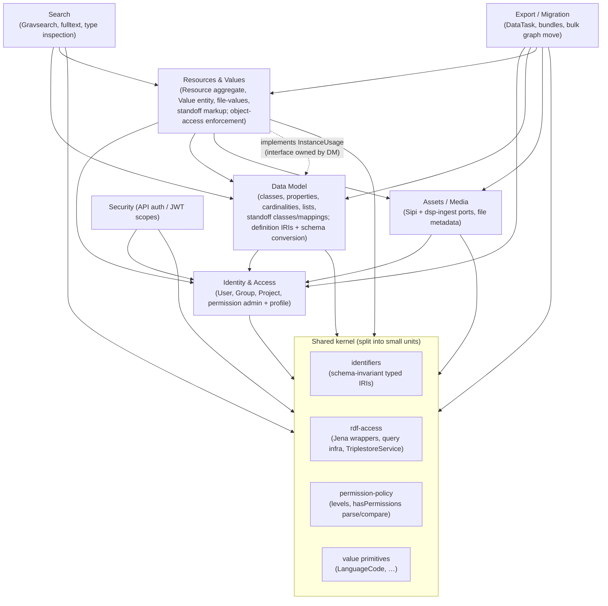

# Context Map — dsp-api

Working map of the bounded contexts in dsp-api, built during a domain-modelling
session. The goal is to let **domain meaning drive code structure** (and, downstream,
small Bazel compilation units) — not the reverse.

Status: **draft, in progress.** Boundaries and relationships are still being sharpened.

> Code paths below are relative to `modules/webapi/src/main/scala/org/knora/webapi/` unless
> otherwise prefixed (post-#4183 the `webapi` sources live under `modules/webapi/`).

## Contexts

Core (the heart — the reason dsp-api is not just "a triplestore with a REST wrapper":
users author their own **data model** at runtime, and everything else stores/retrieves
instances against it):

- **Data Model** — the user-authored schema: classes, properties, cardinalities, and
  controlled vocabularies (**Lists**). Currently split across `slice/ontology`
  and legacy `responders/v2/ontology` + `messages/v2/ontologymessages`/`listsmessages`.
    - Domain term is **"data model"**, _not_ "ontology" (ontology is the RDF-implementation word).
    - **Lists belong to Data Model** (confirmed). A list is a hierarchical controlled vocabulary;
    defining one is a _modelling_ act (it constrains valid data), exactly parallel to
    classes/properties. Resources reference list nodes via `HierarchicalListValue`
    (`valueHasListNode`) — the same upstream/downstream shape as Data Model → Resources.
    - **Two mismatches to correct** (code/infra structure ≠ domain meaning; meaning wins):
    1. Lists are managed today via the **admin API** (`ListsMessagesADM`), grouped with project
       administration. Domain says they are Data Model.
    2. List nodes are **physically stored in the data graph**, not the ontology graph — yet they
       are Data Model, not data. Reinforces that the RDF graph is _not_ a per-context boundary.
- **Resources & Values** — the instance data: resources and their values, conforming to a
  data model. Text-with-markup (**standoff**) folds in here as a kind of value. Currently
  mostly legacy `responders/v2` (`ResourcesResponderV2`, `ValuesResponderV2`,
  `StandoffResponderV2`) + `messages/v2`.
    - **One bounded context, confirmed** (not two). **Resource is the aggregate root**; **Value**
    is a versioned entity _inside_ the resource's consistency boundary. Tell: every standalone
    value operation locks on the _resource_ IRI (`IriLocker.runWithIriLock(..., resourceIri)`),
    and the two responders never call each other — the resource/value responder split is legacy
    verb-axis decomposition, not a language boundary. No value exists independently of a resource.

Significant satellites:

- **Search** — retrieval of resources, including **Gravsearch**, dsp-api's own custom query
  language. Its own bounded context with distinctive vocabulary (Gravsearch query, _type
  inspection_, _prequery_ vs _main query_, _transformers_, _inference optimisation_ —
  `messages/util/search/gravsearch/...`). Downstream (Customer) of Data Model and Resources.
    - **The one legitimate heavy user of the shared RDF kernel:** translating a query into SPARQL
    over the data graph _is_ its domain, so it permanently knows the resource RDF encoding. The
    "no new cross-context SPARQL" ratchet does **not** apply to Search — its substrate access is
    by design, unlike Data Model's accidental peek into instance data.
    - **Two sub-models today, converging (redesign in progress):**
        - _Full-text search_ — **zero** data-model knowledge; queries text only.
        - _Gravsearch_ — **lives off** data-model knowledge (type inference, inference optimisation).
        - A redesign is bringing these closer together.
    - **Boundary in flux — do NOT harden prematurely:** filtering/facets are planned for data
    retrieval, which will pull Search and Resources _closer_. Treat the Search↔Resources seam as
    intentionally soft for now.
    - **Emerging shared contract:** unified/faceted retrieval increasingly needs a stable,
    _published_ view of the data model (facet = filter by property/class ⇒ must know
    properties). Suggests **Data Model should publish a schema-projection capability** that
    Search (and future faceted retrieval) consume — a candidate key piece of ubiquitous language.

Supporting / generic:

- **Assets / Media** — today a **thin integration context** (anti-corruption layer / ports to the
  external **Sipi** and **dsp-ingest** services). dsp-api stores only metadata + `InternalFilename`,
  never bytes. Domain is small (filename, mime/dimensions, IIIF URL construction, ingest
  orchestration) — hence "important but not complex." Code is **scattered** (`store/iiif`
  `SipiService`; `slice/admin` `DspIngestClient`/`InternalFilename`/`RestrictedView`) — a
  code-vs-domain mismatch to consolidate.
    - **File-value types** (`StillImageFileValueContentV2`, `DocumentFileValueContentV2`, …) are
    **values → they belong to Resources & Values**, not here. Assets owns the ports + metadata,
    not the value representation.
    - **`RestrictedView`** (reduced-res/watermark serving policy): _setting_ owned by Identity &
    Access (project config); _enforcement_ owned by Assets (applied when serving). Mirrors the
    authz config-vs-enforcement split.
    - **Forward-looking (planned):** dsp-ingest may be **merged into dsp-api as one service**, which
    would **drastically expand this context** — from a thin ACL into a real ingest domain (upload,
    storage, checksums, BagIt/archival — cf. `modules/bagit`, derivative generation). Sipi
    integration may also deepen. ⇒ Design the Assets boundary cleanly _now_ so the merge lands as
    growth _inside_ an existing seam rather than a re-carve.
- **Identity & Access** — User, Group, Project, Permission, RestrictedView. Most mature
  slice (`slice/admin`).
- **Security / Auth** — authentication, JWT, scopes (`slice/security`).
- **Export / Migration** — project data import/export and migration (`slice/export`). A distinct
  supporting context: owns its own model (`DataTask`/`DataTaskStatus` async-job lifecycle,
  migration bundle format, import validator, `AdminModelScoping`). Sits at the **top** of the
  dependency graph (depends on many, depended-on by none) — broad coupling is its job. Works
  mostly at the **shared-substrate (named-graph) level** for bulk copy (intrinsic, like Search),
  so the SPARQL ratchet is relaxed for the bulk move — but its reads of _admin domain data_
  (users, permissions for scoping) are accidental coupling and should go through Identity's
  published capabilities.

## Relationships

Relationships below are tentative and still being sharpened.

- **Data Model → Resources & Values**: Data Model is _nominally_ upstream/supplier — Resources
  conform to the classes/properties/cardinalities it defines. **But the dependency is not
  clean:** to protect schema evolution, Data Model reaches _into instance data_ (e.g.
  `OntologyResponderV2.isEntityUsed`, `CardinalityHandler.isPropertyUsedInResources` →
  `IsPropertyUsedInResourcesQuery`). It does this via **raw SPARQL against the shared
  triplestore**, not by calling the Resources domain. This is the single most important
  boundary in the system.
    - **Decision (current):** treat the RDF triplestore/graph as an explicit **shared kernel**;
    each context may write its own SPARQL against it (pattern "2"). Pragmatic — formalizes what
    exists. Cost: resource-encoding knowledge is duplicated in both contexts, uncaught by the
    compiler.
    - **Decision (target, future):** invert to **published capabilities** (pattern "3") — e.g. a
    Resources-owned `InstanceUsage` contract (`isClassUsed` / `isPropertyUsed`); no context
    writes SPARQL against another context's data. Encapsulates instance-encoding in one place;
    gives a compiler-enforced seam. To be adopted later, not now.
    - **Rule going forward (the "ratchet"):** existing cross-context SPARQL stays for now, but
    **no _new_ cross-context SPARQL** — any new cross-boundary read goes through a published
    capability. Stops the coupling accreting while allowing incremental migration toward the
    target. (Recorded as a map note by choice; not promoted to an ADR.)
- **Resources & Values → Assets**: a resource may represent a file/asset.
- **Search → Data Model + Resources**: Gravsearch queries are expressed in terms of the data
  model and return resources.
- **Identity & Access → everything**: projects own data models and resources; permissions
  gate access.

## Target dependency structure

The payoff for the modularization/Bazel goal: a **DAG** where every edge points from a dependent
to its dependency, and each context is a candidate compilation unit. Layers (bottom = most
depended-upon, no domain dependencies):

**Layering (dependencies point downward only):**

1. **Shared kernel** — no domain deps. Deliberately split into _several small units_ (identifiers /
   rdf-access / permission-policy / primitives) so a context can depend on `identifiers` without
   pulling in `rdf-access`. This split is the highest-leverage move for small Bazel units.
2. **Identity & Access** — foundational; projects scope everything, so every domain context sits
   above it.
3. **Data Model** and **Assets/Media** — depend on kernel + Identity. Data Model owns the
   schema-variant definition IRIs + schema conversion relocated out of `SmartIri`.
4. **Resources & Values** — depends on kernel + Identity + Data Model + Assets.
5. **Search** — depends on Data Model (type inference) + Resources.
6. **Export/Migration** — top of graph; depends on all.
7. **Security** — API-layer auth gate, depends on Identity.

**The one non-obvious edge (cycle avoidance).** The Data Model → Resources "is this entity used?"
check would create a cycle (Resources already depends on Data Model). Resolve by **Dependency
Inversion**: the `InstanceUsage` contract is **defined in Data Model** (the Customer states what it
needs); **Resources implements it** and is wired in at the composition root. Compile-time edge stays
`Resources → Data Model`; Data Model calls the interface at runtime. No cycle. (This is the "pattern
3 / ratchet target" from the Shared Kernel section, expressed as a graph edge.)

**Intrinsic substrate users.** Search and Export legitimately operate at the `rdf-access` level
(query translation; bulk named-graph copy). Their broad substrate coupling is by design — the "no
new cross-context SPARQL" ratchet targets _accidental_ peeking (Data Model→instances,
Export→admin-data), not these.

**What this means for Bazel:** contexts become compilation units; the kernel splits into a few tiny
units at the bottom. The current blocker is not the boundaries above — it's that `StringFormatter`

+ `SmartIri` + `OntologyConstants` collapse the kernel + Data Model + validation into one ~2500-line
floor that everything imports. **Decomposing that floor is the prerequisite; the context boundaries
above are already close to right.**

## Shared Kernel

The genuine cross-context foundation. **Today it is a false floor:** `StringFormatter.scala`
(1453 lines, defines both `StringFormatter` _and_ `SmartIri`; ~72–96 dependent files) and
`OntologyConstants` (1067 lines, ~92 dependent files) sit at the bottom of the dependency graph
and conflate identifier primitives + Data Model semantics + string validation + RDF vocabulary.
**This — not the domain boundaries — is the primary blocker to small compilation units:** every
context that touches an IRI implicitly pulls in Data Model's schema machinery.

Key distinction: **identity vs. behavior.**

- A typed IRI as a **pure identifier** (validated string + which kind of entity it points at) is
  kernel-safe. dsp-api already has these: `ResourceIri`, `ResourceClassIri`, `PropertyIri`,
  `OntologyIri`, `ProjectIri`, `UserIri`, `ListIri`, `ValueIri`, `GroupIri`, `PermissionIri`.
- `SmartIri`'s problem is **behavior that requires the Data Model** (`toOntologySchema`,
  `getEntityName`, `getOntologyFromEntity`, `fromLinkValuePropToLinkProp`). A value object that
  converts itself between ontology schemas has swallowed the Data Model.

**Decisions:**

1. **Keep typed IRIs** — the model is right, not "dumb IRIs".
2. **Strip `SmartIri`'s schema-aware behavior out and relocate it to the Data Model context** as
   explicit operations over IRIs. Typing stays; embedded ontology logic leaves the kernel.
3. **Domicile: option (B) — a thin shared-identifiers kernel** of pure typed IRIs, so a context
   can _mention_ another context's entity by ID without depending on that context's module (and
   without cycle risk). Context-internal-only IRIs may still live in their context. (Chosen over
   (A) domicile-in-owning-context; user had no strong preference, (B) better serves small units.)
4. Fix today's inconsistency: Identity's IRIs are correctly domiciled in-context, but Data
   Model's (`ResourceClassIri`/`PropertyIri`/`OntologyIri`) and Resources' (`ResourceIri`/
   `ValueIri`) reference IDs sit in `common` while `ListIri` is stranded in `admin`. Consolidate
   the cross-context reference IDs into the shared-identifiers kernel.

5. **Two IRI families, made first-class — not all IRIs are schema-variant.**
   - **Schema-invariant data IRIs** (resource instances, values, projects, users, lists):
     `ResourceIri`, `ValueIri`, `ProjectIri`, `UserIri`, `ListIri`, `GroupIri`, `PermissionIri`.
     Same string in every schema; schema conversion is meaningless. → **shared-identifiers
     kernel**, pure identity, _not_ backed by `SmartIri`.
   - **Schema-variant definition IRIs** (data-model entities): `PropertyIri`, `ResourceClassIri`,
     `OntologyIri` — have internal + API (Complex/Simple) forms and genuinely convert. The
     `toOntologySchema`/`toInternalSchema` operations exist **only** on this family (converting a
     data IRI should be a _compile error_, not a silent no-op). Because schema-variance _is_ Data
     Model knowledge, these types + their conversion → **Data Model context**. Downstream
     contexts naming a class/property depend on Data Model (legitimate upstream direction).
   - Today's state: a `KnoraIri` trait in `slice/common/KnoraIris.scala` already groups the
     definition IRIs and grants schema conversion — but (a) the invariant family has no explicit
     counterpart type, (b) `KnoraIri.equals`/`hashCode` are defined _through_ `toInternalSchema`
     (identity via conversion), and (c) every typed IRI wraps a `SmartIri` internally, so the
     typed layer is a veneer over the god-object rather than a replacement for it.
   - **`ListIri` resolution:** Lists (entity) belong to Data Model, but a `ListIri` is a
     schema-invariant reference token → it lives in the kernel. Entity in its context, bare
     reference-ID in the kernel = the shared-identifiers pattern.

Genuine kernel contents (target): pure schema-invariant typed identifiers + value primitives
(`LanguageCode`) + raw RDF/triplestore access (Jena wrappers, query infra) + the **permission
policy primitive** (see Authorization below).

## Cross-cutting: Authorization

Authorization is **not** a bounded context of its own — it decomposes into three pieces that
belong in three places (confirmed). Today it is tangled: `PermissionUtilADM` (`messages/util`) is
a shared utility used directly by Values/Resources/Ontology/Search; object-access permissions
live as `knora-base:hasPermissions` literals on the data; admin/default permissions are owned by
`PermissionsResponder` in admin.

| Piece | What it is | Belongs in |
| --- | --- | --- |
| **Permission policy primitive** | permission-level model (RV < V < M < D < CR), `hasPermissions` parse + compare. Pure, universal. | **Shared kernel** (policy value object) |
| **Permission administration + user profile** | managing administrative & default-object-access permissions; computing a user's permission profile (groups, admin flags). | **Identity & Access** |
| **Enforcement at point of use** | read an object's permission literal off _your own_ data, compare to the user profile via the kernel primitive; Search folds it into query generation. | **each context** |

Two distinct authz layers — do not conflate: (1) coarse API-layer JWT **scopes** (authentication +
endpoint gate, `slice/security`); (2) fine-grained **object-access** permissions (the table above).

## Flagged ambiguities / open questions

Resolved:

- "Ontology" (code) vs "data model" (domain) — same concept, domain term wins in prose.
- **Lists** are part of Data Model (not a context of their own). ✓
- **Resources & Values** is one context; Resource aggregate root, Value entity. ✓
- The RDF **graph is a shared kernel**, not a per-context store (list nodes + resources share the
  data graph; Data Model queries instance data via shared SPARQL). ✓

Resolved (cont.):

- **Standoff** is a **cross-cutting feature, not a context.** Same definition/instance split as
  everything else: standoff tag _classes_ + XML↔standoff _mappings_ (+XSLT) are the schema face →
  **Data Model**; standoff _markup on a text value_ + conversion machinery
  (`XMLToStandoffUtil`, `StandoffTagUtilV2`) are the instance face → **Resources & Values**.
    - **Practical note:** projects almost never define their own standoff classes/mappings — there
    is one encouraged standard mapping, custom definitions are discouraged. So the Data Model face
    of standoff is **near-static / low-churn**; don't over-invest in the custom-standoff-definition
    machinery when modularizing.

Still open:

- Does **Search** stay one context, or split (Gravsearch language vs. simple/fulltext search)?
  How does it relate to Data Model + Resources?
- What is in the **shared kernel / `common`** — genuine cross-context vocabulary (IRI, project
  ref, RDF value, SmartIri) vs. things that leaked in? (Linchpin for small compilation units.)
- **Assets/Media** boundary — where does it sit relative to Resources (file values) and to Sipi/ingest?
