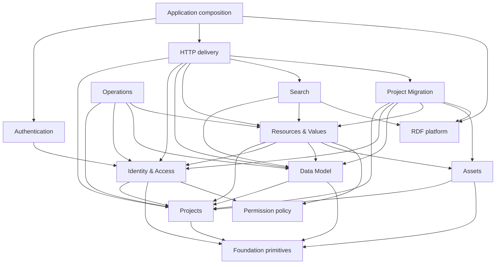

# Context Map — dsp-api

Working map of the bounded contexts and technical modules in dsp-api. Domain meaning drives code
ownership and, downstream, Bazel target ownership. Current package names and RDF graph placement do
not determine the model.

Status: **draft, with the principal ownership decisions settled.** Search, Operations, and the
smallest useful public contracts remain deliberately provisional.

> Code paths are relative to `modules/webapi/src/main/scala/org/knora/webapi/` unless otherwise
> prefixed.

## Product framing

dsp-api is the backend of the **Virtual Research Environment (VRE)**: the environment in which
researchers and data stewards create, edit, organise, query, and manage research data.

During the transition to the VRE / Repository architecture, the VRE remains the source of truth
and operationally retains data that will ultimately be handed to the Repository. This does **not**
make dsp-api the Archive. The target Archive is a separate long-term preservation system within
the Repository architecture.

The contexts below therefore describe VRE capabilities. **Project Migration** owns export and
handoff from the VRE; it does not own archival custody or long-term preservation.

## Core VRE contexts

### Projects

Owns project identity, metadata, lifecycle, legal defaults, licences, and project-level settings.
Today this is mixed into `slice/admin`, but administrative delivery is not a domain seam.

Projects is separate from Identity & Access. Enriched HTTP responses that combine project data
with users or data-model IRIs are query composition above the domain modules, not evidence that
Projects owns those concepts.

### Identity & Access

Owns Users, Groups, memberships, permission administration, and effective permission profiles.
It depends on Projects because memberships and administrative permissions are project-scoped.

Authentication, JWT handling, and request scopes are a separate technical module. Fine-grained
object-access enforcement stays with the context that owns the protected object.

### Data Model

Owns the user-authored model: Classes, Properties, Cardinalities, controlled vocabularies
(**Lists**), Definition IRIs, schema conversion, and standoff definitions/mappings. Current code is
spread across `slice/ontology`, `slice/lists`, `slice/admin`, legacy ontology responders/messages,
and shared IRI machinery.

- The domain term is **Data Model**. “Ontology” is the RDF implementation term and remains valid in
  code names.
- Lists belong to Data Model. Defining a controlled vocabulary is a modelling act, regardless of
  its current admin route or storage in the data graph.
- Standoff classes and XML mappings are definitions and belong here. Standoff markup on a Text
  Value belongs to Resources & Values.
- Schema-variant Definition IRIs and their conversion belong here, not in a global identifier
  module.

### Resources & Values

Owns active VRE instance data: the Resource aggregate, Values, resource metadata, file-value
references, and standoff markup. Current code is mostly in legacy resource/value/standoff
responders and messages, with newer work in `slice/resources`.

Resource is the aggregate root. A Value is a versioned entity inside the Resource's consistency
scope and has no independent lifecycle. The current responder split is a technical decomposition,
not a domain seam.

File Values remain here because they are Values. They reference Assets but do not transfer Resource
ownership to the Assets context.

### Search

Owns retrieval of Resources, including Gravsearch, full-text retrieval, type inspection, prequery
and main-query construction, inference optimisation, and result assembly.

Search is one provisional context. Its relationship with Resources is changing as filtering and
faceted retrieval evolve, so its internal seams should not be hardened prematurely. Data Model
should eventually publish the stable projection Search needs.

Search is an intrinsic user of low-level RDF execution because query translation is part of its
implementation. That exception does not give Search ownership of another context's RDF meaning.

## Supporting VRE contexts

### Assets

Owns Sipi and ingest integration, asset metadata, byte-serving interfaces, serving-policy
enforcement, and the natural home for future ingest functionality. dsp-api currently retains asset
metadata and identifiers while Sipi and ingest handle bytes.

- File Values belong to Resources & Values.
- Restricted View configuration is a Project setting; enforcement belongs to Assets.
- Consolidating ingest into dsp-api expands Assets inside an existing seam. It does not make Assets
  responsible for archival custody.

### Project Migration

Owns VRE import/export, migration bundles, bulk graph movement, validation, and the Data Task
lifecycle. It coordinates many upstream contexts and is intentionally near the top of the graph.

Bulk named-graph movement may use the RDF platform directly. Reads of Projects, Users, Groups, or
permissions must use their published interfaces. Project Migration hands data out of or into the
VRE; it is not the Archive.

### Operations

Owns only genuine cross-context maintenance workflows. Maintenance that concerns one context stays
with that owner. Operations must not become a replacement dumping ground for the current `admin`,
`store`, or root packages.

Whether a dedicated Operations module is needed remains conditional on identifying enough real
cross-context workflows.

## Technical modules

These are technical ownership, not additional VRE domains:

| Module | Responsibility |
| --- | --- |
| **Foundation primitives** | Universal validation and values with no domain dependencies |
| **Permission policy** | Pure permission levels, parsing, and comparison |
| **RDF platform** | Generic triplestore execution, transactions, and RDF library integration |
| **Authentication** | Credentials, JWTs, scopes, and request authentication |
| **HTTP delivery** | Versioned DTOs, codecs, endpoints, and translation to domain commands/results |
| **Application composition** | Configuration, concrete adapter selection, ZIO assembly, startup, and routes |

The table is not an instruction to create one target per row. A domain normally begins as one deep
production module. Additional targets are justified only by real adapters, published contracts, or
cross-domain test support.

## Relationships

- **Identity & Access → Projects**: membership and permission administration are project-scoped.
- **Data Model → Projects**: a project owns one or more Data Models.
- **Assets → Projects**: asset settings and policies are project-scoped.
- **Resources & Values → Projects + Identity & Access + Data Model + Assets**: Resources are
  project-owned, conform to a Data Model, are protected by permission profiles/policy, and may
  reference Assets.
- **Search → Data Model + Resources & Values + RDF platform**: queries use model meaning and return
  Resources; query translation legitimately uses generic RDF execution.
- **Project Migration → Projects + Identity & Access + Data Model + Resources & Values + Assets +
  RDF platform**: migration coordinates the VRE contexts and may move whole named graphs.
- **Operations → published interfaces of the contexts it coordinates**.
- **Authentication → Identity & Access**: authenticated requests carry an effective identity and
  permission profile.
- **HTTP delivery → domain interfaces**: delivery translates but does not define domain meaning.
- **Application composition → domain interfaces and concrete adapters**: only composition chooses
  implementations.

### Data Model asking about instance use

Protecting model evolution requires Data Model to ask whether a Class or Property is used by any
Resource. Today this is raw cross-context SPARQL.

The target is a consumer-owned `InstanceUsage` interface defined by Data Model and implemented by a
Resources & Values adapter. Application composition wires the adapter. The compile-time edge
remains Resources & Values → Data Model, so the graph stays acyclic.

**Ratchet:** existing cross-context SPARQL may be migrated incrementally, but new cross-context
reads use published interfaces. Search query translation and Project Migration bulk graph movement
are explicit intrinsic RDF-platform uses, not a general exemption.

## Target dependency structure

Arrows point from consumer to dependency:

```mermaid
graph TD
    FP["Foundation primitives"]
    PP["Permission policy"]
    RDF["RDF platform"]

    PROJECTS["Projects"]
    IAM["Identity & Access"]
    DM["Data Model"]
    ASSETS["Assets"]
    RV["Resources & Values"]
    SEARCH["Search"]
    MIGRATION["Project Migration"]
    OPS["Operations"]

    AUTHN["Authentication"]
    HTTP["HTTP delivery"]
    APP["Application composition"]

    PROJECTS --> FP
    IAM --> PROJECTS
    IAM --> FP
    IAM --> PP
    DM --> PROJECTS
    DM --> FP
    ASSETS --> PROJECTS
    ASSETS --> FP
    RV --> PROJECTS
    RV --> IAM
    RV --> DM
    RV --> ASSETS
    RV --> PP
    SEARCH --> DM
    SEARCH --> RV
    SEARCH --> RDF
    MIGRATION --> PROJECTS
    MIGRATION --> IAM
    MIGRATION --> DM
    MIGRATION --> RV
    MIGRATION --> ASSETS
    MIGRATION --> RDF
    OPS --> PROJECTS
    OPS --> IAM
    OPS --> DM
    OPS --> RV
    AUTHN --> IAM
    HTTP --> PROJECTS
    HTTP --> IAM
    HTTP --> DM
    HTTP --> RV
    HTTP --> SEARCH
    HTTP --> MIGRATION
    APP --> AUTHN
    APP --> HTTP
    APP --> RDF
```

Context-owned RDF adapters depend on the owning domain interface and the RDF platform. Domain
implementations do not depend on concrete triplestore code.

## The false foundation

The current blocker is not merely target declaration. Several high-fanout files look foundational
while importing domain or delivery meaning:

- `messages/StringFormatter.scala` combines formatting, validation, identifiers, and schema-aware
  `SmartIri` behaviour;
- `messages/OntologyConstants.scala` combines generic RDF vocabulary with context-specific
  Data Model, Resources, and administration vocabulary;
- `dsp.errors.Errors` gives context-specific errors global ownership;
- root and `slice/common` values import higher-level domain types.

A single large `common` target would hide these cycles rather than fix them. The target foundation
is intentionally small:

- universal validation and primitive values;
- the deliberately shared permission policy;
- generic RDF execution in the separate RDF platform module.

### Identifier ownership

Two IRI families must be explicit:

- **Data IRI** — schema-invariant identifiers such as Resource, Value, Project, User, Group, List,
  and Permission IRIs. Schema conversion is unavailable.
- **Definition IRI** — schema-variant Data Model identifiers such as Class, Property, and Data Model
  IRIs. Data Model owns their conversion.

This distinction does **not** place every Data IRI in one global identifiers target. A Project IRI
is normally a small published contract owned by Projects; a User IRI belongs to Identity & Access;
a Resource IRI belongs to Resources & Values. Context-owned contracts keep semantic dependencies
visible in Bazel. Only genuinely universal identifiers belong in Foundation primitives.

`SmartIri` remains a temporary compatibility implementation while callers move to the explicit
families and context-owned contracts.

## Authorization

Authorization is deliberately distributed:

| Piece | Ownership |
| --- | --- |
| Permission levels and `hasPermissions` parsing/comparison | Permission policy |
| Administrative/default permissions and effective profile | Identity & Access |
| Restricted View configuration | Projects |
| Object-access enforcement | Context owning the protected object |
| Asset-serving enforcement | Assets |
| JWT authentication and endpoint scopes | Authentication |

This keeps the shared policy module deep and small while preserving locality for enforcement.

## Guardrails

1. Domain implementations do not import HTTP delivery, application composition, or concrete RDF
   implementations.
2. Context-specific identifiers normally live in small contracts owned by their context.
3. Context-specific RDF meaning stays in an adapter owned by that context.
4. `messages`, `responders`, `store`, and `common` are migration locations, not target modules.
5. New cross-context reads use published interfaces.
6. Visibility is private by default.
7. Tests cross the same public interface as production callers unless deliberate test support is
   published.
8. The aggregate `webapi` targets remain compatibility entrypoints, not dependencies of new
   internal targets.

## Settled decisions and open questions

Settled:

- Projects is separate from Identity & Access.
- Lists belongs to Data Model.
- Resources & Values is one context with Resource as aggregate root.
- Standoff splits by definition and instance meaning.
- Assets is explicit; File Values remain in Resources & Values.
- Authorization is distributed.
- RDF access is a technical platform with context-owned adapters, not a shared domain kernel.
- Project Migration is VRE handoff, not archival custody.

Still open:

- What stable Data Model projection should Search consume as faceted retrieval develops?
- Which maintenance workflows justify a dedicated Operations module?
- Which context identifiers need a tiny published contract rather than a direct dependency on the
  whole domain module?
- Should Project Migration remain one deep module once interactive export and whole-project
  migration interfaces are visible?

The current implementation sequence is recorded in [`MODULARIZATION-PLAN.md`](./MODULARIZATION-PLAN.md).
