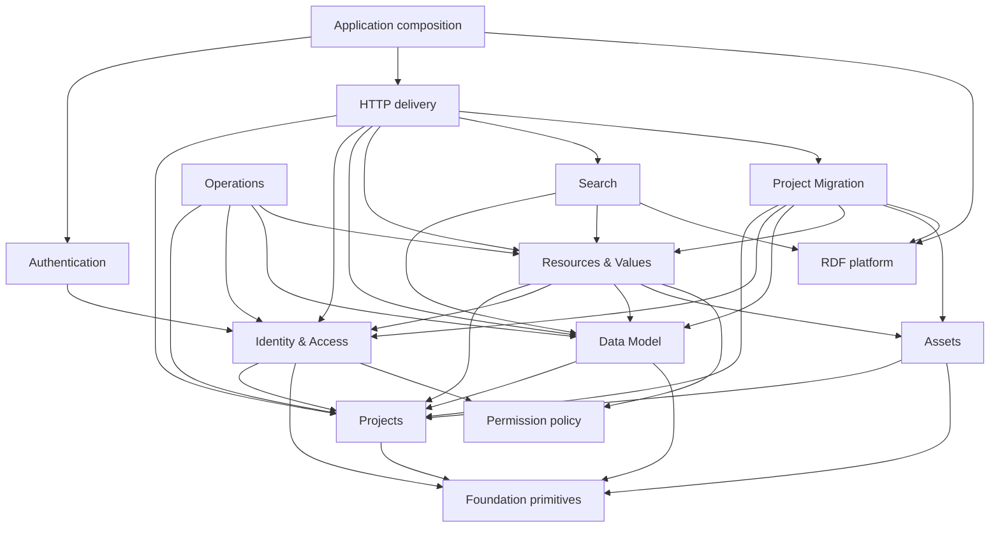

# dsp-api Context Map

Index, not a glossary. Do not add vocabulary here; each term lives in its bounded context's `CONTEXT.md`.

Working index of the bounded contexts and technical modules in dsp-api. Domain meaning drives code
ownership and, downstream, Bazel target ownership. Current package names and RDF graph placement do
not determine the model.

Status: **draft, with the principal ownership decisions settled.** Search, Operations, and the
smallest useful public contracts remain deliberately provisional.

> Code paths are relative to `modules/webapi/src/main/scala/org/knora/webapi/` unless otherwise
> prefixed.

## Product framing

dsp-api is the backend of the **Virtual Research Environment (VRE)**: the environment in which
researchers and data stewards create, edit, organise, query, and manage research data. During the
transition to the VRE / Repository architecture, the VRE remains the source of truth and
operationally retains data that will ultimately be handed to the Repository. This does **not** make
dsp-api the Archive. The target Archive is a separate long-term preservation system within the
Repository architecture. The contexts below therefore describe VRE capabilities. **Project
Migration** owns export and handoff from the VRE; it does not own archival custody or long-term
preservation.

## Bounded contexts

Core VRE contexts:

- [Projects](docs/contexts/projects/CONTEXT.md): project identity, metadata, lifecycle, legal
  defaults, licences, and project-level settings.
- [Identity & Access](docs/contexts/identity-access/CONTEXT.md): Users, Groups, memberships,
  permission administration, and effective permission profiles.
- [Data Model](docs/contexts/data-model/CONTEXT.md): the user-authored model of Classes, Properties,
  Cardinalities, controlled vocabularies, and standoff definitions.
- [Resources & Values](docs/contexts/resources-values/CONTEXT.md): active VRE instance data, with
  Resource as the aggregate root.
- [Search](docs/contexts/search/CONTEXT.md): retrieval of Resources, including Gravsearch, full-text
  retrieval, and query construction.

Supporting VRE contexts:

- [Assets](docs/contexts/assets/CONTEXT.md): Sipi and ingest integration, asset metadata,
  byte-serving interfaces, and serving-policy enforcement.
- [Project Migration](docs/contexts/project-migration/CONTEXT.md): VRE import/export, migration
  bundles, bulk graph movement, and the Data Task lifecycle.
- [Operations](docs/contexts/operations/CONTEXT.md): genuine cross-context maintenance workflows,
  and nothing else.

## Technical modules

These are technical ownership, not additional VRE domains:

| Module | Responsibility |
| --- | --- |
| **Foundation primitives** | Universal validation and values with no domain dependencies |
| **Permission policy** | Pure permission levels, parsing, and comparison |
| **RDF platform** | Generic triplestore execution, transactions, and RDF library integration |
| **Authentication** | Credentials, JWTs, scopes, and request authentication |
| **HTTP delivery** | Versioned DTOs, codecs, endpoints, and translation to domain commands/results |
| **Application composition** | Configuration, concrete adapter selection, ZIO assembly, startup, and routes |

The table is not an instruction to create one target per row. A domain normally begins as one deep
production module. Additional targets are justified only by real adapters, published contracts, or
cross-domain test support.

## Context map

- **Identity & Access to Projects**: membership and permission administration are project-scoped.
- **Data Model to Projects**: a project owns one or more Data Models.
- **Assets to Projects**: asset settings and policies are project-scoped.
- **Resources & Values to Projects + Identity & Access + Data Model + Assets**: Resources are
  project-owned, conform to a Data Model, are protected by permission profiles/policy, and may
  reference Assets.
- **Search to Data Model + Resources & Values + RDF platform**: queries use model meaning and return
  Resources; query translation legitimately uses generic RDF execution.
- **Project Migration to Projects + Identity & Access + Data Model + Resources & Values + Assets +
  RDF platform**: migration coordinates the VRE contexts and may move whole named graphs.
- **Operations to published interfaces of the contexts it coordinates**.
- **Authentication to Identity & Access**: authenticated requests carry an effective identity and
  permission profile.
- **HTTP delivery to domain interfaces**: delivery translates but does not define domain meaning.
- **Application composition to domain interfaces and concrete adapters**: only composition chooses
  implementations.

### Data Model asking about instance use

Protecting model evolution requires Data Model to ask whether a Class or Property is used by any
Resource. Today this is raw cross-context SPARQL.

The target is a consumer-owned `InstanceUsage` interface defined by Data Model and implemented by a
Resources & Values adapter. Application composition wires the adapter. The compile-time edge
remains Resources & Values to Data Model, so the graph stays acyclic.

**Ratchet:** existing cross-context SPARQL may be migrated incrementally, but new cross-context
reads use published interfaces. Search query translation and Project Migration bulk graph movement
are explicit intrinsic RDF-platform uses, not a general exemption.

### Target dependency structure

Arrows point from consumer to dependency:

Context-owned RDF adapters depend on the owning domain interface and the RDF platform. Domain
implementations do not depend on concrete triplestore code.

## Identifier ownership

Two IRI families must be explicit:

- **Data IRI**: schema-invariant identifiers such as Resource, Value, Project, User, Group, List,
  and Permission IRIs. Schema conversion is unavailable.
- **Definition IRI**: schema-variant Data Model identifiers such as Class, Property, and Data Model
  IRIs. Data Model owns their conversion.

This distinction does **not** place every Data IRI in one global identifiers target. A Project IRI
is normally a small published contract owned by Projects; a User IRI belongs to Identity & Access;
a Resource IRI belongs to Resources & Values. Context-owned contracts keep semantic dependencies
visible in Bazel. Only genuinely universal identifiers belong in Foundation primitives.

`SmartIri` remains a temporary compatibility implementation while callers move to the explicit
families and context-owned contracts.

## Authorization

Authorization is deliberately distributed:

| Piece | Ownership |
| --- | --- |
| Permission levels and `hasPermissions` parsing/comparison | Permission policy |
| Administrative/default permissions and effective profile | Identity & Access |
| Restricted View configuration | Projects |
| Object-access enforcement | Context owning the protected object |
| Asset-serving enforcement | Assets |
| JWT authentication and endpoint scopes | Authentication |

This keeps the shared policy module deep and small while preserving locality for enforcement.

## The false foundation

The current blocker is not merely target declaration. Several high-fanout files look foundational
while importing domain or delivery meaning:

- `messages/StringFormatter.scala` combines formatting, validation, identifiers, and schema-aware
  `SmartIri` behaviour;
- `messages/OntologyConstants.scala` combines generic RDF vocabulary with context-specific
  Data Model, Resources, and administration vocabulary;
- `dsp.errors.Errors` gives context-specific errors global ownership;
- root and `slice/common` values import higher-level domain types.

A single large `common` target would hide these cycles rather than fix them. The target foundation
is intentionally small:

- universal validation and primitive values;
- the deliberately shared permission policy;
- generic RDF execution in the separate RDF platform module.

## Guardrails

1. Domain implementations do not import HTTP delivery, application composition, or concrete RDF
   implementations.
2. Context-specific identifiers normally live in small contracts owned by their context.
3. Context-specific RDF meaning stays in an adapter owned by that context.
4. `messages`, `responders`, `store`, and `common` are migration locations, not target modules.
5. New cross-context reads use published interfaces.
6. Visibility is private by default.
7. Tests cross the same public interface as production callers unless deliberate test support is
   published.
8. The aggregate `webapi` targets remain compatibility entrypoints, not dependencies of new
   internal targets.

## Shared

Genuinely cross-context vocabulary, recorded once here and referenced from the contexts that use it.
Per-context vocabulary belongs in that context's own `CONTEXT.md`, never in this section.

### Product context

**VRE**:
The Virtual Research Environment in which researchers and data stewards create, edit, organise,
query, and manage research data.
_Avoid_: Archive

**dsp-api**:
The backend of the VRE and its transitional source of truth.
_Avoid_: Archive, Repository

**Repository**:
The downstream environment for preserving and presenting published data.
_Avoid_: VRE

**Archive**:
The separate long-term preservation system within the Repository architecture.
_Avoid_: dsp-api, Assets, Project Migration

The VRE's transitional retention of data does not give dsp-api archival custody. Project Migration
hands data between the VRE and other systems; the Archive remains an external context.

### Technical language

**Data IRI**:
A schema-invariant identifier such as a Resource, Value, Project, User, Group, List, or Permission
IRI.
_Avoid_: Definition IRI

**Definition IRI**:
A schema-variant identifier for a Data Model entity, with internal and public forms.
_Avoid_: Generic Data IRI

**Schema**:
A representation of a Definition IRI or entity: internal, v2 Complex, or v2 Simple.
_Avoid_: Data Model

**Foundation primitive**:
A universal validation or value with no domain dependency.
_Avoid_: Every cross-context identifier

**Permission policy**:
Pure permission levels plus `hasPermissions` parsing and comparison.
_Avoid_: Permission administration

**RDF platform**:
Generic triplestore execution, transactions, and RDF library integration.
_Avoid_: Shared domain model, shared kernel

**Context-owned RDF adapter**:
An adapter containing the triples and queries whose meaning belongs to one context.
_Avoid_: Global repository layer

**Authentication**:
Credential, JWT, Scope, and request-authentication concerns.
_Avoid_: Object-access authorization

**Scope**:
A coarse JWT grant used to gate an endpoint.
_Avoid_: Object-access permission

**InstanceUsage**:
The Data Model-owned interface for asking whether a Class or Property is used by Resources.
_Avoid_: Raw cross-context SPARQL

**Ratchet**:
The rule that existing cross-context SPARQL may remain temporarily while new cross-context reads use
published interfaces.
_Avoid_: Big-bang rewrite

**Intrinsic RDF-platform user**:
Search query translation or Project Migration bulk movement, where low-level RDF execution is part of
the implementation.
_Avoid_: Any context that can reach the triplestore

Data IRIs are not automatically globally owned. A Project IRI normally belongs to a small Projects
contract, a User IRI to Identity & Access, and a Resource IRI to Resources & Values. The Data IRI /
Definition IRI distinction describes behaviour; context ownership describes dependency direction.

### Shared relationships

- A **Definition IRI** may convert between Schemas; a **Data IRI** may not.
- Context-specific RDF meaning remains in a **context-owned RDF adapter** even when several adapters
  use the same **RDF platform**.

## Settled decisions and open questions

Settled:

- Projects is separate from Identity & Access.
- Lists belongs to Data Model.
- Resources & Values is one context with Resource as aggregate root.
- Standoff splits by definition and instance meaning.
- Assets is explicit; File Values remain in Resources & Values.
- Authorization is distributed.
- RDF access is a technical platform with context-owned adapters, not a shared domain kernel.
- Project Migration is VRE handoff, not archival custody.

Still open:

- What stable Data Model projection should Search consume as faceted retrieval develops?
- Which maintenance workflows justify a dedicated Operations module?
- Which context identifiers need a tiny published contract rather than a direct dependency on the
  whole domain module?
- Should Project Migration remain one deep module once interactive export and whole-project
  migration interfaces are visible?

## Related documents

The current implementation sequence is recorded in [`MODULARIZATION-PLAN.md`](./MODULARIZATION-PLAN.md).
Component topology and dependencies are recorded separately in [`ARCH-MAP.md`](./ARCH-MAP.md).
