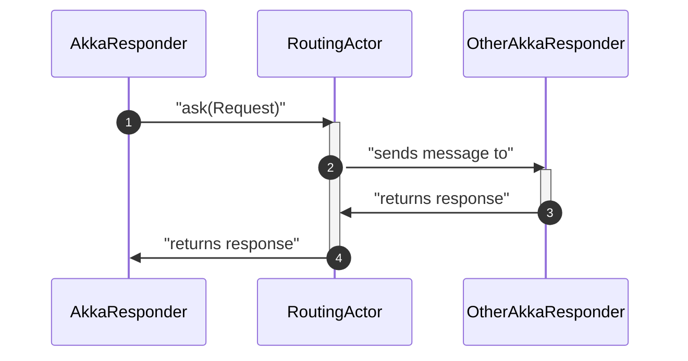
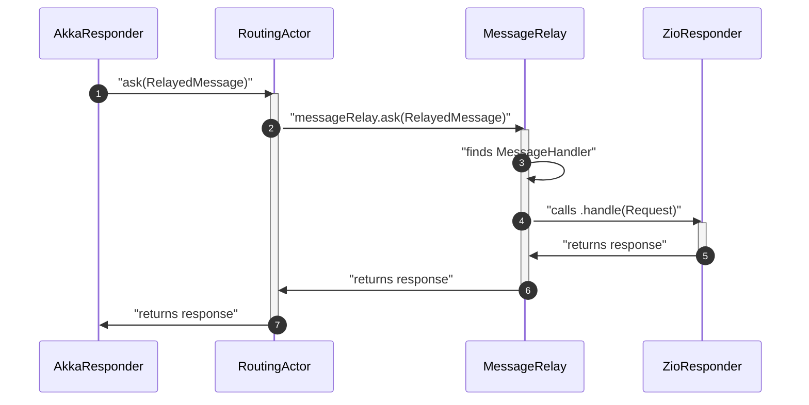
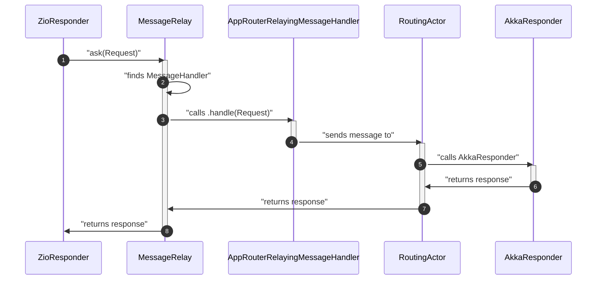
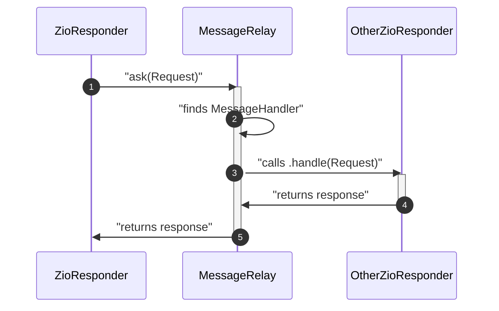
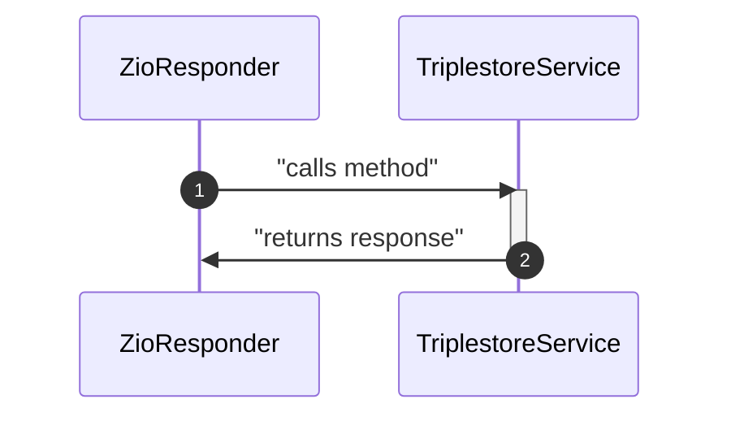

# ADR-0007 ZIO-fication of Responders

Date: 2023-02-20

## Status

Draft

## Context

In order to remove all _Akka_ dependencies, we have to migrate the existing `Responder`s to a `ZIO` based
implementation.
This migration should be possible to do on a per `Responder` basis so that we do not a single "big-bang" release with
too much code changed at once.

### Status Quo

The central and only `Actor` is the `RoutingActor` which contains instances of each `Responder` as a field.
Each of the `Responder`s needs a `ActorRef` to the `RoutingActor` and used the _Akka_ "ask pattern" for communication
with the other `Responders`.
This means a `Responder` can only be created inside the `RoutingActor` because the `RoutingActor` must know
every `Responder` in order to route the message but the `Responder` needs the `ActorRef` in order to communicate with
the other `Responders`.
This leads to a circular dependency between the `RoutingActor` and all _Akka_ based `Responders`.

### Goal

In the long term all `Responders` do not contain any _Akka_ dependency anymore and all implementations currently
returning a `Future` will return a `zio.Task`.

The `zio.Task` is a very suitable replacement for the `Future` because:

* a `Future[A]` will complete with either a value `A` or with a failure `Throwable`.
* a `zio.Task[A]` will succeed with either a value `A` or fail with an error of type `Throwable`.

Ideally all `Responders` will directly call the necessary components directly through invoking methods.
However, this will not be possible in the beginning as there are `Responders` who call on each other creating yet another
circular dependency which we cannot simply recreate with `ZLayer` dependency injection.
Hence, a _message like_ communication pattern through a central component the `MessageRelay` will be introduced which
can replace the existing _Akka_ "ask pattern" one to one in the ziofied component.

## Solution

The `MessageRelay` is capable of relaying message to subscribed `MessageHandler`s and replaces the existing _Akka_ "ask
pattern" with the `RoutingActor`.
Messages which will have a `MessageHandler` implementation must `extend` the `RelayedMessage` trait so that these are
routed to the `MessageRelay` from the `RoutingActor`.
All other messages will be handled as before.

In ziofied `Responders` we can use the `MessageRelay` for communication with all other `Responders` in a similar fashion
as the _Akka_ "ask pattern" by invoking the method `MessageRelay#ask(ResponderRequest): Task[Any]`.
A special `MessageHandler` will route all messages which do _not_ implement the `RelayedMessage` trait back to
the `RoutingActor`, this is the `AppRouterRelayingMessageHandler`.

In the long run we will prefer to invoke methods on the respective ziofied services directly.
This is now already possible for example with the `TriplestoreServive`, i.e. instead of
calling `MessageRelay#ask[SparqlSelectResul](SparqlSelectRequest)` it is much easier and more importantly *typesafe* to
call `TriplestoreService#sparqlHttpSelect(String): UIO[SparqlSelectResult]`.

#### Communication between Akka based Responder and another Akka based Responder

Nothing changes with regard to existing communication patterns:

#### Communication between Akka based Responder and ziofied Responder

The `AkkaResponder` code remains unchanged and will still `ask` the `ActorRef` to the `RoutingActor`.
The `RoutingActor` will forward the message to the `MessageRelay` and return its response to the `AkkaResponder`.

#### Communication between ziofied Responder and Akka based Responder

The `AppRouterRelayingMessageHandler` route all messages which _do not_ implement the `RelayedMessage` trait to
the `RoutingActor`.

#### Communication between two ziofied Responders

#### Variant using the MessageRelay

#### Variant if other Responder is a direct dependency

## Decision

In preparation of the move from `Akka` to `ZIO`, it was decided that the `Responders` should be ported to use return `ZIO`s and the `MessageRelay` instead of `Future`s and the `ActorRef` to the `RoutingActor`.

## Consequences

In a first step only the `Responders` are going to be ported, one by one, to use the above pattern. The `Akka Actor System` still remains, will be used in the test and will be removed in a later step.
Due to the added indirections and the blocking nature of `Unsafe.unsafe(implicit u => r.unsafe.run(effect))` it is necessary to spin up more `RoutingActor` instances as otherwise deadlocks will occur.
This should not be a problem as any shared state, e.g. caches, is not held within the `RoutingActore` or one of its contained `Responder` instances.
