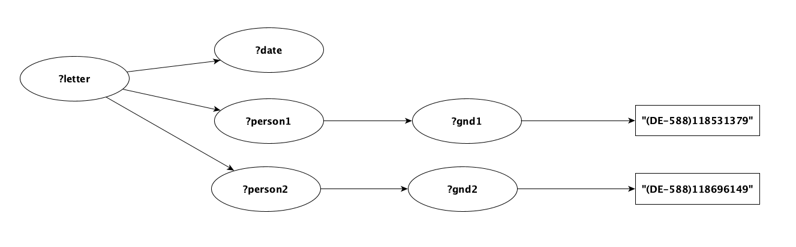

<!---
 * Copyright © 2021 - 2022 Swiss National Data and Service Center for the Humanities and/or DaSCH Service Platform contributors.
 * SPDX-License-Identifier: Apache-2.0
-->

# Gravsearch Design

For a detailed overview of Gravsearch, see
[Gravsearch: Transforming SPARQL to query humanities data](https://doi.org/10.3233/SW-200386).

## Gravsearch Package

The classes that process Gravsearch queries and results can be found in `org.knora.webapi.messages.util.search.gravsearch`.

## Type Inspection

The code that converts Gravserch queries into SPARQL queries, and processes the query results, needs to know the
types of the entities that are used in the input query. As explained in
[Type Inference](../../../03-apis/api-v2/query-language.md#type-inference), these types can be inferred,
or they can be specified in the query using type annotations.

Type inspection is implemented in the package `org.knora.webapi.messages.util.search.gravsearch.types`.
The entry point to this package is `GravsearchTypeInspectionRunner`, which is instantiated by `SearchResponderV2`.
The result of type inspection is a `GravsearchTypeInspectionResult`, in which each typeable entity in the input query is
associated with a `GravsearchEntityTypeInfo`, which can be either:

- A `PropertyTypeInfo`, which specifies the type of object that a property is expected to have.
- A `NonPropertyTypeInfo`, which specifies the type of a variable, or the type of an IRI representing a resource or value.

### Identifying Typeable Entities

After parsing a Gravsearch query, `SearchResponderV2` calls `GravsearchTypeInspectionRunner.inspectTypes`, passing
the WHERE clause of the input query. This method first identifies the entities whose types need to be determined. Each
of these entities is represented as a `TypeableEntity`. To do this, `GravsearchTypeInspectionRunner` uses `QueryTraverser`
to traverse the WHERE clause, collecting typeable entities in a visitor called `TypeableEntityCollectingWhereVisitor`.
The entities that are considered to need type information are:

- All variables.
- All IRIs except for those that represent type annotations or types.

### The Type Inspection Pipeline

`GravsearchTypeInspectionRunner` contains a pipeline of type inspectors, each of which extends `GravsearchTypeInspector`.
There are two type inspectors in the pipeline:

- `AnnotationReadingGravsearchTypeInspector`: reads
   [type annotations](../../../03-apis/api-v2/query-language.md#type-annotations) included in a Gravsearch query.
- `InferringGravsearchTypeInspector`: infers the types of entities from the context in which they are used, as well
  as from ontology information that it requests from `OntologyResponderV2`.

Each type inspector takes as input, and returns as output, an `IntermediateTypeInspectionResult`, which
associates each `TypeableEntity` with zero or more types. Initially, each `TypeableEntity` has no types. 
Each type inspector adds whatever types it finds for each entity. 

At the end of the pipeline, each entity should
have exactly one type. Therefore, to only keep the most specific type for an entity, 
the method `refineDeterminedTypes` refines the determined types by removing those that are base classes of others. However,
it can be that inconsistent types are determined for entities. For example, in cases where multiple resource class types 
are determined, but one is not a base class of the others. From the following statement 

```
{ ?document a beol:manuscript . } UNION { ?document a beol:letter .}
```

two inconsistent types can be inferred for `?document`: `beol:letter` and `beol:manuscript`.
In these cases, a sanitizer `sanitizeInconsistentResourceTypes` replaces the inconsistent resource types by 
their common base resource class (in the above example, it would be `beol:writtenSource`). 

Lastly, an error is returned if

- An entity's type could not be determined. The client must add a type annotation to make the query work.
- Inconsistent types could not be sanitized (an entity appears to have more than one type). The client must correct the query.

If there are no errors, `GravsearchTypeInspectionRunner` converts the pipeline's output to a
`GravsearchTypeInspectionResult`, in which each entity is associated with exactly one type.

#### AnnotationReadingGravsearchTypeInspector

This inspector uses `QueryTraverser` to traverse the WHERE clause, collecting type annotations in a visitor called
`AnnotationCollectingWhereVisitor`. It then converts each annotation to a `GravsearchEntityTypeInfo`.

#### InferringGravsearchTypeInspector

This inspector first uses `QueryTraverser` to traverse the WHERE clause, assembling an index of
usage information about typeable entities in a visitor called `UsageIndexCollectingWhereVisitor`. The `UsageIndex` contains,
for example, an index of all the entities that are used as subjects, predicates, or objects, along with the
statements in which they are used. It also contains sets of all the Knora class and property IRIs
that are used in the WHERE clause. `InferringGravsearchTypeInspector` then asks `OntologyResponderV2` for information
about those classes and properties, as well as about the classes that are subject types or object types of those properties.

Next, the inspector runs inference rules (which extend `InferenceRule`) on each `TypeableEntity`. Each rule
takes as input a `TypeableEntity`, the usage index, the ontology information, and the `IntermediateTypeInspectionResult`,
and returns a new `IntermediateTypeInspectionResult`. For example, `TypeOfObjectFromPropertyRule` infers an entity's type
if the entity is used as the object of a statement and the predicate's `knora-api:objectType` is known. For each `TypeableEntity`, 
if a type is inferred from a property, the entity and the inferred type are added to 
`IntermediateTypeInspectionResult.entitiesInferredFromProperty`.

The inference rules are run repeatedly, because the output of one rule may allow another rule to infer additional
information. There are two pipelines of rules: a pipeline for the first iteration of type inference, and a
pipeline for subsequent iterations. This is because some rules can return additional information if they are run
more than once on the same entity, while others cannot.

The number of iterations is limited to `InferringGravsearchTypeInspector.MAX_ITERATIONS`, but in practice
two iterations are sufficient for most realistic queries, and it is difficult to design a query that requires more than
six iterations.

## Transformation of a Gravsearch Query

A Gravsearch query submitted by the client is parsed by `GravsearchParser` and preprocessed by `GravsearchTypeInspector`
to get type information about the elements used in the query (resources, values, properties etc.)
and do some basic sanity checks.

In `SearchResponderV2`, two queries are generated from a given Gravsearch query: a prequery and a main query.

### Query Transformers

The Gravsearch query is passed to `QueryTraverser` along with a query transformer. Query transformers are classes
that implement traits supported by `QueryTraverser`:

- `WhereTransformer`: instructions how to convert statements in the WHERE clause of a SPARQL query (to generate the prequery's Where clause).

To improve query performance, this trait defines the method `optimiseQueryPatterns` whose implementation can call 
private methods to optimise the generated SPARQL. For example, before transformation of statements in WHERE clause, query 
pattern orders must be optimised by moving `LuceneQueryPatterns` to the beginning and `isDeleted` statement patterns to the end of the WHERE clause. 

- `ConstructToSelectTransformer` (extends `WhereTransformer`): instructions how to turn a Construct query into a Select query (converts a Gravsearch query into a prequery)
- `SelectToSelectTransformer` (extends `WhereTransformer`): instructions how to turn a triplestore independent Select query into a triplestore dependent Select query (implementation of inference).    
- `ConstructToConstructTransformer` (extends `WhereTransformer`): instructions how to turn a triplestore independent Construct query into a triplestore dependent Construct query (implementation of inference).

The traits listed above define methods that are implemented in the transformer classes and called by `QueryTraverser` to perform SPARQL to SPARQL conversions.
When iterating over the statements of the input query, the transformer class's transformation methods are called to perform the conversion.

### Prequery

The purpose of the prequery is to get an ordered collection of results representing only the IRIs of one page of matching resources and values.
Sort criteria can be submitted by the user, but the result is always deterministic also without sort criteria.
This is necessary to support paging.
A prequery is a SPARQL SELECT query.

The classes involved in generating prequeries can be found in `org.knora.webapi.messages.util.search.gravsearch.prequery`.

If the client submits a count query, the prequery returns the overall number of hits, but not the results themselves.

In a first step, before transforming the WHERE clause, query patterns must be further optimised by removing
the `rdfs:type` statement for entities whose type could be inferred from their use with a property IRI, since there would be no need 
for explicit `rdfs:type` statements for them (unless the property IRI from which the type of an entity must be inferred from 
is wrapped in an `OPTIONAL` block). This optimisation takes the Gravsearch query as input (rather than the generated SPARQL),
because it uses type information that refers to entities in the Gravsearch query, and the generated SPARQL might
have different entities.

Next, the Gravsearch query's WHERE clause is transformed and the prequery (SELECT and WHERE clause) is generated from this result.
The transformation of the Gravsearch query's WHERE clause relies on the implementation of the abstract class `AbstractPrequeryGenerator`.

`AbstractPrequeryGenerator` contains members whose state is changed during the iteration over the statements of the input query.
They can then by used to create the converted query.

- `mainResourceVariable: Option[QueryVariable]`: SPARQL variable representing the main resource of the input query. Present in the prequery's SELECT clause.
- `dependentResourceVariables: mutable.Set[QueryVariable]`: a set of SPARQL variables representing dependent resources in the input query. Used in an aggregation function in the prequery's SELECT clause (see below).
- `dependentResourceVariablesGroupConcat: Set[QueryVariable]`: a set of SPARQL variables representing an aggregation of dependent resources. Present in the prequery's SELECT clause.
- `valueObjectVariables: mutable.Set[QueryVariable]`: a set of SPARQL variables representing value objects. Used in an aggregation function in the prequery's SELECT clause (see below).
- `valueObjectVarsGroupConcat: Set[QueryVariable]`: a set of SPARQL variables representing an aggregation of value objects. Present in the prequery's SELECT clause.

The variables mentioned above are present in the prequery's result rows because they are part of the prequery's SELECT clause.

The following example illustrates the handling of variables.
The following Gravsearch query looks for pages with a sequence number of 10 that are part of a book:

```sparql
PREFIX incunabula: <http://0.0.0.0:3333/ontology/0803/incunabula/simple/v2#>
PREFIX knora-api: <http://api.knora.org/ontology/knora-api/simple/v2#>

    CONSTRUCT {
        ?page knora-api:isMainResource true .

        ?page knora-api:isPartOf ?book .

        ?page incunabula:seqnum ?seqnum .
    } WHERE {

        ?page a incunabula:page .

        ?page knora-api:isPartOf ?book .

        ?book a incunabula:book .

        ?page incunabula:seqnum ?seqnum .

        FILTER(?seqnum = 10)

    }
```

The prequery's SELECT clause is built by
`NonTriplestoreSpecificGravsearchToPrequeryTransformer.getSelectColumns`,
based on the variables used in the input query's `CONSTRUCT` clause.
The resulting SELECT clause looks as follows:

```sparql
SELECT DISTINCT
    ?page
    (GROUP_CONCAT(DISTINCT(IF(BOUND(?book), STR(?book), "")); SEPARATOR='') AS ?book__Concat)
    (GROUP_CONCAT(DISTINCT(IF(BOUND(?seqnum), STR(?seqnum), "")); SEPARATOR='') AS ?seqnum__Concat)
    (GROUP_CONCAT(DISTINCT(IF(BOUND(?book__LinkValue), STR(?book__LinkValue), "")); SEPARATOR='') AS ?book__LinkValue__Concat)
    WHERE {...}
    GROUP BY ?page
    ORDER BY ASC(?page)
    LIMIT 25
```

`?page` represents the main resource. When accessing the prequery's result rows, `?page` contains the IRI of the main resource.
The prequery's results are grouped by the main resource so that there is exactly one result row per matching main resource.
`?page` is also used as a sort criterion although none has been defined in the input query.
This is necessary to make paging work: results always have to be returned in the same order (the prequery is always deterministic).
Like this, results can be fetched page by page using LIMIT and OFFSET.

Grouping by main resource requires other results to be aggregated using the function `GROUP_CONCAT`.
`?book` is used as an argument of the aggregation function.
The aggregation's result is accessible in the prequery's result rows as `?book__Concat`.
The variable `?book` is bound to an IRI.
Since more than one IRI could be bound to a variable representing a dependent resource, the results have to be aggregated.
`GROUP_CONCAT` takes two arguments: a collection of strings (IRIs in our use case) and a separator
(we use the non-printing Unicode character `INFORMATION SEPARATOR ONE`).
When accessing `?book__Concat` in the prequery's results containing the IRIs of dependent resources, the string has to be split with the separator used in the aggregation function.
The result is a collection of IRIs representing dependent resources.
The same logic applies to value objects.

Each `GROUP_CONCAT` checks whether the concatenated variable is bound in each result in the group; if a variable
is unbound, we concatenate an empty string. This is necessary because, in Apache Jena (and perhaps other
triplestores), "If `GROUP_CONCAT` has an unbound value in the list of values to concat, the overall result is 'error'"
(see [this Jena issue](https://issues.apache.org/jira/browse/JENA-1856)).

If the input query contains a `UNION`, and a variable is bound in one branch
of the `UNION` and not in another branch, it is possible that the prequery
will return more than one row per main resource. To deal with this situation,
`SearchResponderV2` merges rows that contain the same main resource IRI.

### Main Query

The purpose of the main query is to get all requested information about the main resource, dependent resources, and value objects.
The IRIs of those resources and value objects were returned by the prequery.
Since the prequery only returns resources and value objects matching the input query's criteria,
the main query can specifically ask for more detailed information on these resources and values without having to reconsider these criteria.

#### Generating the Main Query

The classes involved in generating the main query can be found in
`org.knora.webapi.messages.util.search.gravsearch.mainquery`.

The main query is a SPARQL CONSTRUCT query. Its generation is handled by the
method `GravsearchMainQueryGenerator.createMainQuery`.
It takes three arguments:
`mainResourceIris: Set[IriRef], dependentResourceIris: Set[IriRef], valueObjectIris: Set[IRI]`.

These sets are constructed based on information about variables representing
dependent resources and value objects in the prequery, which is provided by
`NonTriplestoreSpecificGravsearchToPrequeryTransformer`:

- `dependentResourceVariablesGroupConcat`: `Set(QueryVariable(book__Concat))`
- `valueObjectVariablesGroupConcat`: `Set(QueryVariable(seqnum__Concat), QueryVariable(book__LinkValue__Concat))`

From the given Iris, statements are
generated that ask for complete information on *exactly* these resources and
values. For any given resource Iri, only the values present in
`valueObjectIris` are to be queried. This is achieved by using SPARQL's
`VALUES` expression for the main resource and dependent resources as well as
for values.

#### Processing the Main Query's results

To do the permission checking, the results of the main query are passed to
`ConstructResponseUtilV2.splitMainResourcesAndValueRdfData`,
which transforms a `SparqlConstructResponse` (a set of RDF triples)
into a structure organized by main resource Iris. In this structure, dependent
resources and values are nested and can be accessed via their main resource,
and resources and values that the user does not have permission to see are
filtered out. As a result, a page of results may contain fewer than the maximum
allowed number of results per page, even if more pages of results are available.

`MainQueryResultProcessor.getRequestedValuesFromResultsWithFullGraphPattern`
then filters out values that the user did not explicitly ask for in the input
query.

Finally, `ConstructResponseUtilV2.createApiResponse` transforms the query
results into an API response (a `ReadResourcesSequenceV2`). If the number
of main resources found (even if filtered out because of permissions) is equal
to the maximum allowed page size, the predicate
`knora-api:mayHaveMoreResults: true` is included in the response.

## Inference

Gravsearch queries support a subset of RDFS reasoning
(see [Inference](../../../03-apis/api-v2/query-language.md#inference) in the API documentation
on Gravsearch). This is implemented as follows:

When the non-triplestore-specific version of a SPARQL query is generated, statements that do not need
inference are marked with the virtual named graph `<http://www.knora.org/explicit>`.

When the triplestore-specific version of the query is generated:

- If the triplestore is GraphDB, `SparqlTransformer.transformKnoraExplicitToGraphDBExplicit` changes statements
  with the virtual graph `<http://www.knora.org/explicit>` so that they are marked with the GraphDB-specific graph
  `<http://www.ontotext.com/explicit>`, and leaves other statements unchanged. 
  `SparqlTransformer.transformKnoraExplicitToGraphDBExplicit` also adds the `valueHasString` statements which GraphDB needs 
  for text searches.

- If Knora is not using the triplestore's inference (e.g. with Fuseki),
  `SparqlTransformer.transformStatementInWhereForNoInference` removes `<http://www.knora.org/explicit>`, and expands unmarked
  statements using `rdfs:subClassOf*` and `rdfs:subPropertyOf*`.

Gravsearch also provides some virtual properties, which take advantage of forward-chaining inference
as an optimisation if the triplestore provides it. For example, the virtual property
`knora-api:standoffTagHasStartAncestor` is equivalent to `knora-base:standoffTagHasStartParent*`. If Knora is not using the triplestore's inference, `SparqlTransformer.transformStatementInWhereForNoInference`
replaces `knora-api:standoffTagHasStartAncestor` with `knora-base:standoffTagHasStartParent*`.

# Optimisation of generated SPARQL

The triplestore-specific transformers in `SparqlTransformer.scala` can run optimisations on the generated SPARQL, in
the method `optimiseQueryPatterns` inherited from `WhereTransformer`. For example, `moveLuceneToBeginning` moves
Lucene queries to the beginning of the block in which they occur.

## Query Optimization by Topological Sorting of Statements

GraphDB seems to have inherent algorithms to optimize the query time, however query performance of Fuseki highly depends 
on the order of the query statements. For example, a query such as the one below:

```sparql
PREFIX beol: <http://0.0.0.0:3333/ontology/0801/beol/v2#>
PREFIX knora-api: <http://api.knora.org/ontology/knora-api/v2#>

CONSTRUCT {
  ?letter knora-api:isMainResource true .
  ?letter ?linkingProp1  ?person1 .
  ?letter ?linkingProp2  ?person2 .
  ?letter beol:creationDate ?date .
} WHERE {
  ?letter beol:creationDate ?date .

  ?letter ?linkingProp1 ?person1 .
  FILTER(?linkingProp1 = beol:hasAuthor || ?linkingProp1 = beol:hasRecipient )

  ?letter ?linkingProp2 ?person2 .
  FILTER(?linkingProp2 = beol:hasAuthor || ?linkingProp2 = beol:hasRecipient )

  ?person1 beol:hasIAFIdentifier ?gnd1 .
  ?gnd1 knora-api:valueAsString "(DE-588)118531379" .

  ?person2 beol:hasIAFIdentifier ?gnd2 .
  ?gnd2 knora-api:valueAsString "(DE-588)118696149" .
} ORDER BY ?date
```

takes a very long time with Fuseki. The performance of this query can be improved
by moving up the statements with literal objects that are not dependent on any other statement:

```
  ?gnd1 knora-api:valueAsString "(DE-588)118531379" .
  ?gnd2 knora-api:valueAsString "(DE-588)118696149" .
```

The rest of the query then reads:

```
  ?person1 beol:hasIAFIdentifier ?gnd1 .
  ?person2 beol:hasIAFIdentifier ?gnd2 .
  ?letter ?linkingProp1 ?person1 .
  FILTER(?linkingProp1 = beol:hasAuthor || ?linkingProp1 = beol:hasRecipient )

  ?letter ?linkingProp2 ?person2 .
  FILTER(?linkingProp2 = beol:hasAuthor || ?linkingProp2 = beol:hasRecipient )
 ?letter beol:creationDate ?date .
```

Since we cannot expect clients to know about performance of triplestores in order to write efficient queries, we have 
implemented an optimization method to automatically rearrange the statements of the given queries. 
Upon receiving the Gravsearch query, the algorithm converts the query to a graph. For each statement pattern,
the subject of the statement is the origin node, the predicate is a directed edge, and the object 
is the target node. For the query above, this conversion would result in the following graph:



The [Graph for Scala](http://www.scala-graph.org/) library is used to construct the graph and sort it using [Kahn's 
topological sorting algorithm](https://en.wikipedia.org/wiki/Topological_sorting#Kahn's_algorithm).

The algorithm returns the nodes of the graph ordered in several layers, where the 
root element `?letter` is in layer 0, `[?date, ?person1, ?person2]` are in layer 1, `[?gnd1, ?gnd2]` in layer 2, and the 
leaf nodes `[(DE-588)118531379, (DE-588)118696149]` are given in the last layer (i.e. layer 3). 
According to Kahn's algorithm, there are multiple valid permutations of the topological order. The graph in the example 
 above has 24 valid permutations of topological order. Here are two of them (nodes are ordered from left to right with the highest 
 order to the lowest):
 
- `(?letter, ?date, ?person2, ?person1, ?gnd2, ?gnd1, (DE-588)118696149, (DE-588)118531379)`   
- `(?letter, ?date, ?person1, ?person2, ?gnd1, ?gnd2, (DE-588)118531379, (DE-588)118696149)`.   

From all valid topological orders, one is chosen based on certain criteria; for example, the leaf should node should not 
belong to a statement that has predicate `rdf:type`, since that could match all resources of the specified type.
Once the best order is chosen, it is used to re-arrange the query 
statements. Starting from the last leaf node, i.e. 
`(DE-588)118696149`, the method finds the statement pattern which has this node as its object, and brings this statement 
to the top of the query. This rearrangement continues so that the statements with the fewest dependencies on other 
statements are all brought to the top of the query. The resulting query is as follows:

```sparql
PREFIX beol: <http://0.0.0.0:3333/ontology/0801/beol/v2#>
PREFIX knora-api: <http://api.knora.org/ontology/knora-api/v2#>

CONSTRUCT {
  ?letter knora-api:isMainResource true .
  ?letter ?linkingProp1  ?person1 .
  ?letter ?linkingProp2  ?person2 .
  ?letter beol:creationDate ?date .
} WHERE {
  ?gnd2 knora-api:valueAsString "(DE-588)118696149" .
  ?gnd1 knora-api:valueAsString "(DE-588)118531379" .
  ?person2 beol:hasIAFIdentifier ?gnd2 .
  ?person1 beol:hasIAFIdentifier ?gnd1 .
  ?letter ?linkingProp2 ?person2 .
  ?letter ?linkingProp1 ?person1 .
  ?letter beol:creationDate ?date .
  FILTER(?linkingProp1 = beol:hasAuthor || ?linkingProp1 = beol:hasRecipient )
  FILTER(?linkingProp2 = beol:hasAuthor || ?linkingProp2 = beol:hasRecipient )
} ORDER BY ?date
```

Note that position of the FILTER statements does not play a significant role in the optimization. 

If a Gravsearch query contains statements in `UNION`, `OPTIONAL`, `MINUS`, or 
`FILTER NOT EXISTS`, they are reordered 
by defining a graph per block. For example, consider the following query with `UNION`:

```sparql
{
    ?thing anything:hasRichtext ?richtext .
    FILTER knora-api:matchText(?richtext, "test")
    ?thing anything:hasInteger ?int .
    ?int knora-api:intValueAsInt 1 .
}
UNION
{
    ?thing anything:hasText ?text .
    FILTER knora-api:matchText(?text, "test")
    ?thing anything:hasInteger ?int .
    ?int knora-api:intValueAsInt 3 .
}
```
This would result in one graph per block of the `UNION`. Each graph is then sorted, and the statements of its 
block are rearranged according to the topological order of graph. This is the result:

```sparql
{
   ?int knora-api:intValueAsInt 1 .
    ?thing anything:hasRichtext ?richtext .
    ?thing anything:hasInteger ?int .
    FILTER(knora-api:matchText(?richtext, "test"))
} UNION {
    ?int knora-api:intValueAsInt 3 .
    ?thing anything:hasText ?text .
    ?thing anything:hasInteger ?int .
    FILTER(knora-api:matchText(?text, "test"))
}
```

### Cyclic Graphs

The topological sorting algorithm can only be used for DAGs (directed acyclic graphs). However,
a Gravsearch query can contains statements that result in a cyclic graph, e.g.:

```
PREFIX anything: <http://0.0.0.0:3333/ontology/0001/anything/simple/v2#>
PREFIX knora-api: <http://api.knora.org/ontology/knora-api/simple/v2#>

CONSTRUCT {
    ?thing knora-api:isMainResource true .
} WHERE {
  ?thing anything:hasOtherThing ?thing1 .
  ?thing1 anything:hasOtherThing ?thing2 .
  ?thing2 anything:hasOtherThing ?thing . 

```

In this case, the algorithm tries to break the cycles in order to sort the graph. If this is not possible,
the query statements are not reordered.
