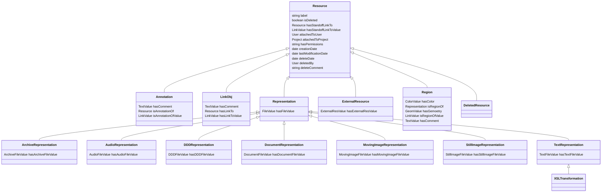
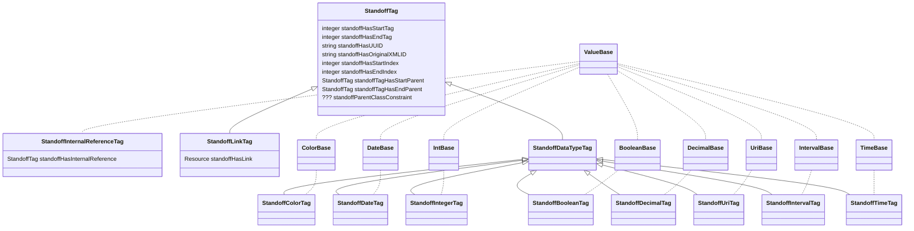
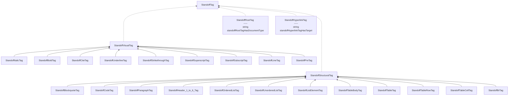
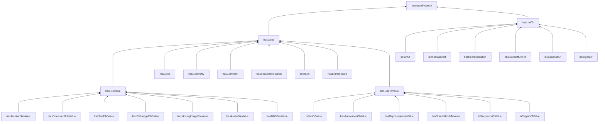
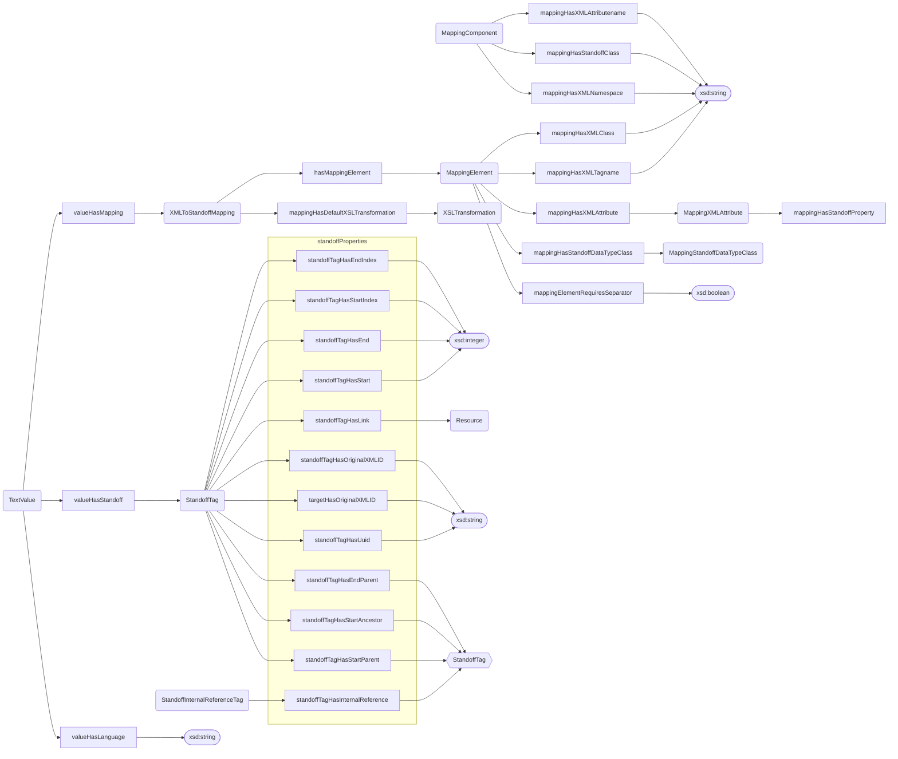
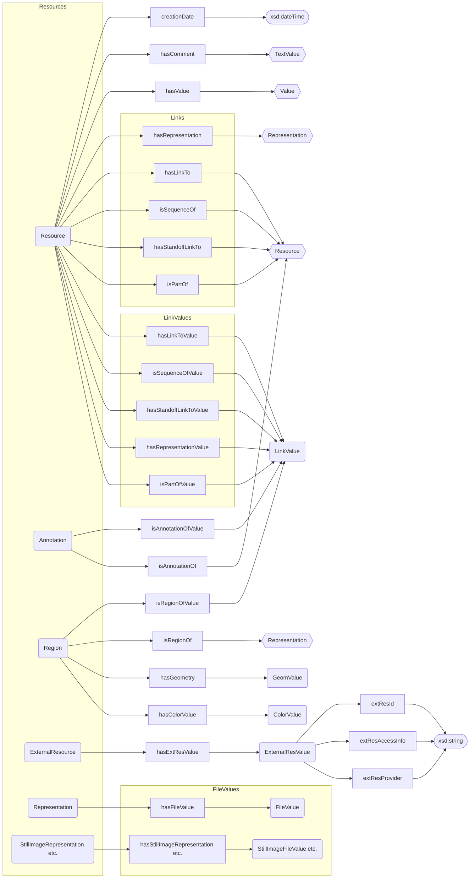
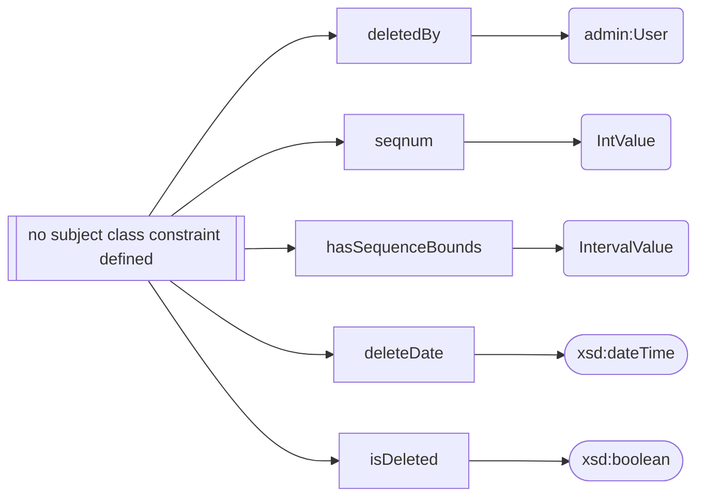

# Class and Property Hierarchies

## Class Hierarchy

While `knora-admin` and `salsah-gui` have relatively flat class hierarchies, 
in `knora-base` there are very complicated - yet highly relevant - inheritance structures. 
The following class diagrams try to model these structures. 
For the sake of comprehensibility, it was necessary to split the ontology into multiple diagrams,
even though this obliterates the evident connections between those diagrams.

### Resources

### Values

!!! Note "Legend"

    - doted lines: the boxes are copies from another diagram.

```mermaid
classDiagram
  %% Classes
  class Value {
    date valueCreationDate
    User attachedToUser
    string hasPermissions
    integer valueHasOrder
    string valueHasComment
    boolean isDeleted
    date deleteDate
    User deletedBy
    string deleteComment
    Value previousValue
    string valueHasString
    string valueHasUUID
  }
  class ColorBase {
    string valueHasColor
  }
  class DateBase {
    string valueHasCalendar
    string valueHasEndPrecision
    integer valueHasEndJDN
    string valueHasStartPrecision
    integer valueHasStartJDN
  }
  class IntBase {
    integer valueHasInteger
  }
  class BooleanBase {
    boolean valueHasBoolean
  }
  class DecimalBase {
    decimal valueHasDecimal
  }
  class UriBase {
    URI valueHasUri
  }
  class IntervalBase {
    decimal valueHasIntervalStart
    decimal valueHasIntervalEnd
  }
  class TimeBase {
    date valueHasTimeStamp
  }
  class ListValue {
    ListNode valueHasListNode
  }
  class TextValue {
    StandoffTag valueHasStandoff
    integer valueHasMaxStandoffStartIndex
    string valueHasLanguage
    XSLToStandoffMApping valueHasMapping
  }
  class LinkValue {
    integer valueHasRefCount
  }
  class GeomValue {
    string valueHasGeometry
  }
  class GeonameValue {
    string valueHasGeonameCode
  }
  class ExternalResValue {
    string extResId
    string extResProvider
    string extResAccessInfo
  }
  class FileValue {
    string internalFileName
    string internalMimeType
    string originalFileName
    string originalMimeType
  }
  class ArchiveFileValue {

  }
  class AudioFileValue {
    decimal duration
  }
  class DDDFileValue
  class DocumentFileValue {
    integer pageCount
    integer dimX
    integer dimY
  }
  class MovingImageFileValue
  class StillImageFileValue {
    integer dimX
    integer dimY
  }
  class TextFileValue


  %% Relationships
  ValueBase <|-- Value
  ValueBase <|-- ColorBase
  ValueBase <|-- DateBase
  ValueBase <|-- IntBase
  ValueBase <|-- BooleanBase
  ValueBase <|-- DecimalBase
  ValueBase <|-- UriBase
  ValueBase <|-- IntervalBase
  ValueBase <|-- TimeBase
  Value <|-- ListValue
  Value <|-- TextValue
  Value <|-- LinkValue
  Value <|-- GeomValue
  Value <|-- GeonameValue
  Value <|-- ExternalResValue
  Value <|-- FileValue
  Value <|-- DeletedValue
  Value <|-- ColorValue
  ColorBase <|-- ColorValue
  Value <|-- DateValue
  DateBase <|-- DateValue
  Value <|-- IntValue
  IntBase <|-- IntValue
  Value <|-- BooleanValue
  BooleanBase <|-- BooleanValue
  Value <|-- DecimalValue
  DecimalBase <|-- DecimalValue
  Value <|-- UriValue
  UriBase <|-- UriValue
  Value <|-- IntervalValue
  IntervalBase <|-- IntervalValue
  Value <|-- TimeValue
  TimeBase <|-- TimeValue
  FileValue <|-- ArchiveFileValue
  FileValue <|-- AudioFileValue
  FileValue <|-- DDDFileValue
  FileValue <|-- DocumentFileValue
  FileValue <|-- MovingImageFileValue
  FileValue <|-- StillImageFileValue
  FileValue <|-- TextFileValue
  ValueBase .. StandoffInternalReferenceTag
  ColorBase .. StandoffColorTag
  DateBase .. StandoffDateTag
  IntBase .. StandoffIntegerTag
  BooleanBase .. StandoffBooleanTag
  DecimalBase .. StandoffDecimalTag
  UriBase .. StandoffUriTag
  IntervalBase .. StandoffIntervalTag
  TimeBase .. StandoffTimeTag
```

### Standoff in knora-base

### Standoff Ontology

## Property Hierarchy

### Properties and Values

### Resource Metadata

```mermaid
flowchart BT
  creationDate ---> objectCannotBeMarkedAsDeleted
  deleteDate --> objectCannotBeMarkedAsDeleted
  isDeleted ---> objectCannotBeMarkedAsDeleted
  isRootNode ---> objectCannotBeMarkedAsDeleted
  hasRootNode ---> objectCannotBeMarkedAsDeleted
  lastModificationDate ---> objectCannotBeMarkedAsDeleted
  listNodePosition ---> objectCannotBeMarkedAsDeleted
  listNodeName ---> objectCannotBeMarkedAsDeleted
  deleteComment ---> objectCannotBeMarkedAsDeleted
  hasPermissions ---> objectCannotBeMarkedAsDeleted
  deletedBy --> objectCannotBeMarkedAsDeleted
  standoffTagHasLink ---> objectCannotBeMarkedAsDeleted 
  hasSubListNode --> objectCannotBeMarkedAsDeleted
  standoffTagHasEnd ---> objectCannotBeMarkedAsDeleted
  standoffTagHasInternalReference --> objectCannotBeMarkedAsDeleted 
  valueHas ----> objectCannotBeMarkedAsDeleted
  standoffTagHasStart --> objectCannotBeMarkedAsDeleted 
  standoffTagHasStartIndex ---> objectCannotBeMarkedAsDeleted
  standoffTagHasEndIndex --> objectCannotBeMarkedAsDeleted
  standoffTagHasUuid ---> objectCannotBeMarkedAsDeleted
  standoffTagHasEndParent --> objectCannotBeMarkedAsDeleted
  standoffTagHasOriginalXMLID ---> objectCannotBeMarkedAsDeleted
  targetHasOriginalXMLID --> objectCannotBeMarkedAsDeleted
  standoffTagHasStartAncestor ----> objectCannotBeMarkedAsDeleted 
  standoffTagHasStartParent --> objectCannotBeMarkedAsDeleted
  standoffTagHasStartParent --> standoffTagHasStartAncestor
  hasMappingElement ---> objectCannotBeMarkedAsDeleted
  mappingHasXMLTagname --> objectCannotBeMarkedAsDeleted
  mappingHasXMLNamespace ---> objectCannotBeMarkedAsDeleted
  mappingHasXMLClass --> objectCannotBeMarkedAsDeleted
  mappingHasStandoffClass ---> objectCannotBeMarkedAsDeleted
  mappingHasXMLAttribute --> objectCannotBeMarkedAsDeleted
  mappingHasXMLAttributename ---> objectCannotBeMarkedAsDeleted
  mappingHasStandoffProperty --> objectCannotBeMarkedAsDeleted
  mappingHasStandoffDataTypeClass ---> objectCannotBeMarkedAsDeleted
  mappingElementRequiresSeparator --> objectCannotBeMarkedAsDeleted
  mappingHasDefaultXSLTransformation ---> objectCannotBeMarkedAsDeleted

  duration --> valueHas
  pageCount ---> valueHas
  dimY --> valueHas
  dimX ---> valueHas
  valueHasStandoff --> valueHas
  valueHasMaxStandoffStartIndex ---> valueHas
  previousValue --> valueHas
  ValueHasMapping ---> valueHas
  extResAccessInfo --> valueHas
  extResId ---> valueHas
  extResProvider --> valueHas
  fps ---> valueHas
  internalFilename --> valueHas
  internalMimeType ---> valueHas
  originalFilename ---> valueHas
  originalMimeType ---> valueHas
  valueHasComment ---> valueHas
  valueCreationDate ---> valueHas
  valueHasUUID ---> valueHas
  valueHasCalendar ---> valueHas
  valueHasColor ---> valueHas
  valueHasEndJDN ---> valueHas
  valueHasEndPrecision ---> valueHas
  valueHasDecimal ---> valueHas
  valueHasGeometry ---> valueHas
  valueHasGeonameCode ---> valueHas
  valueHasInteger ---> valueHas
  valueHasBoolean ---> valueHas
  valueHasUri ---> valueHas
  valueHasIntervalEnd ---> valueHas
  valueHasIntervalStart ---> valueHas
  valueHasTimeStamp ---> valueHas
  valueHasListNode ---> valueHas
  valueHasOrder ---> valueHas
  valueHasRefCount ---> valueHas
  valueHasStartJDN ---> valueHas
  valueHasStartPrecision ---> valueHas
  valueHasString ---> valueHas

  valueHasLanguage
```

## Property Triple Structure

### Text Related Triples

### Resource Triples Structure

!!! Note "Legend"

    - round boxes: resources
    - square boxes: properties
    - hexagonal boxes: resoures that are duplicated for graphical reasons
    - oval boxes: xsd values
    - grey squares: thematic units

### Properties without Subject Class Constraint

