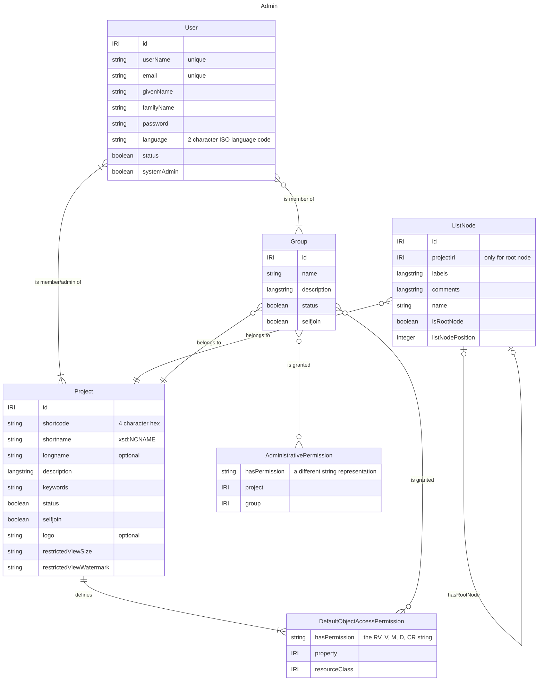
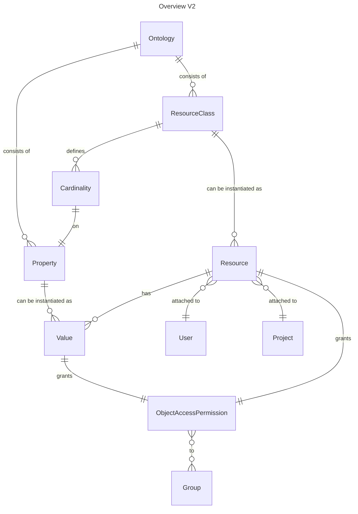
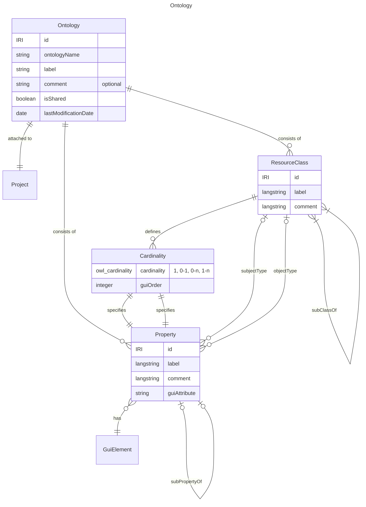
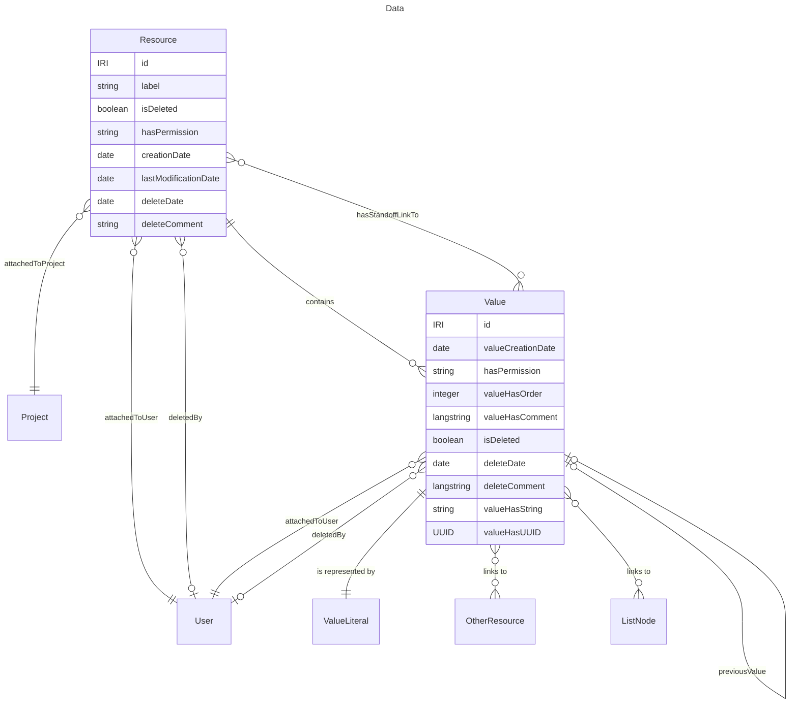

# Domain Entities and Relations

In the context of [DEV-1415: Domain Model](https://linear.app/dasch/project/domain-model-e39ceb242242)
we attempted to gain a clear overview over the DSP's domain,
as implicitly modelled by the ontologies, code, validations and documentation of the DSP-API.

The following document aims to give a higher level overview of said domain.

!!! Note

    - As a high level overview, this document does not aim for exhaustivity.
    - Naming is tried to be kept as simple as possible, 
      while trying to consolidate different naming schemes
      (ontologies, code, API),
      which in result means that no naming scheme is strictly followed.
    - The split between V2 and Admin is arbitrary as those are intertwined within the system.
      It merely serves the purpose of organizing the presented entities.

## Domain Entities

The following Entity-Relationship-Diagrams visualize the top level entities present in the DSP. 
The attributes of these entities should be exhaustive; 
cardinalities or validation constraints are normally not depicted. 
The indicated relationships are of conceptual nature and are more complicated in the actual system.

!!! danger "Unclear/Unexpected Stuff"

    - User.phone?
    - Institution? (name, description, website, phone, address, email)
    - Project.belongsToInstitution?

