# Domain Model

In the context of [DEV-1415: Domain Model](https://linear.app/dasch/project/domain-model-e39ceb242242)
we attempted to gain a clear overview over the DSP's domain,
as implicitly modelled by the ontologies, code, validations and documentation of the DSP-API.

The following document aims to give a higher level overview of said domain.

!!! Note

    - As a high level overview, this document does not aim for exhaustivity.
    - Naming is tried to be kept as simple as possible, 
      while trying to consolidate different naming schemes
      (ontologies, code, API),
      which in result means that no naming scheme is strictly followed.
    - The split between V2 and Admin is arbitrary as those are intertwined within the system.
      It merely serves the purpose of organizing the presented entities.

## Domain Entities

The following Entity-Relationship-Diagrams visualize the top level entities present in the DSP. 
The attributes of these entities should be exhaustive; 
cardinalities or validation constraints are normally not depicted. 
The indicated relationships are of conceptual nature and are more complicated in the actual system.

!!! danger "Unclear/Unexpected Stuff"

    - User.phone?
    - Institution? (name, description, website, phone, address, email)
    - Project.belongsToInstitution?

## System Instances of Classes

Apart from class and property definitions, 
`knora-base` and `knora-admin` also provide a small number of class instances 
that should be present in any running DSP stack:

## Class Hierarchy

While `knora-admin` and `salsah-gui` have relatively flat class hierarchies, 
in `knora-base` there are very complicated - yet highly relevant - inheritance structures. 
The following class diagrams try to model these structures. 
For the sake of comprehensibility, it was necessary to split the ontology into multiple diagrams,
even though this obliterates the evident connections between those diagrams.

```mermaid
---
title: Values
---
classDiagram
  %% Classes
  class Value {
    date valueCreationDate
    User attachedToUser
    string hasPermissions
    integer valueHasOrder
    string valueHasComment
    boolean isDeleted
    date deleteDate
    User deletedBy
    string deleteComment
    Value previousValue
    string valueHasString
    string valueHasUUID
  }
  class ColorBase {
    string valueHasColor
  }
  class DateBase {
    string valueHasCalendar
    string valueHasEndPrecision
    integer valueHasEndJDN
    string valueHasStartPrecision
    integer valueHasStartJDN
  }
  class IntBase {
    integer valueHasInteger
  }
  class BooleanBase {
    boolean valueHasBoolean
  }
  class DecimalBase {
    decimal valueHasDecimal
  }
  class UriBase {
    URI valueHasUri
  }
  class IntervalBase {
    decimal valueHasIntervalStart
    decimal valueHasIntervalEnd
  }
  class TimeBase {
    date valueHasTimeStamp
  }
  class ListValue {
    ListNode valueHasListNode
  }
  class TextValue {
    StandoffTag valueHasStandoff
    integer valueHasMaxStandoffStartIndex
    string valueHasLanguage
    XSLToStandoffMApping valueHasMapping
  }
  class LinkValue {
    integer valueHasRefCount
  }
  class GeomValue {
    string valueHasGeometry
  }
  class GeonameValue {
    string valueHasGeonameCode
  }
  class ExternalResValue {
    string extResId
    string extResProvider
    string extResAccessInfo
  }
  class FileValue {
    string internalFileName
    string internalMimeType
    string originalFileName
    string originalMimeType
  }

  %% Relationships
  ValueBase <|-- Value
  ValueBase <|-- ColorBase
  ValueBase <|-- DateBase
  ValueBase <|-- IntBase
  ValueBase <|-- BooleanBase
  ValueBase <|-- DecimalBase
  ValueBase <|-- UriBase
  ValueBase <|-- IntervalBase
  ValueBase <|-- TimeBase
  Value <|-- ListValue
  Value <|-- TextValue
  Value <|-- LinkValue
  Value <|-- GeomValue
  Value <|-- GeonameValue
  Value <|-- ExternalResValue
  Value <|-- FileValue
  Value <|-- DeletedValue
  Value <|-- ColorValue
  ColorBase <|-- ColorValue
  Value <|-- DateValue
  DateBase <|-- DateValue
  Value <|-- IntValue
  IntBase <|-- IntValue
  Value <|-- BooleanValue
  BooleanBase <|-- BooleanValue
  Value <|-- DecimalValue
  DecimalBase <|-- DecimalValue
  Value <|-- UriValue
  UriBase <|-- UriValue
  Value <|-- IntervalValue
  IntervalBase <|-- IntervalValue
  Value <|-- TimeValue
  TimeBase <|-- TimeValue
  FileValue <|-- ArchiveFileValue
  FileValue <|-- AudioFileValue
  FileValue <|-- DDDFileValue
  FileValue <|-- DocumentFileValue
  FileValue <|-- MovingImageFileValue
  FileValue <|-- StillImageFileValue
  FileValue <|-- TextFileValue
```

## Domain User Stories

The following section provides a list of use cases / user stories. 
They should ideally cover all cases of what a user may want to do when they interact with the DSP.

!!! info "Legend"

    The different bullet points mean:

    - [ ] Not yet possible
    - [x] Fully implemented
    - partially implemented / needs checking

  - Administration
      - User Administration
          - Join the DSP as a user  
            Currently no self-sign-up, only system admins can add users.
          - [x] Add team members to a project  
          - [x] Remove team members from project  
          - Create groups with certain permissions attached
          - Modify permissions for a group
          - [x] Add project members to groups for for giving users particular permissions  
          - [x] Remove project members from groups
      - Project Administration
          - Create a project  
            Only possible for system administrators.
          - [x] Delete a project
          - Define default object access permissions for the project
          - Update Project metadata
              - [x] in DSP
              - in META  
                Only possible through the DSP-META repo
  - Data Modeling
      - [x] Add one or more data models (ontologies) to a project
      - [x] Update ontology metadata
      - [x] Add Resource Classes to a datamodel
      - Change resource classes
      - [x] Delete Resource classes
      - [x] Define reuseable properties for a datamodel
      - Edit properties
      - [x] Delete properties
      - [x] Add properties to a resource class with a defined cardinality
      - [x] Remove properties from a resource class
      - Change the cardinality of a property on a resource class
  - Data Generation
      - [x] Creating Resources
      - Updating Resources
          - changing the resource type
          - [x] adding values
          - [x] updating values
          - annotating/commenting on values
          - [x] deleting values
      - Linking Resources
          - [x] to other project resources
          - to external resources
      - Annotating/Commenting on Resources
      - [x] Deleting Resources
    - [ ] Data Archiving
        - [ ] Publish the existing data  
          Only possible through changing permissions (which App doesn't allow)
        - [ ] Archive it as a fixed, stable version  
          Currently not possible
  - Data Reuse
      - Browsing
          - [x] Browse Projects
          - [x] Browse Project Metadata
          - Inspect a projects datamodel(s)
          - Browse a projects data
              - [ ] all data
              - [x] by resource class
              - [ ] matching filters/facettes
      - [x] Searching  
        With the caveat that certain searches that are possible may not be good, fast or intuitive
          - [x] Search for projects covering a certain topic
          - [x] Search for a project of which one knows it already exists
          - [x] Search for a datapoint of which one already knows it exists
          - [x] Search for data matching criteria within a project
          - [x] Search for data matching criteria across projects
      - Programmatic reuse
          - [ ] download datasets/corpora as a dump (ideally in diverse formats)
          - [x] retrieve data matching certain search/filter criteria
          - [x] retrieve single resources/values by identifiers
