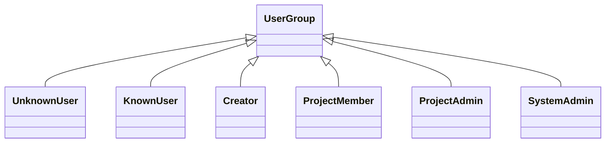
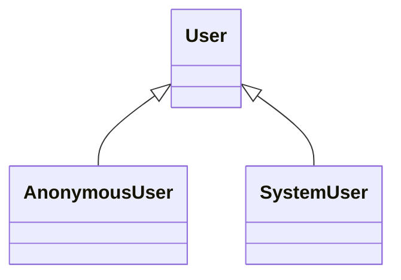
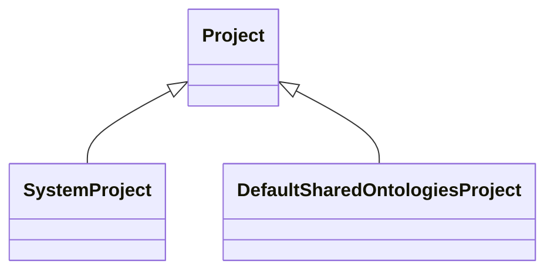

# System Instances

Apart from class and property definitions, 
`knora-base` and `knora-admin` provide a small number of class instances 
that should be present in any running DSP stack:

## Built-in User Groups

## Built-in Users

## Built-in Projects

