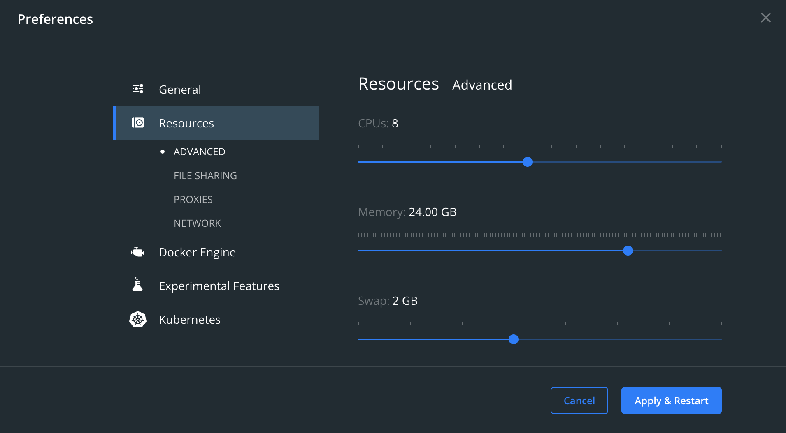
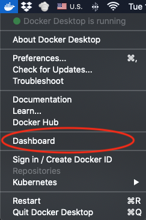
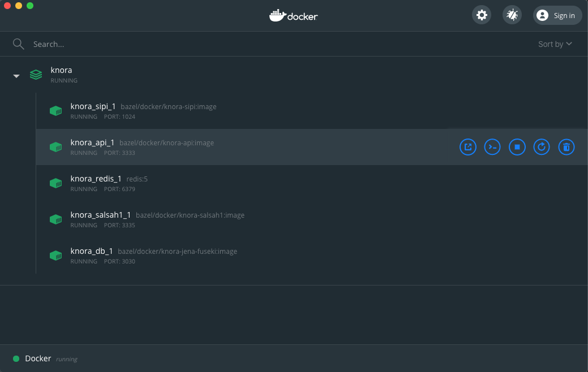
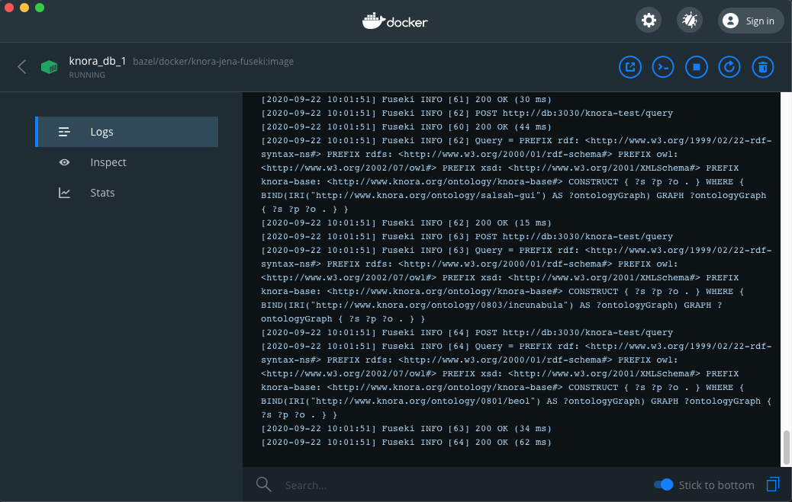
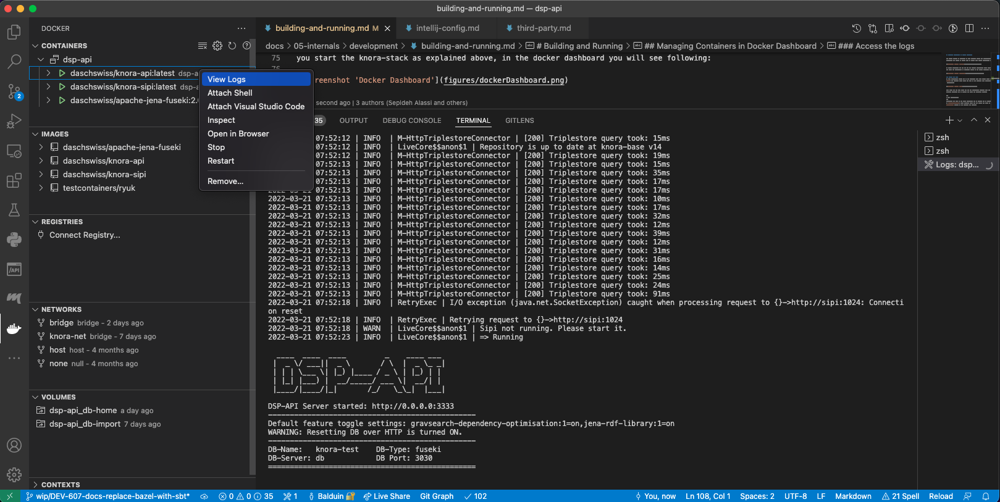

# Building and Running

## Setting up Docker

1. Install [Docker](https://www.docker.com/)
2. Go to Docker preferences and increase the memory allocation.
   
   The stack's memory usage is limited to ~20GB, though it should only use that much during heavy workloads. You should
   be good to go in any case if you allocate 22GB or more.

## Running the stack

With Docker installed and configured,

1. Run the following:

   ```bash
   just init-db-test
   ```

   to initialize Fuseki's dsp-repo dataset with loading some test data into the triplestore 

1. Start the entire knora-stack (fuseki (db), sipi, api, salsah1) with the following command:

   ```bash
   just stack-up
   ```

**_Note_**: To delete the existing containers and for a clean start, before creating the knora-test repository explained
in the first step above, run the following:

```bash
just stack-down-delete-volumes
```

This stops the knora-stack and deletes any created volumes (deletes the database!).

To only shut down the Knora-Stack without deleting the containers:

```bash
just stack-down
```

To restart the knora-api use the following command:

```bash
just stack-restart-api
```

If a change is made to knora-api code, only its image needs to be rebuilt. In that case, use

```bash
just stack-up-fast
```

which starts the knora-stack by skipping rebuilding most of the images (only api image is rebuilt).

## Managing Containers in Docker Dashboard

The Docker Desktop is installed on your computer during the installation of docker, it enables easy management of docker
containers and access to Docker Hub. To manage your docker containers, docker desktop provides a dashbord.



In docker dashboard, you can see all the running containers, stop, start, restart, or completely delete them. For
example, when
you start the knora-stack as explained above, in the docker dashboard you will see following:



### Access the logs

To read information logged out of any container (db, api, etc.), click on the container in the dashboard and choose
`logs`. The example, below shows the logs of the database (db) container that includes the last SPARQL query sent to the
triplestore.



Note that, you can also print out the log information directly from the command line. For example, the same logs of the
database container can be printed out using the following command:

```bash
just stack-logs-db
```

Similarly, the logs of the other containers can be printed out by running `just stack-logs-api`
or `just stack-logs-sipi`.
These commands print out and follow the logs, to only print the logs out without following, use
`-no-follow` version of the commands for example:

```bash
just stack-logs-db-no-follow
```

Lastly, to print out the entire logs of the running knora-stack, use

```bash
just stack-logs
```

With the Docker plugin installed, you can attach a terminal to the docker container within VS Code. This will stream the
docker logs to the terminal window of the editor.



The docker plugin also allows for a number of other useful features, like inspecting the container's file system or
attaching a shell to the container.

## Running against the dev database

When changes are hard to test with local test data (e.g. they need realistic data), you can run the API locally against the remote dev Fuseki triplestore:

1. Create a `.env` file in the repo root with `DEV_DB_PASSWORD=<password>` (this file is git-ignored). Passwords can be found in [ops-deploy/host_vars](https://github.com/dasch-swiss/ops-deploy/tree/main/host_vars).
2. Run:

   ```bash
   just run-with-dev-db
   ```

3. The API will start connected to `db.dev.dasch.swiss` via HTTPS.

## Running the automated tests

To run all test targets, use the following in the command line:

```bash
just test-unit test-it test-e2e
```

To run a single test from the command line, for example `SearchV2R2RSpec`,
run the following:

```bash
sbt " webapi / testOnly *SearchV2R2RSpec* "
```

_**Note:** to run tests, the api container must be stopped first!_

## Build and Publish Documentation

First, you need to install the requirements through:

```bash
just docs-install-requirements
```

Then, to build docs into the local `site` folder, run the following command:

```bash
just docs-build
```

At this point, you can serve the docs to view them locally using

```bash
just docs-serve
```

Documentation is published to GitHub Pages automatically by CI (`.github/workflows/publish-docs.yml`) on merge to `main`.

## Build and Publish Docker Images

To build and publish all Docker images locally

```bash
just docker-build
```

To publish all Docker images to Dockerhub

```bash
just docker-publish
```

## Continuous Integration

For continuous integration testing, we use Github CI Actions. Every commit
pushed to the git repository or every pull request, triggers the build.
Additionally, in Github there is a small checkmark beside every commit,
signaling the status of the build (successful, unsuccessful, ongoing).

The build that is executed on Github CI Actions is defined in the `.github/workflows/*.yml` files.

## Webapi Server Startup-Flags

The Webapi-Server can be started with a number of flags.

### `loadDemoData` - Flag

When the webapi-server is started with the `loadDemoData` flag, then at
startup, the data which is configured in `application.conf` under the
`app.triplestore.rdf-data` key is loaded into the triplestore, and any
data in the triplestore is removed beforehand.
