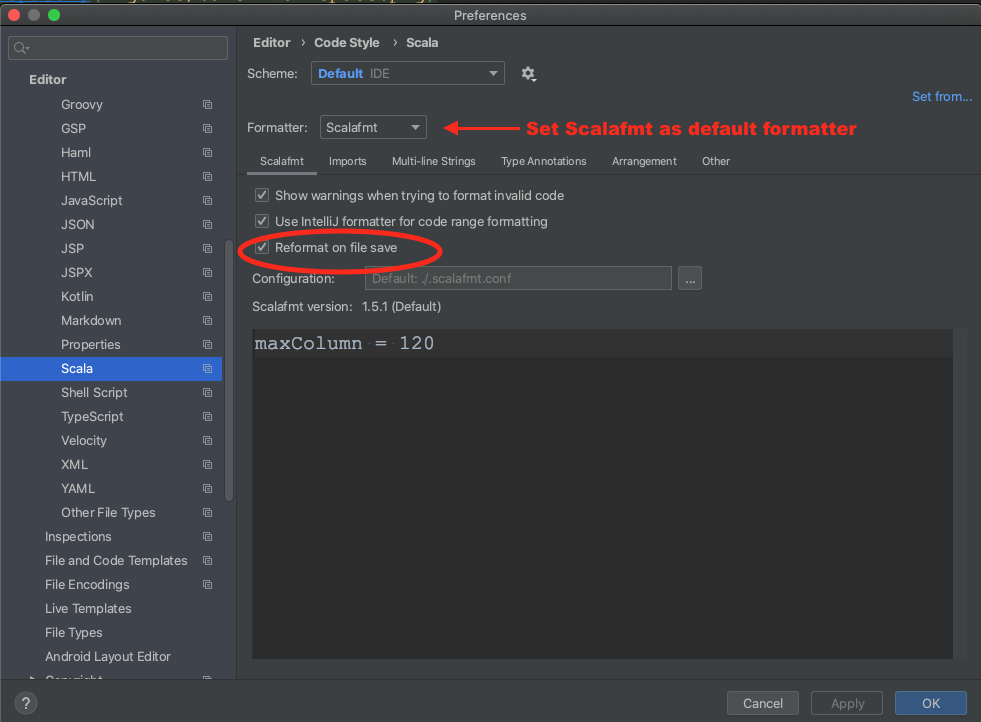
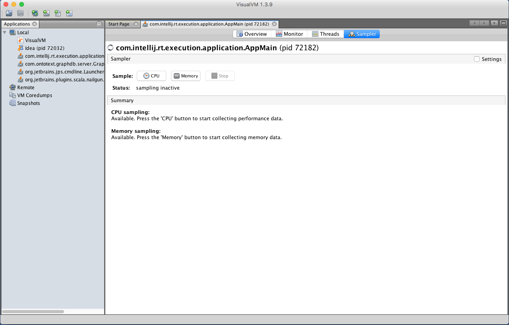

<!---
 * Copyright © 2021 - 2022 Swiss National Data and Service Center for the Humanities and/or DaSCH Service Platform contributors.
 * SPDX-License-Identifier: Apache-2.0
-->

# Setup IntelliJ for development of DSP-API

TODO add "Setup VS Code for development of DSP-API"

## Create an IntelliJ Project for DSP-API

TODO 

## Setup IntelliJ Code Formatter

Use [Scalafmt](https://scalameta.org/scalafmt/) in [IntelliJ IDEA](https://www.jetbrains.com/idea) to format Scala code.

In IntelliJ editor setting (`Preferences -> Editor -> Code Style -> Scala`), choose `Scalafmt` as formatter and check the box for 
`Reformat on file save` as shown below:

 
 
## Use IntelliJ IDEA's Run/Debugger Configuration with Knora

TODO

## Profile Knora Using VisualVM in IntelliJ

First, download and install [VisualVM](https://visualvm.github.io/).

Then, in IntelliJ, under Preferences -\> Plugins, search for the
[VisualVM
Launcher](https://plugins.jetbrains.com/plugin/7115-visualvm-launcher),
click on "Search in repositories", install the plugin, and restart
IntelliJ. IntelliJ's toolbar should now contain a button with a green
triangle on an orange circle, with the tooltip "Run with VisualVM":

You can use this button to run the class `org.knora.webapi.app.Main` and
profile it in VisualVM. The first time you do this, IntelliJ will ask
you for the path to the VisualVM executable. On macOS this is
`/Applications/VisualVM.app/Contents/MacOS/visualvm`.

When VisualVM starts, it will open a window like this:

To use the profiler, click on the "Sampler" tab, then on the "CPU"
button:

Now run some DSP-API operations that you're interested in profiling,
preferably several times to allow the sampler to collect enough data.
Then click on the "Snapshot" button:

In the snapshot, you'll see a list of threads that were profiled:

You can then browse the call tree for each thread, looking for Knora
method calls, to see the total time spent in each method:

