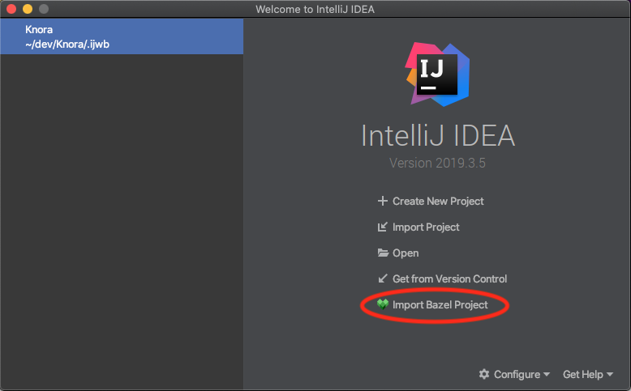
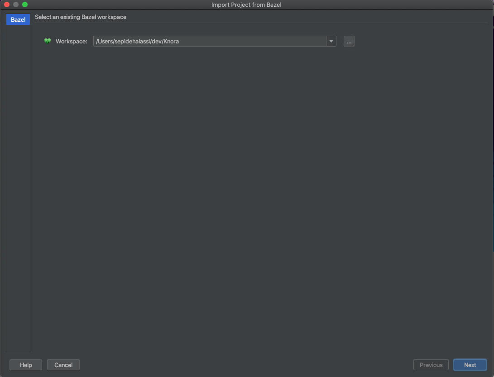
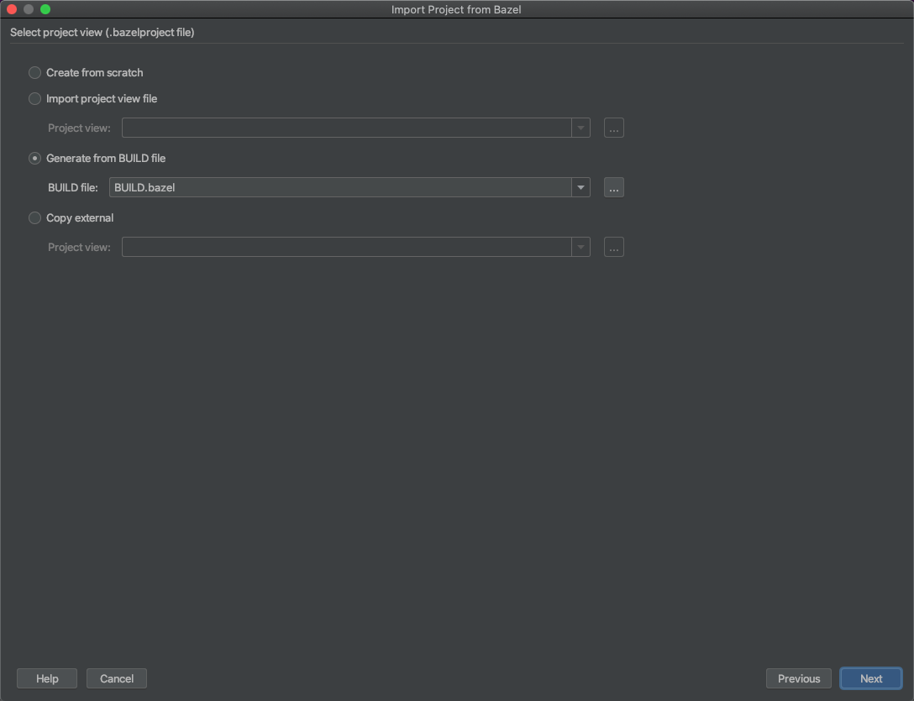
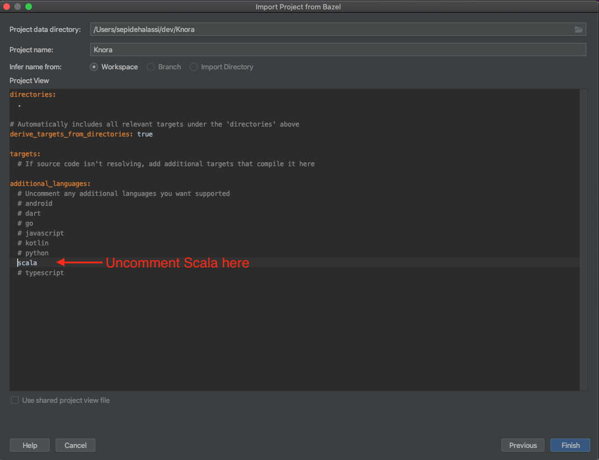
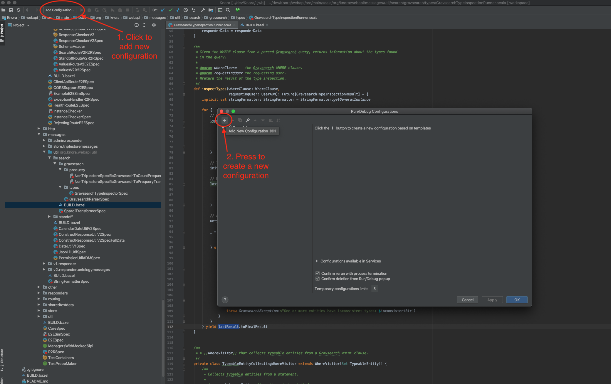
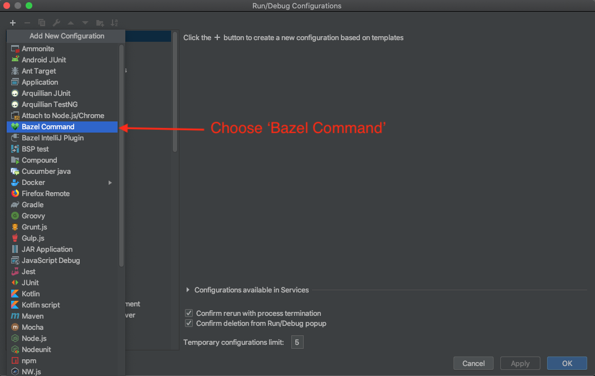
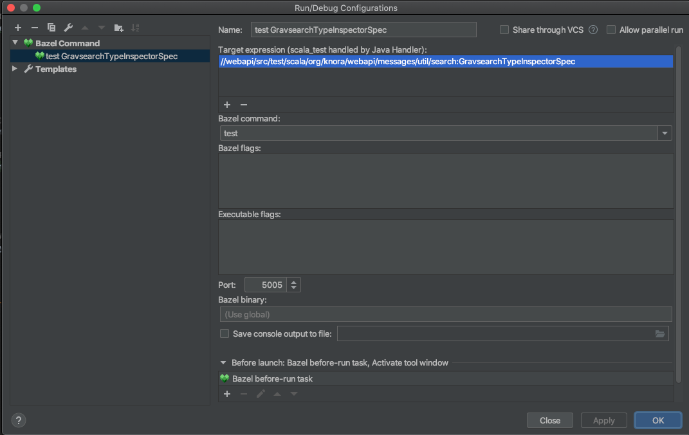
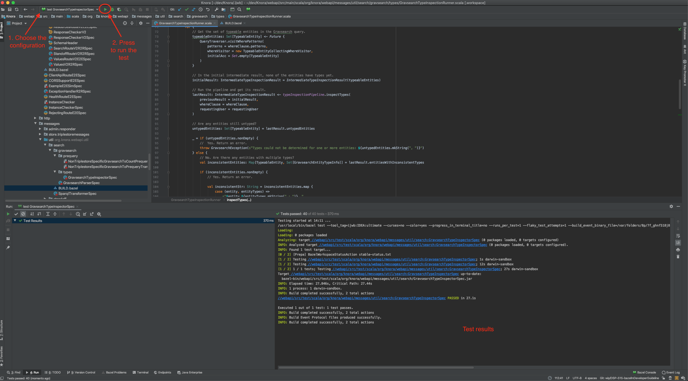
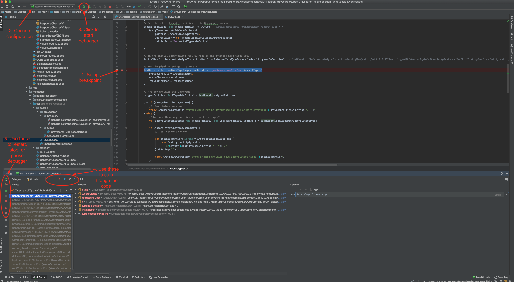

<!---
 * Copyright © 2022 Swiss National Data and Service Center for the Humanities and/or DaSCH Service Platform contributors.
 * SPDX-License-Identifier: Apache-2.0
-->

# Setup IntelliJ for development of Knora

## Create an IntelliJ Project for Knora

  - Download and install a version of [IntelliJ IDEA](https://www.jetbrains.com/idea/) that [supports Bazel](https://plugins.jetbrains.com/plugin/8609-bazel/versions), eg. version `2019.03.05`.
  - Follow the installation procedure and install the `Scala plugin`

  - Add Bazel Plugin: run InteliJ and install the plugin from inside IntelliJ.
  - Create a project for Knora: restart InteliJ and create a project for Knora using `Import Bazel Project` option.
  
  
  
  - Make sure that the Bazel `Workspace` points to the path of Knora and click `next`.
  
  
  
  - Select the `Generate from BUILD file` option and give the path to the main `BUILD.bazel` file of Knora, click `next`.
  
  
  
  - Uncomment the `Scala` language and click `Finish`.
  
  
  
  At this point a `.ijwb` file is created for Knora project and added to the welcome screen of InteiJ. You can open the project by clicking on it.

  - Once the project is built and opened in InteliJ, make sure that project in synced with Bazel build files by clicking
   on Bazel logo `Sync Project with Build Files`. This needs to be repeated every time there is a change in a `BUILD.bazel` file.
   
   

## Setup IntelliJ Code Formatter

Use [Scalafmt](https://scalameta.org/scalafmt/) in [IntelliJ IDEA](https://www.jetbrains.com/idea) to format Scala code.

In IntelliJ editor setting (`Preferences -> Editor -> Code Style -> Scala`), choose `Scalafmt` as formatter and check the box for 
`Reformat on file save` as shown below:

 
 
## Use IntelliJ IDEA's Run/Debugger Configuration with Knora

First, you need to create an application configuration to run or debug a code. Here the configuration is explained using a test as an 
  example, but similarly the application configuration of InteliJ can be used for building the webapi.
  
To run a specific test in a command line using Bazel, you would need to give the path of the test relative to its 
  package as defined in the `BUILD.bazel` of the package. For example, to run the test  `GravsearchTypeInspectorSpec` in the
   command line, you would need to enter `bazel test //webapi/src/test/scala/org/knora/webapi/messages/util/search:GravsearchTypeInspectorSpec`.
  Now to run or debug the same test and its underlying code in InteliJ, a new configuration should be
  set up:
  
   - Click on the 'Add Configuration' to create a new application configuration. 
    

   - Click on the `+` and choose `Bazel Command` 
   

   - Give the type of the command, i.e. `test` and the path parameter, as shown below. Then press `Apply`, and finish 
   the configuration by pressing `OK`.

After the configuration is completed, it will appear in a drop-down menu that shows all available configurations. 

  - To run a configured command, eg. to run the test `GravsearchTypeInspectorSpec`, 
    1. choose its configuration from the drop-down menu
    2. click on the `Run` symbol, the results will appear in the a `Run` window. Note that, before running the test, the 
    docker container of api should be stopped. 
    

  - To debug the code for example by executing a test: 
    1. Click on a line-number to add a breakpoint. 
    2. Choose the respective configuration from the drop-down menu. 
    3. Click on the debugging symbol to start the application with a debugger attached, as shown below:

## Profile Knora Using VisualVM in IntelliJ

First, download and install [VisualVM](https://visualvm.github.io/).

Then, in IntelliJ, under Preferences -\> Plugins, search for the
[VisualVM
Launcher](https://plugins.jetbrains.com/plugin/7115-visualvm-launcher),
click on "Search in repositories", install the plugin, and restart
IntelliJ. IntelliJ's toolbar should now contain a button with a green
triangle on an orange circle, with the tooltip "Run with VisualVM":

You can use this button to run the class `org.knora.webapi.app.Main` and
profile it in VisualVM. The first time you do this, IntelliJ will ask
you for the path to the VisualVM executable. On macOS this is
`/Applications/VisualVM.app/Contents/MacOS/visualvm`.

When VisualVM starts, it will open a window like this:

To use the profiler, click on the "Sampler" tab, then on the "CPU"
button:

Now run some DSP-API operations that you're interested in profiling,
preferably several times to allow the sampler to collect enough data.
Then click on the "Snapshot" button:

In the snapshot, you'll see a list of threads that were profiled:

You can then browse the call tree for each thread, looking for Knora
method calls, to see the total time spent in each method:

