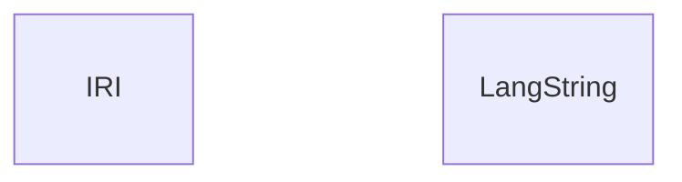
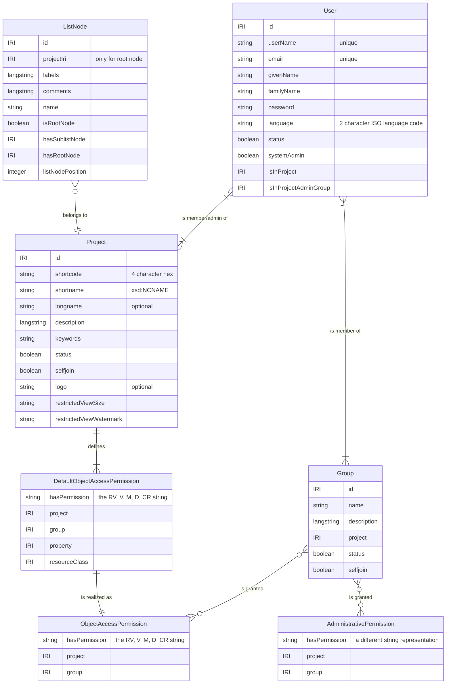
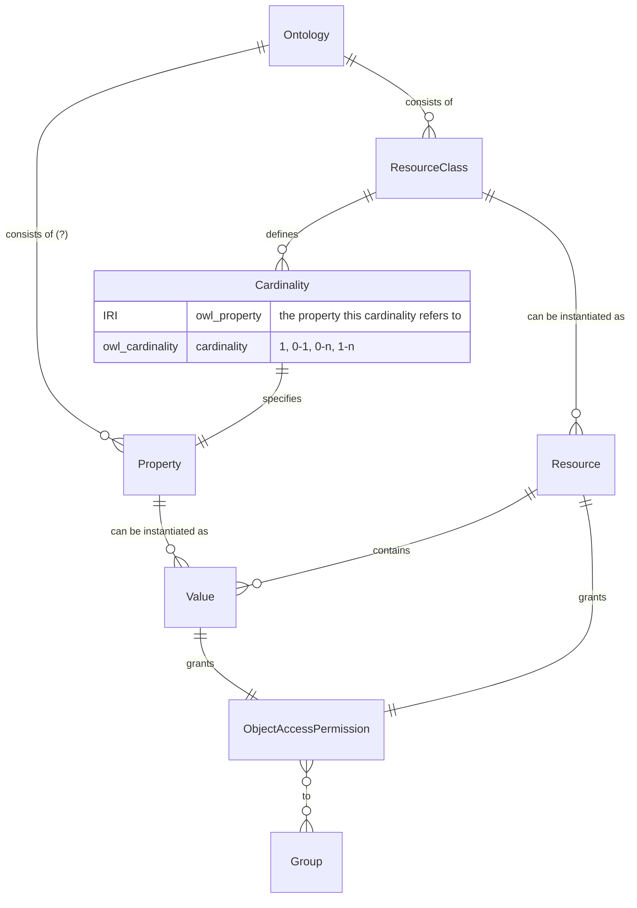
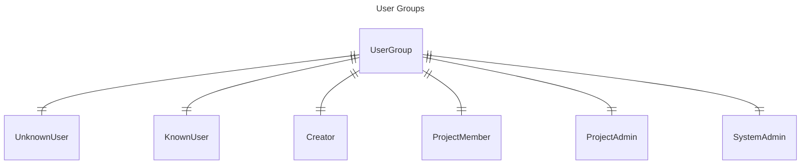
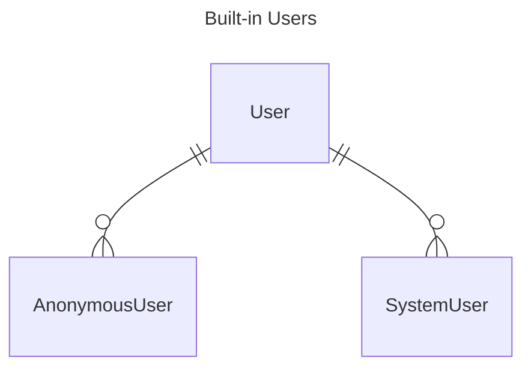
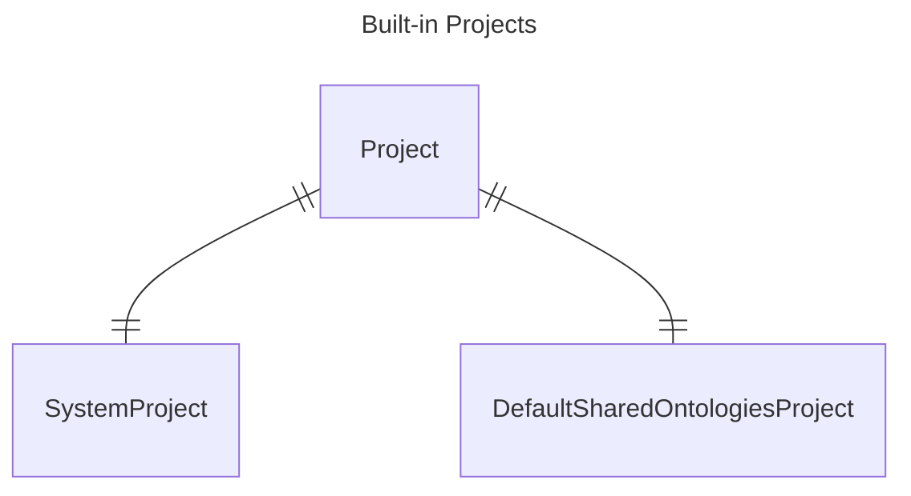

# Domain Model

Note:

- The listing of Entities in this document are not exhaustive, 
  instead they represent the most relevant entities.
- The naming of attributes is not consistent: 
  It sometimes follows the request payload and sometimes the ontologies. 
  Plural/Singular is not a reliably representing cardinalities, but can serve as an indication.
- The split between Admin and V2 is somewhat arbitrary, 
  as the distinction in the RESTful API does not fully align with the distinction in the ontologies.

## General

## Admin

Confusions:
- User.phone?
- Institution? (name, description, website, phone, address, email)
- Project.belongsToInstitution?

## V2

### Overview

## System Instances

