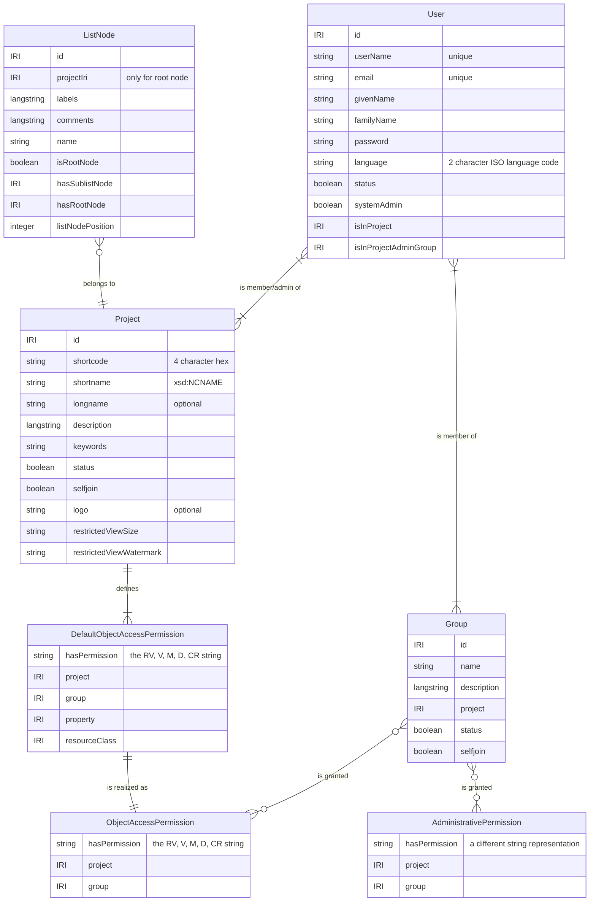
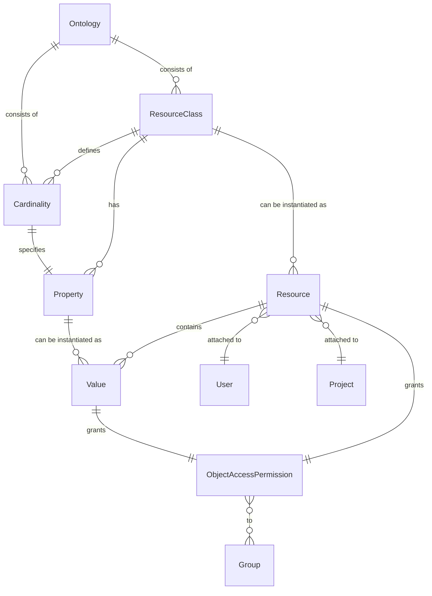
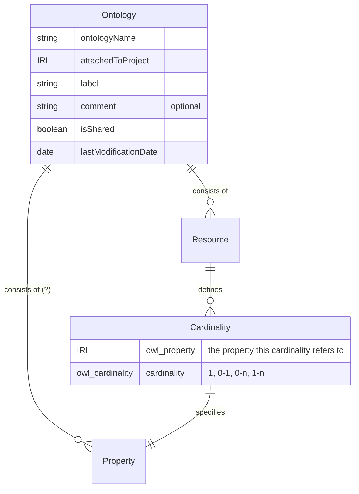
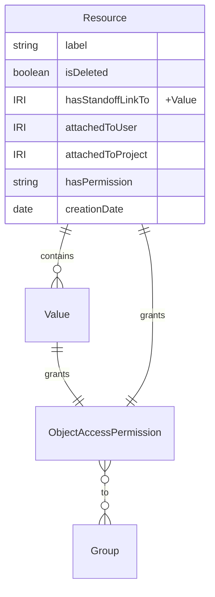
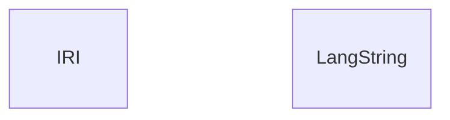
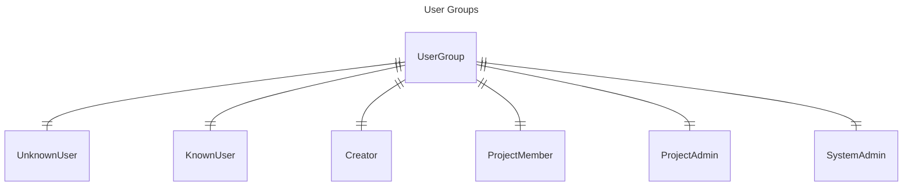
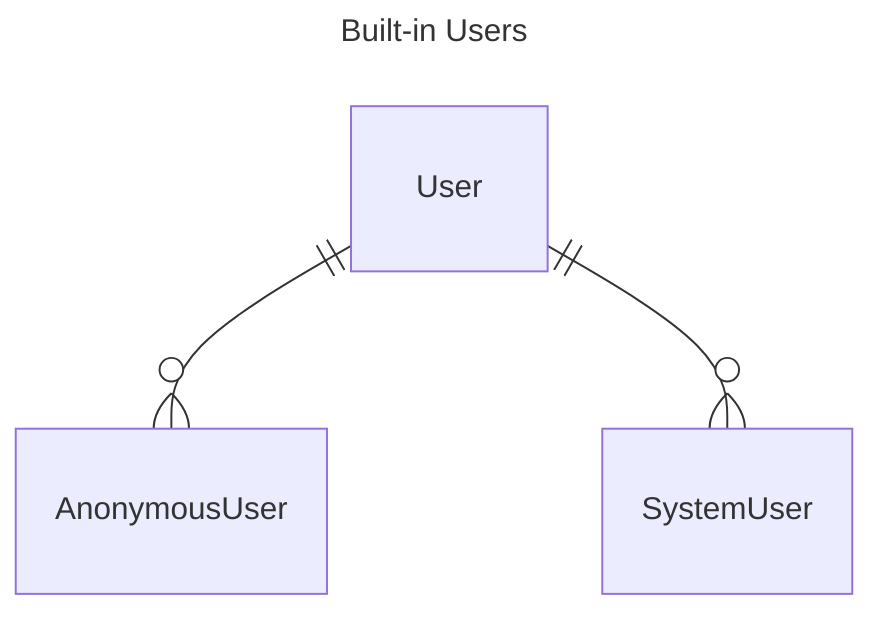
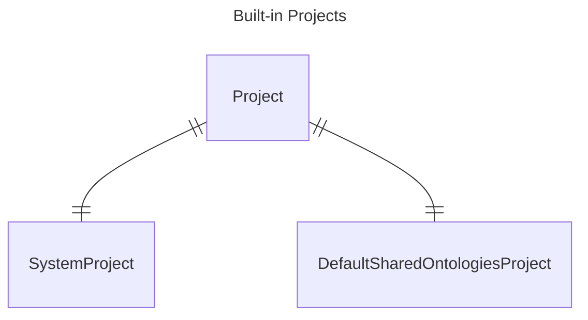

# Domain Model

## Domain Entities

Note:

- The listing of Entities in this document are not exhaustive, 
  instead they represent the most relevant entities.
- The naming of attributes is not consistent: 
  It sometimes follows the request payload and sometimes the ontologies. 
  Plural/Singular is not a reliably representing cardinalities, but can serve as an indication.
- The split between Admin and V2 is somewhat arbitrary, 
  as the distinction in the RESTful API does not fully align with the distinction in the ontologies.

### Admin

Confusions:
- User.phone?
- Institution? (name, description, website, phone, address, email)
- Project.belongsToInstitution?

### V2

#### Overview

#### Ontology

#### Data

### General

### System Instances

## Domain User Stories

- Administration
  - User Administration
    - Join the DSP as a user  
      Currently no self-sign-up, only system admins can add users.
    - [x] Add team members to a project  
    - [x] Remove team members from project  
    - Create groups with certain permissions attached
    - Modify permissions for a group
    - [x] Add project members to groups for for giving users particular permissions  
    - [x] Remove project members from groups
  - Project Administration
    - Create a project  
      Only possible for system administrators.
    - [x] Delete a project
    - Define default object access permissions for the project
    - Update Project metadata
      - [x] in DSP
      - in META  
        Only possible through the DSP-META repo
- Data Modeling
  - [x] Add one or more data models (ontologies) to a project
  - [x] Update ontology metadata
  - [x] Add Resource Classes to a datamodel
  - Change resource classes
  - [x] Delete Resource classes
  - [x] Define reuseable properties for a datamodel
  - Edit properties
  - [x] Delete properties
  - [x] Add properties to a resource class with a defined cardinality
  - [x] Remove properties from a resource class
  - Change the cardinality of a property on a resource class
- Data Generation
  - [x] Creating Resources
  - Updating Resources
    - changing the resource type
    - [x] adding values
    - [x] updating values
    - annotating/commenting on values
    - [x] deleting values
  - Linking Resources
    - [x] to other project resources
    - to external resources
  - Annotating/Commenting on Resources
  - [x] Deleting Resources
- Data Archiving
  - Publish the existing data  
    Only possible through changing permissions (which App doesn't allow)
  - Archive it as a fixed, stable version  
    Currently not possible
- Data Reuse
  - Browsing
    - [x] Browse Projects
    - [x] Browse Project Metadata
    - Inspect a projects datamodel(s)
    - Browse a projects data
      - all data
      - [x] by resource class
      - matching filters/facettes
  - Searching  
    With the caveat that certain searches that are possible may not be good, fast or intuitive
    - [x] Search for projects covering a certain topic
    - [x] Search for a project of which one knows it already exists
    - [x] Search for a datapoint of which one already knows it exists
    - [x] Search for data matching criteria within a project
    - [x] Search for data matching criteria across projects
  - Programmatic reuse
    - download datasets/corpora as a dump (ideally in diverse formats)
    - [x] retrieve data matching certain search/filter criteria
    - [x] retrieve single resources/values by identifiers
