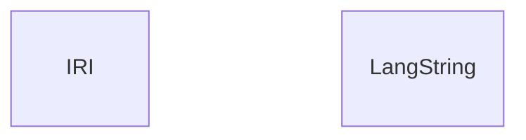
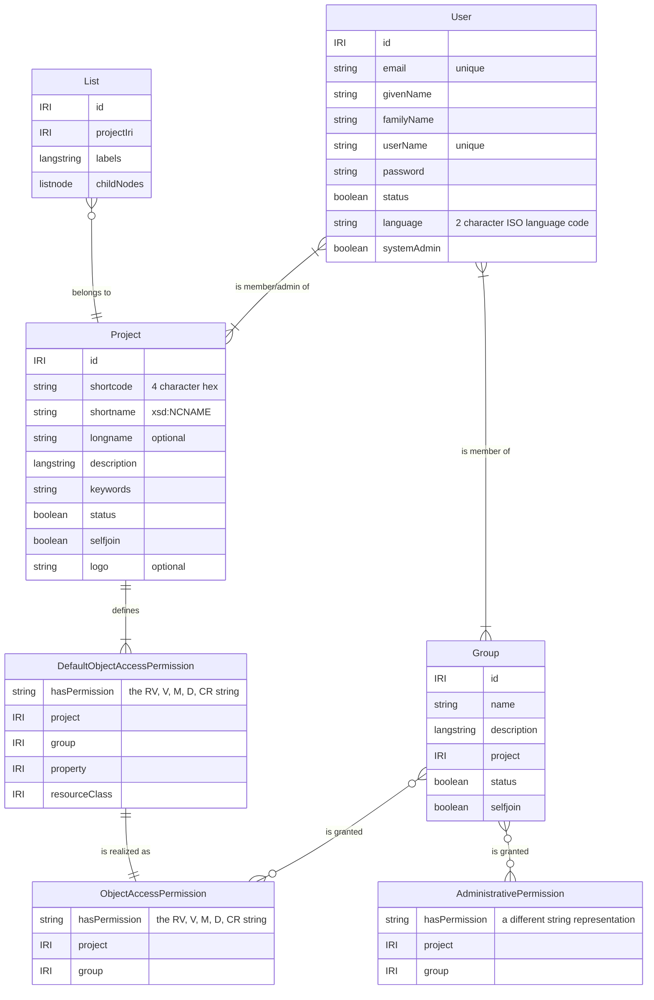
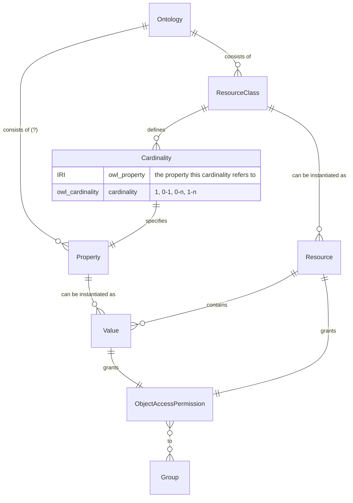

# Domain Model

## General

```mermaid
erDiagram
    IRI
    LangString
```

## Admin

```mermaid
erDiagram
    User {
        IRI id
        string email "unique"
        string givenName
        string familyName
        string userName "unique"
        string password
        boolean status
        string language "2 character ISO language code"
        boolean systemAdmin
    }

    Project {
        IRI id
        string shortcode "4 character hex"
        string shortname "xsd:NCNAME"
        string longname "optional"
        langstring description
        string keywords
        boolean status
        boolean selfjoin
        string logo "optional"
    }

    Group {
        IRI id
        string name
        langstring description
        IRI project
        boolean status
        boolean selfjoin
    }

    List {
        IRI id
        IRI projectIri
        langstring labels
        listnode childNodes
    }
    ObjectAccessPermission {
        string hasPermission "the RV, V, M, D, CR string"
        IRI project
        IRI group
    }
    DefaultObjectAccessPermission {
        string hasPermission "the RV, V, M, D, CR string"
        IRI project
        IRI group
        IRI property
        IRI resourceClass
    }
    AdministrativePermission {
        string hasPermission "a different string representation"
        IRI project
        IRI group
    }

    User }|--|{ Project: "is member/admin of"
    User }|--|{ Group: "is member of"
    List }o--|| Project: "belongs to"
    Project ||--|{ DefaultObjectAccessPermission: defines
    Group }o--o{ AdministrativePermission: "is granted"
    Group }o--o{ ObjectAccessPermission: "is granted"
    DefaultObjectAccessPermission ||--|| ObjectAccessPermission: "is realized as"
```

## V2

```mermaid
erDiagram
    %% Ontology
    Ontology
    ResourceClass
    Property
    Cardinality {
        IRI owl_property "the property this cardinality refers to"
        owl_cardinality cardinality "1, 0-1, 0-n, 1-n"
    }
    Ontology ||--o{ ResourceClass: "consists of"
    Ontology ||--o{ Property: "consists of (?)"
    ResourceClass ||--o{ Cardinality: defines
    Cardinality ||--|| Property: specifies
    
    %% Data
    Resource
    ResourceClass ||--o{ Resource: "can be instantiated as"
    Value
    Property ||--o{ Value: "can be instantiated as"
    Resource ||--o{ Value: contains

    Value ||--|| ObjectAccessPermission: grants
    Resource ||--|| ObjectAccessPermission: grants
    ObjectAccessPermission }o--o{ Group: "to"
```
