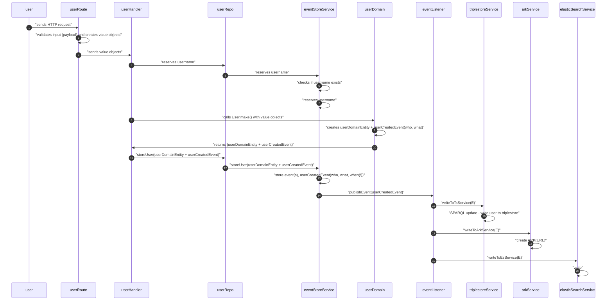

## Example for an HTTP Request Flow with Events

### Create a User

```mermaid
sequenceDiagram
    autonumber
    user                    ->> userRoute:               "sends HTTP request"
    userRoute               ->> userRoute:               "validates input (payload) and creates value objects"
    userRoute               ->> userHandler:             "sends value objects"
    userHandler             ->> userRepo:                "reserves username"
    userRepo                ->> eventStoreService:       "reserves username"
    eventStoreService       ->> eventStoreService:       "checks if username exists"
    eventStoreService       ->> eventStoreService:       "reserves username"
    userHandler             ->> userDomain:              "calls User.make() with value objects"
    userDomain              ->> userDomain:              "creates userDomainEntity + userCreatedEvent(who, what)"
    userDomain              ->> userHandler:             "returns (userDomainEntity + userCreatedEvent)"
    userHandler             ->> userRepo:                "storeUser(userDomainEntity + userCreatedEvent)"
    userRepo                ->> eventStoreService:       "storeUser(userDomainEntity + userCreatedEvent)"
    eventStoreService       ->> eventStoreService:       "store event(s), userCreatedEvent(who, what, when(!))"
    eventStoreService       ->> eventListener:           "publishEvent(userCreatedEvent)"
    eventListener           ->> triplestoreService:      "writeToTsService(E)"
    triplestoreService      ->> triplestoreService:      "SPARQL update - write user to triplestore"
    eventListener           ->> arkService:              "writeToArkService(E)"
    arkService              ->> arkService:              "create ARK(URL)"
    eventListener           ->> elasticSearchService:    "writeToEsService(E)"
    elasticSearchService    ->> elasticSearchService:    "write"
```
