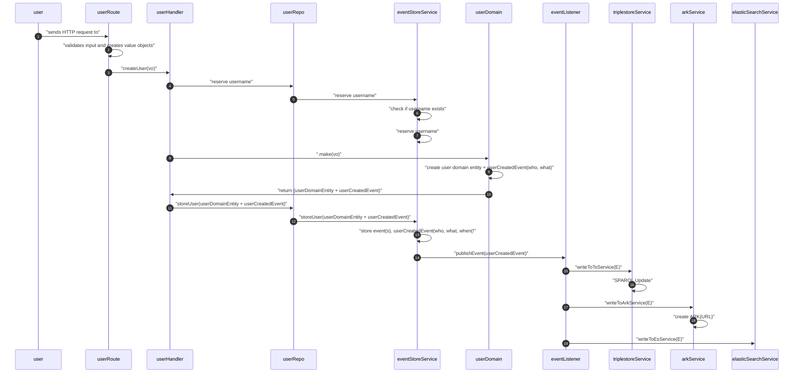

## HTTP Request Flow with Events

```mermaid
sequenceDiagram
    autonumber
    user                ->> userRoute:              "sends HTTP request to"
    userRoute           ->> userRoute:              "validates input and creates value objects"
    userRoute           ->> userHandler:             "createUser(vo)"
    userHandler         ->> userRepo:                "reserve username"
    userRepo            ->> eventStoreService:       "reserve username"
    eventStoreService   ->> eventStoreService:       "check if username exists"
    eventStoreService   ->> eventStoreService:       "reserve username"
    userHandler         ->> userDomain:              ".make(vo)"
    userDomain          ->> userDomain:              "create user domain entity + userCreatedEvent(who, what)"
    userDomain          ->> userHandler:             "return (userDomainEntity + userCreatedEvent)"
    userHandler         ->> userRepo:                "storeUser(userDomainEntity + userCreatedEvent)"
    userRepo            ->> eventStoreService:       "storeUser(userDomainEntity + userCreatedEvent)"
    eventStoreService   ->> eventStoreService:       "store event(s), userCreatedEvent(who, what, when(!"
    eventStoreService   ->> eventListener:           "publishEvent(userCreatedEvent)"
    eventListener       ->> triplestoreService:      "writeToTsService(E)"
    triplestoreService  ->> triplestoreService:      "SPARQL Update"
    eventListener       ->> arkService:              "writeToArkService(E)"
    arkService          ->> arkService:              "create ARK(URL)"
    eventListener       ->> elasticSearchService:    "writeToEsService(E)"
```
