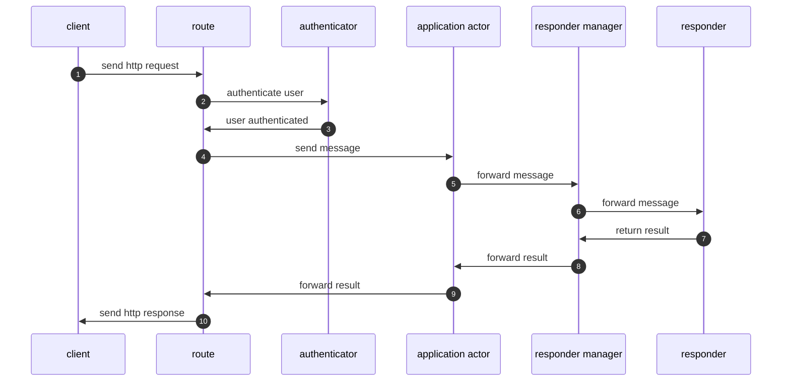
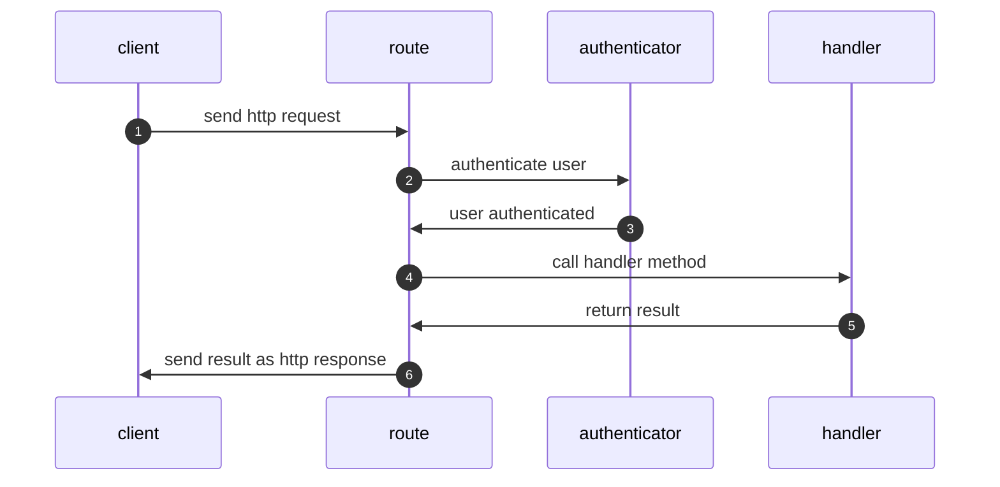

## HTTP Request Flow V2 vs. V3

V1 / V2 / admin:

```mermaid
sequenceDiagram
    autonumber
    client              ->> route: send http request
    route               ->> authenticator: authenticate user
    authenticator       ->> route: user authenticated
    route               ->> application actor: send message
    application actor   ->> responder manager: forward message
    responder manager   ->> responder: forward message
    responder           ->> responder manager: return result
    responder manager   ->> application actor: forward result
    application actor   ->> route: forward result
    route               ->> client: send http response
```

V3:

```mermaid
sequenceDiagram
    autonumber
    client              ->> route: send http request
    route               ->> authenticator: authenticate user
    authenticator       ->> route: user authenticated
    route               ->> handler: call handler method
    handler             ->> route: return result
    route               ->> client: send result as http response
```
