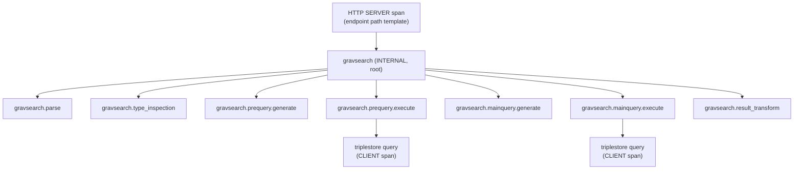

# Gravsearch Trace Runbook

A one-page guide to diagnosing a slow Gravsearch query from its trace. The goal is that you can open
a trace cold and name the dominant stage and read the time decomposition without prior briefing.

## 1. Find a slow trace

Open **Grafana → Explore → `grafanacloud-dasch-traces`** (Tempo), TraceQL tab, and run the
slow-query recipe:

```traceql
{ span:name = "gravsearch" && span:duration > 2s }
```

See **[TraceQL Recipes](traceql-recipes.md)** for the full set (threshold relative to the baseline
p95, drill-down by stage, filter by query shape, find errors and interruptions). Click a result to
open the trace, then find the `gravsearch` span — it is an `INTERNAL` span nested under the HTTP
`SERVER` span for the request.

## 2. The span tree

A full-path query (the prequery returned at least one main resource) produces this tree:



All stage spans are direct children of the `gravsearch` root. The triplestore round-trips appear as
`CLIENT` spans nested **under** the two `*.execute` stages — that nesting is how you separate time
spent *in the triplestore* from time spent generating SPARQL or transforming results.

## 3. What each stage means

| Stage span | Measures | Typical cost driver |
| --- | --- | --- |
| `gravsearch.parse` | Parsing the Gravsearch string into a `ConstructQuery` AST | Negligible; only notable on parse failure |
| `gravsearch.type_inspection` | Inferring entity/value types for the query | Large or deeply-typed queries |
| `gravsearch.prequery.generate` | Building the prequery SPARQL (resource IRIs + ordering) | Complex WHERE clauses, many patterns/joins |
| `gravsearch.prequery.execute` | Running the prequery against Fuseki (CLIENT span nested here) | **Most common hotspot** — triplestore time |
| `gravsearch.mainquery.generate` | Building the main query for the page of resource IRIs | Many properties / large page |
| `gravsearch.mainquery.execute` | Running the main query against Fuseki (CLIENT span nested here) | Triplestore time for the value graph |
| `gravsearch.result_transform` | Permission filtering + assembling the API response | Large result pages, heavy markup |

A **count** query (`/v2/searchextended/count`) runs only the prequery side: `gravsearch.parse`,
`gravsearch.type_inspection`, `gravsearch.prequery.generate`, `gravsearch.prequery.execute` under
the root — four prequery-side stages, no main-query or result-transform spans. This is expected
(see [§6](#6-absent-spans-four-normal-topologies)), not a truncated trace.

## 4. Root-span attributes

The `gravsearch` root span carries a **query shape** — a bounded fingerprint of *what kind* of query
this was, with no user data in it. Use it to group "queries like this one" without leaking FILTER
literals or instance IRIs.

| Attribute | Example | Use |
| --- | --- | --- |
| `gravsearch.query.shape` | `resource-list\|has_filter\|has_order_by\|patterns:4-7\|joins:1` | Bounded label; safe to group/aggregate by. Format: result-type, then each true flag, then `patterns:<bucket>` and `joins:<bucket>` (buckets: `0`, `1`, `2-3`, `4-7`, `8+`) |
| `gravsearch.shape.has_filter` | `true` | Per-flag booleans for TraceQL filtering — also `has_optional`, `has_union`, `has_order_by`, `has_offset`, `has_link_traversal`, `is_fulltext` |
| `gravsearch.schema_predicates` | `hasTitle,isPartOf` | Sorted, de-duplicated **ontology** predicate names only (never instance IRIs). Drill-down detail, not a metric label |

On a failed or interrupted stage span you may also see:

| Attribute / field | Meaning |
| --- | --- |
| span status `ERROR`, description `"<stage>: <ClassName>"` | A typed stage failure, e.g. `gravsearch.prequery.execute: TriplestoreException`. The message is sanitized — never the raw SPARQL or FILTER literal |
| `error.type` | The exception class simple name |
| `gravsearch.exit_reason = interrupted` | The fiber was interrupted (client disconnect / timeout / cancellation) — see [§6](#6-absent-spans-four-normal-topologies) |

## 5. Reading the time decomposition

1. Note the **root `gravsearch` duration** — that is the responder's total.
2. Walk the stage spans in order; the one with the largest duration is the dominant stage.
3. For an `*.execute` stage, compare the stage duration with its **nested triplestore `CLIENT`
   span**: if they are close, the time is in Fuseki; if the stage is much longer than the client
   span, the time is in DSP-API around the query.
4. Stage durations do not perfectly sum to the root (there is glue between stages), but one stage
   normally dominates. `gravsearch.prequery.execute` is the most common hotspot.

## 6. Absent spans: four normal topologies

The instrumentation deliberately **omits** spans for work that did not happen rather than emitting
zero-duration placeholders. So a trace with fewer than eight spans is usually *correct*. Four
distinct shapes look like "missing spans" but each means something specific — do not read any of
them as broken instrumentation, and do not mistake one for another.

| Topology | What you see | What it means | Tell-tale |
| --- | --- | --- | --- |
| **Empty result** | parse → type_inspection → prequery.generate → prequery.execute present; **no** `mainquery.*`, **no** `result_transform` | The prequery returned zero main resources, so there was nothing to fetch — "no rows", not an error | All present spans are `OK`; root has its shape attributes |
| **Parse failure** | root + `gravsearch.parse` only, parse span is `ERROR` | The Gravsearch string was malformed; the pipeline never started | Only the parse span exists and it is `ERROR` (`gravsearch.parse: <Class>`) |
| **Interruption / timeout** | early stages present, later stages absent, **last open span + root are `ERROR`** | The request fiber was interrupted (client disconnect, timeout, cancellation) mid-query | `gravsearch.exit_reason = interrupted` on the open span and the root |
| **Shape-less early interrupt** | root present but **without `gravsearch.query.shape` / `gravsearch.shape.*`**, little or nothing below it | Interrupted (or failed) *before* parse completed, so the shape was never derived | Missing shape attributes **and** `exit_reason = interrupted` / `ERROR` on the root — not a broken shape derivation |

How to tell them apart quickly:

- **Later stages missing + everything `OK` + shape present** → empty result. Benign.
- **Only the parse span + it is `ERROR`** → parse failure. Look at the client's query, not the
  instrumentation.
- **Later stages missing + an `ERROR` span carrying `exit_reason = interrupted`** → interruption.
  The query was probably slow and got cancelled — this is exactly the trace you are hunting; read
  the stages that *did* run to see where the time went before the cut.
- **Root has no shape attributes at all** → shape-less early interrupt. The interruption happened so
  early that parse/shape never ran; the absence of shape is expected, not a bug.

!!! note "Why interruption is called out separately"
    OTel span status has no `cancelled` value (only `Unset`/`Ok`/`Error`). Without the
    `gravsearch.exit_reason = interrupted` attribute, an interrupted slow query — early stages
    present, later stages absent — would be indistinguishable from a benign empty result, and from a
    typed stage failure. The attribute is what disambiguates them.
