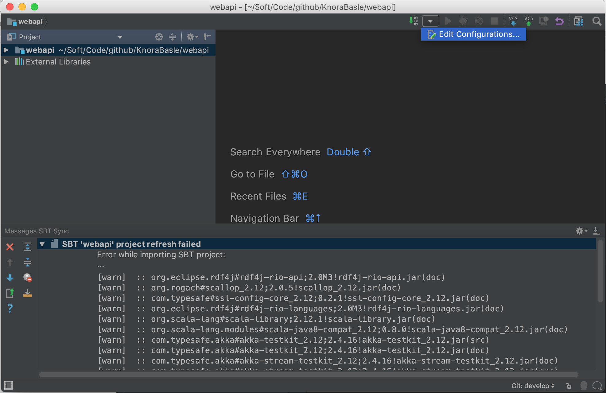
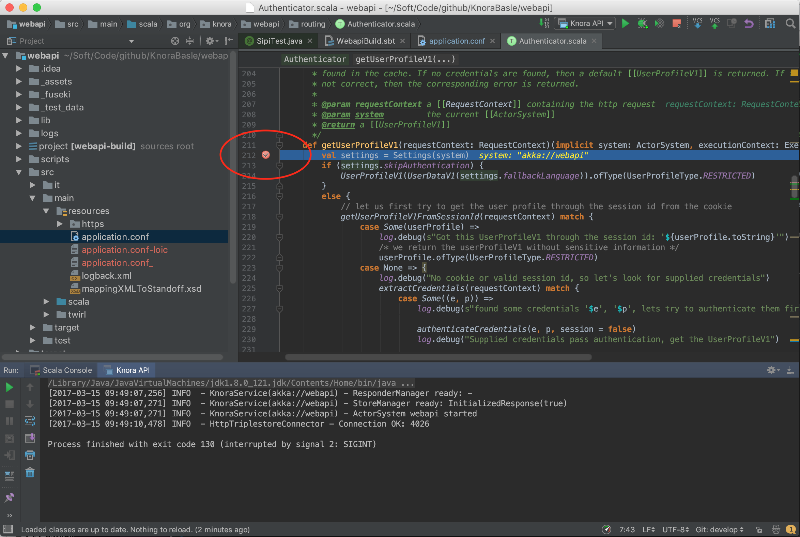
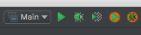

.. Copyright © 2015 Lukas Rosenthaler, Benjamin Geer, Ivan Subotic,
   Tobias Schweizer, André Kilchenmann, and Sepideh Alassi.

   This file is part of Knora.

   Knora is free software: you can redistribute it and/or modify
   it under the terms of the GNU Affero General Public License as published
   by the Free Software Foundation, either version 3 of the License, or
   (at your option) any later version.

   Knora is distributed in the hope that it will be useful,
   but WITHOUT ANY WARRANTY; without even the implied warranty of
   MERCHANTABILITY or FITNESS FOR A PARTICULAR PURPOSE.  See the
   GNU Affero General Public License for more details.

   You should have received a copy of the GNU Affero General Public
   License along with Knora.  If not, see <http://www.gnu.org/licenses/>.

.. _intellij-config:

Setup IntelliJ for development of Knora
=======================================

.. contents:: :local:

Create an IntelliJ Project for the Knora API Server
---------------------------------------------------

-  Download and install `IntelliJ IDEA`_.
-  Follow the installation procedure and install the  ``Scala plugin``

.. figure:: figures/install-scala-plugin.png
   :width: 100%
   :alt: screenshot 'Install Scala Plugin'

   screenshot 'Install Scala Plugin'

-  Import the ``webapi`` directory in the Knora source tree: ``Import Project`` -> Choose the option ``module SBT``

.. figure:: figures/import-from-sbt.png
   :width: 100%
   :alt: screenshot 'import existing SBT project'

   screenshot 'import existing SBT project'

-  make sure that the tab size is set correctly to **4 spaces** (so you can use automatic code reformatting): ``Preferences -> Code Style -> Scala``:

.. figure:: figures/setting-tab-space.png
   :width: 100%
   :alt: screenshot 'setting tab size'

   screenshot 'setting tab size'

Twirl
-----

By default, Intellij excludes some folders like the twirl template files. To include them, go to ``Project Structure`` and remove ``target/scala-2.1*/twirl`` from excluded folders.
Then Intellij will correctly resolve the references to the template files.

Use IntelliJ IDEA's Debugger with the Knora API Server
------------------------------------------------------

-  Create an application configuration:

   screenshot 'edit application config'

.. figure:: figures/create-app.png
   :width: 100%
   :alt: screenshot 'create application configuration'

   screenshot 'create application configuration'

   Fill in the configuration details:

.. figure:: figures/app-config-setup.png
   :width: 100%
   :alt: screenshot 'change application configuration'

   screenshot 'change application configuration'

-  Click on the debugging symbol to start the application with a
   debugger attached

.. figure:: figures/debug.png
   :width: 100%
   :alt: screenshot 'debug'

   screenshot 'debug'

-  Click on a line-number to add a breakpoint

   screenshot 'set a breakpoint'

Profile Knora Using VisualVM in IntelliJ
----------------------------------------

First, download and install VisualVM_.

Then, in IntelliJ, under Preferences -> Plugins, search for the `VisualVM
Launcher`_, click on "Search in repositories", install the plugin, and restart
IntelliJ. IntelliJ's toolbar should now contain a button with a green triangle
on an orange circle, with the tooltip "Run with VisualVM":

   screenshot 'Run with VisualVM button'

You can use this button to run the class ``org.knora.webapi.Main`` and profile it in VisualVM.
The first time you do this, IntelliJ will ask you for the path to the VisualVM executable.
On macOS this is ``/Applications/VisualVM.app/Contents/MacOS/visualvm``.

When VisualVM starts, it will open a window like this:

.. figure:: figures/visualvm-overview.png
   :width: 100%
   :alt: screenshot 'VisualVM overview'

   screenshot 'VisualVM overview'

To use the profiler, click on the "Sampler" tab, then on the "CPU" button:

.. figure:: figures/visualvm-sampler.png
   :width: 100%
   :alt: screenshot 'VisualVM sampler'

   screenshot 'VisualVM sampler'

Now run some Knora API operations that you're interested in profiling,
preferably several times to allow the sampler to collect enough data. Then
click on the "Snapshot" button:

.. figure:: figures/visualvm-snapshot-button.png
   :width: 100%
   :alt: screenshot 'VisualVM snapshot button'

   screenshot 'VisualVM snapshot button'

In the snapshot, you'll see a list of threads that were profiled:

.. figure:: figures/visualvm-snapshot.png
   :width: 100%
   :alt: screenshot 'VisualVM snapshot'

   screenshot 'VisualVM snapshot'

You can then browse the call tree for each thread, looking for Knora method
calls, to see the total time spent in each method:

.. figure:: figures/visualvm-call-tree.png
   :width: 100%
   :alt: screenshot 'VisualVM call tree'

   screenshot 'VisualVM call tree'

.. _IntelliJ IDEA: https://www.jetbrains.com/idea/
.. _VisualVM: https://visualvm.github.io/
.. _VisualVM Launcher: https://plugins.jetbrains.com/plugin/7115-visualvm-launcher
