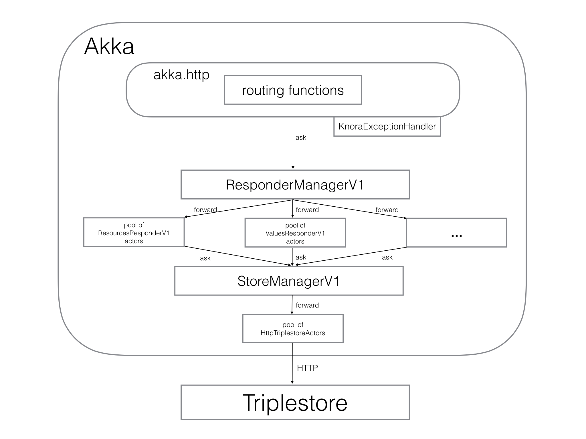

.. Copyright © 2015 Lukas Rosenthaler, Benjamin Geer, Ivan Subotic,
   Tobias Schweizer, André Kilchenmann, and André Fatton.

   This file is part of Knora.

   Knora is free software: you can redistribute it and/or modify
   it under the terms of the GNU Affero General Public License as published
   by the Free Software Foundation, either version 3 of the License, or
   (at your option) any later version.

   Knora is distributed in the hope that it will be useful,
   but WITHOUT ANY WARRANTY; without even the implied warranty of
   MERCHANTABILITY or FITNESS FOR A PARTICULAR PURPOSE.  See the
   GNU Affero General Public License for more details.

   You should have received a copy of the GNU Affero General Public
   License along with Knora.  If not, see <http://www.gnu.org/licenses/>.

Knora API Server Design Overview
=================================

Introduction
-------------

The Knora API server implements Knora's web-based Application Programming Interface (API). It is responsible
for receiving HTTP requests from clients (which may be web browsers or other software), performing
authentication and authorisation, querying and updating the RDF triplestore, transforming the
results of SPARQL queries into Knora API responses, and returning these responses to the client.
It is written in Scala_, using the Akka_ framework for message-based concurrency and the spray_ framework
for web APIs. It is designed to work with any standards-compliant triplestore. It can communicate with
triplestores either via the `SPARQL 1.1 Protocol`_ or by embedding the triplestore in the API server as a library.

Design Diagram
---------------

   A high-level diagram of the Knora API server.

Modules
--------

HTTP Module
^^^^^^^^^^^^^

-  org.knora.webapi.http
-  org.knora.webapi.routes

Responders Module
^^^^^^^^^^^^^^^^^^^

-  org.knora.webapi.responders

Store Module
^^^^^^^^^^^^^^

-  org.knora.store

Shared Between Modules
^^^^^^^^^^^^^^^^^^^^^^^^

-  org.knora.webapi
-  org.knora.webapi.util
-  org.knora.webapi.messages

Actor Supervision and Creation
-------------------------------

At system start, the supervisor actors are created in
``CoreManagerActors.scala``:

::

    val httpServiceManager = system.actorOf(Props(new KnoraHttpServiceManager with LiveActorMaker), name = "httpServiceManager")
    val responderManager = system.actorOf(Props(new ResponderManagerV1 with LiveActorMaker), name = "responderManager")
    val storeManager = system.actorOf(Props(new StoreManager with LiveActorMaker), name = "storeManager")

Each supervisor creates and maintains a pool of workers, with `an Akka
router <http://doc.akka.io/docs/akka/snapshot/scala/routing.html>`__
that dispatches messages to the workers according to some strategy. For
now, all the pools use the 'round-robin' strategy. The pools and routers
are configured in ``application.conf``:

::

    actor {
        deployment {
            user/httpServiceManager/httpServiceRouter {
                router = round-robin-pool
                nr-of-instances = 100
            }

            user/storeManager/triplestoreRouter {
                router = round-robin-pool
                nr-of-instances = 50
            }

            user/responderManager/resourcesRouter {
                router = round-robin-pool
                nr-of-instances = 20
            }

            user/responderManager/valuesRouter {
                router = round-robin-pool
                nr-of-instances = 20
            }

            user/responderManager/representationsRouter {
                router = round-robin-pool
                nr-of-instances = 20
            }

            user/responderManager/usersRouter {
                router = round-robin-pool
                nr-of-instances = 20
            }
        }
    }

Concurrency
------------

Except for a bit of caching, the Knora API server is written in a purely
functional style and has no mutable state, shared or otherwise, not even within actors.
This makes it easier to reason about concurrency, and eliminates an important potential
source of bugs (see `Out of the Tar Pit`_).

There is a pool of HTTP workers that handle HTTP requests concurrently
using the spray routes in the ``routing`` package. Each spray route constructs a
request message and sends it to ``ResponderManagerV1``, which forwards it to a worker actor
in one of its pools. So the size of the HTTP worker pool sets the maximum number
of concurrent HTTP requests, and the size of the worker pool for each
responder sets the maximum number of concurrent messages for that
responder. Whenever a responder needs to do a SPARQL query, it sends a
message to the store manager, which forwards it to a triplestore actor.
The size of the pool(s) of triplestore actors sets the
maximum number of concurrent SPARQL queries.

The routes and actors in the Knora API server uses Akka's ``ask`` pattern, rather than the ``tell``
pattern, to send messages and receive responses, because this simplifies the code
considerably (using ``tell`` would require actors to maintain complex mutable state),
with no apparent reduction in performance.

To manage asynchronous communication between actors, the Knora API server uses Scala's
``Future`` monad extensively. See :ref:`futures-with-akka` for details.

We use Akka's asynchronous logging interface (see `Akka Logging`_).

What the Responders Do
------------------------

In the Knora API server, a 'responder' is an actor that receives a request message (a
Scala case class) in the ``ask`` pattern, gets data from the
triplestore, and turns that data into a reply message (another case
class). These reply messages are are defined in the ``schemas`` package.
A responder can produce a reply representing a complete API response, or
part of a response that will be used by another responder. If it's a
complete API response, it will extend ``KnoraJsonResponse``, which can
be converted directly into JSON by calling its ``toJsValue`` method (see
the section on JSON below).

All messages to responders go through the responder supervisor actor
(``ResponderManagerV1``).

Store Module (org.knora.webapi.store package)
----------------------------------------------

The Store module is used for accessing the triplestore and other
external storage providers.

All access to the Store module goes through the ``StoreManager``
supervisor actor. The ``StoreManager`` creates pools of actors, such as
``HttpTriplestoreActor``, that interface with the storage providers.

The contents of the ``store`` package are not used directly by other
packages, which interact with the ``store`` package only by sending
messages to ``StoreManager``.

Generation and parsing of SPARQL are handled by this module.

See :ref:`store-module` for a deeper discussion.

.. _triplestore-access:

Triplestore Access
--------------------

SPARQL queries are generated from templates, using the Twirl_ template engine.
For example, if we're querying a resource, the template will contain a
placeholder for the resource's IRI. The templates can be found under
``src/main/twirl/queries/sparql/v1``. So far we have been able to avoid generating
different SPARQL for different triplestores.

The ``org.knora.webapi.store`` package contains actors for communicating with triplestores in different ways: a
triplestore can be accessed over HTTP via the `SPARQL 1.1 Protocol`_, or it can be embedded in
the Knora API server. However, a responder is not expected to know which triplestore is being used or how the
triplestore is accessed. To perform a SPARQL query, a responder sends a message to the ``storeManager``
actor, like this:

::

    private val storeManager = context.actorSelection("/user/storeManager")

    // ...

    private def getSomeValue(resourceIri: IRI): Future[String] = {
        for {
            sparqlQuery <- Future(queries.sparql.v1.txt.someTemplate(resourceIri).toString())
            queryResponse <- (storeManager ? SparqlSelectRequest(sparqlQuery)).mapTo[SparqlSelectResponse]
            someValue = // get some value from the query response
        } yield someValue
    }

.. _error-handling:

Error Handling
----------------

The error-handling design has these aims:

1. Simplify the error-handling code in actors as much as possible.

2. Produce error messages that clearly indicate the context in which the
   error occurred (i.e. what the application was trying to do).

3. Ensure that clients receive an appropriate error message when an
   error occurs.

4. Ensure that ``ask`` requests are properly terminated  with an ``akka.actor.Status.Failure``
   message in the event of an error, without which they will simply time out
   (see `Send-And-Receive-Future`_).

5. When a actor encounters an error that isn't the client's fault (e.g.
   a triplestore failure), log it and report it to the actor's
   supervisor, but don't do this with errors caused by bad input.

6. When logging errors, include the full JVM stack trace.

The design does not yet include, but could easily accommodate,
translations of error messages into different languages.

A hierarchy of exception classes is defined in ``Exceptions.scala``,
representing different sorts of errors that could occur. The hierarchy
has two main branches:

-  ``RequestRejectedException``, an abstract class for errors that are
   the client's fault. These errors are not logged.

-  ``InternalServerException``, an abstract class for errors that are
   not the client's fault. These errors are logged.

Exception classes in this hierarchy can be defined to include a wrapped
``cause`` exception. When an exception is logged, its stack trace will
be logged along with the stack trace of its ``cause``. It is therefore
recommended that low-level code should catch low-level exceptions, and
wrap them in one of our higher-level exceptions, in order to clarify the
context in which the error occurred.

To simplify error-handling in responders, a utility method called ``future2Message`` is provided
in ``ActorUtils``. It is intended to be used in an actor's ``receive`` method to respond to
messages in the ``ask`` pattern. If the responder's computation is successful,
it is sent to the requesting actor as a response to the ``ask``. If the
computation fails, the exception representing the failure is wrapped in
a ``Status.Failure``, which is sent as a response to the ``ask``. If the
error is a subclass of ``RequestRejectedException``, only the sender is
notified of the error; otherwise, the error is also logged and rethrown
(so that the actor's supervisor will receive it).

In many cases, we transform data from the triplestore into a ``Map``
object. To simplify checking for required values in these collections,
the class ``ErrorHandlingMap`` is provided. You can wrap any ``Map`` in
an ``ErrorHandlingMap``. You must provide a function that will generate an error message
when a required value is missing, and
optionally a function that throws a particular exception. Rows of SPARQL
query results are already returned in ``ErrorHandlingMap`` objects.

If you want to add a new exception class, see the comments in
``Exceptions.scala`` for instructions.

We still need to add error-handling strategies in supervisor actors.

See also :ref:`futures-with-akka`.

.. _api-routing:

API Routing
---------------

The API routes in the ``routing`` package are defined using the DSL
provided by the `spray-routing`_ library. A routing function has to do the following:

1. Authenticate the client.

2. Figure out what the client is asking for.

3. Construct an appropriate request message and send it to
   ``ResponderManagerV1``, using the ``ask`` pattern.

4. Return a result to the client.

To simplify the coding of routing functions, they are contained in objects that extend
``org.knora.webapi.routing.Authenticator``. Each routing function constructs a ``Try`` in which the following
operations are performed:

1. ``Authenticator.getUserProfileV1`` is called to authenticate the user.

2. The request parameters are interpreted and validated, and a request message is constructed to send to the responder.
   If the request is invalid, ``BadRequestException`` is thrown. If the request message is requesting an update operation,
   it must include a UUID generated by ``UUID.randomUUID``, so the responder can obtain a write lock on the resource
   being updated.

The routing function then passes the ``Try`` to ``org.knora.webapi.routing.RouteUtils.runJsonRoute()``, which takes
care of sending the message to ``ResponderManagerV1`` and returning a response to the client,
as well as handling errors.

See :ref:`how-to-add-a-route` for an example.

JSON
-------

The Knora API server parses and generate JSON using the `spray-json`_ library.

The triplestore returns results in JSON, and these are parsed into ``SparqlSelectResponse`` objects in the ``store``
package (by ``SparqlUtils``, which can be used by any actor in that package). A ``SparqlSelectResponse`` has a
structure that's very close to the JSON returned by a triplestore via the `SPARQL 1.1 Protocol`_:
it contains a header (listing the variables that were used in the query) and a body (containing rows of query
results). Each row of query results is represented by a ``VariableResultsRow``, which contains a ``Map[String, String]``
of variable names to values.

The ``Jsonable`` trait marks classes that can convert themselves into
spray-json AST objects when you call their ``toJsValue`` method; it
returns a ``JsValue`` object, which can then be converted to text by
calling its ``prettyPrint`` or ``compactPrint`` methods. Case classes
representing complete API responses extend the ``KnoraResponseV1``
trait, which extends ``Jsonable``. Case classes representing Knora
values extend the ``ApiValueV1`` trait, which also extends ``Jsonable``. To
make the responders reusable, the JSON for API responses is generated
only at the last moment, by the ``RouteUtils.runJsonRoute()`` function.

.. _Scala: http://www.scala-lang.org/
.. _Akka: http://akka.io/
.. _SPARQL 1.1 Protocol: http://www.w3.org/TR/sparql11-protocol/
.. _Out of the Tar Pit: http://shaffner.us/cs/papers/tarpit.pdf
.. _Twirl: https://github.com/playframework/twirl
.. _spray: http://spray.io/
.. _spray-json: https://github.com/spray/spray-json
.. _Akka Logging: http://doc.akka.io/docs/akka/snapshot/scala/logging.html
.. _Send-And-Receive-Future: http://doc.akka.io/docs/akka/snapshot/scala/actors.html#Ask__Send-And-Receive-Future
.. _spray-routing: http://spray.io/documentation/1.2.3/spray-routing/
