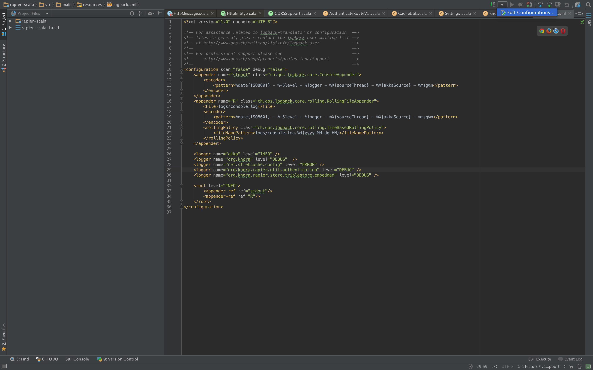
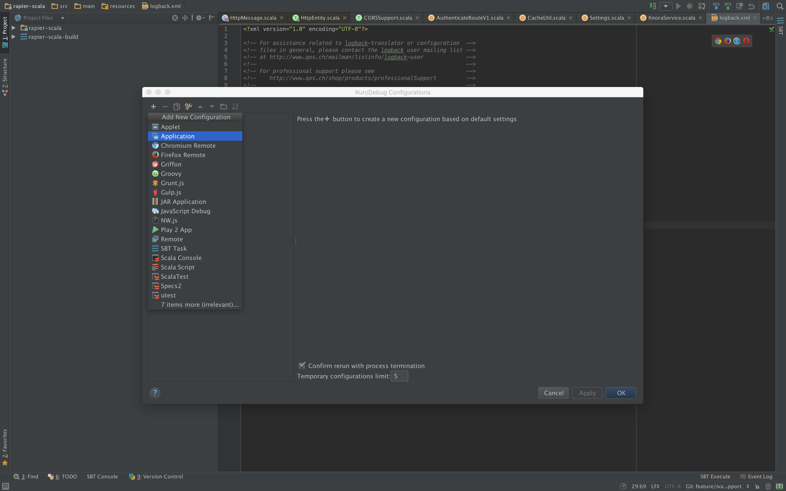
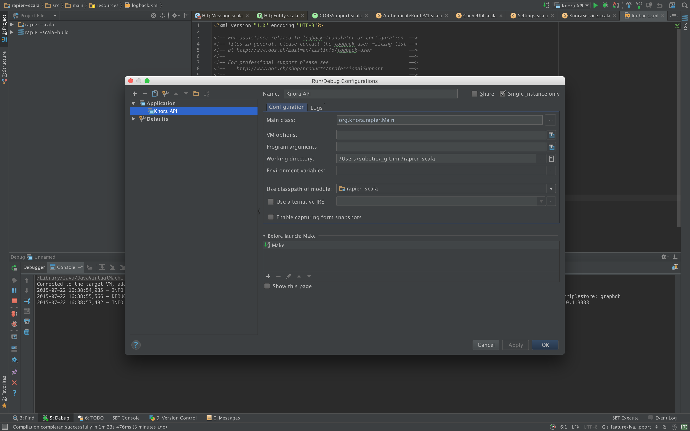
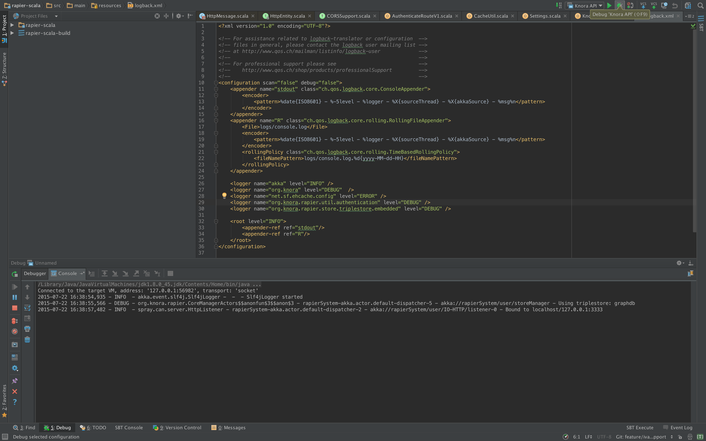
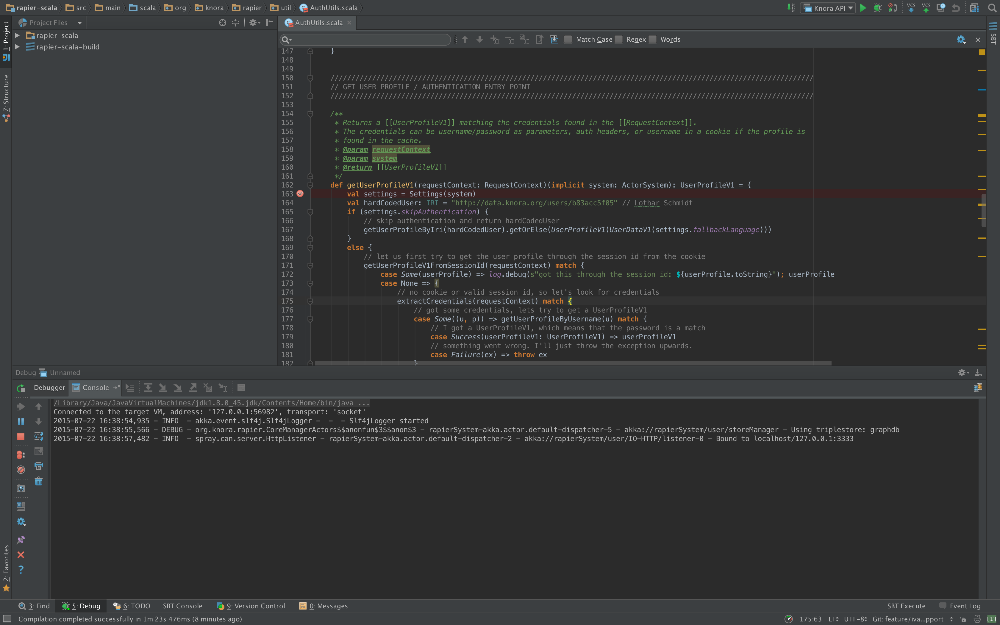

.. Copyright © 2015 Lukas Rosenthaler, Benjamin Geer, Ivan Subotic,
   Tobias Schweizer, André Kilchenmann, and André Fatton.

   This file is part of Knora.

   Knora is free software: you can redistribute it and/or modify
   it under the terms of the GNU Affero General Public License as published
   by the Free Software Foundation, either version 3 of the License, or
   (at your option) any later version.

   Knora is distributed in the hope that it will be useful,
   but WITHOUT ANY WARRANTY; without even the implied warranty of
   MERCHANTABILITY or FITNESS FOR A PARTICULAR PURPOSE.  See the
   GNU Affero General Public License for more details.

   You should have received a copy of the GNU Affero General Public
   License along with Knora.  If not, see <http://www.gnu.org/licenses/>.

.. _intellij-config:

Setup IntelliJ for development of Knora
=======================================

-  Download and install `IntelliJ <https://www.jetbrains.com/idea/>`__
-  To open the gitrep ``rapier-scala`` with IntelliJ's full scala
   support, do the following: ``Import Project`` -> Choose the option
   ``module SBT``
-  Then install the Scala plugin for IntelliJ
-  make sure that the tab size is set correctly to **4 spaces** (so you can use automatic code reformatting): Preferences -> Code Style and also Preferences -> Code Style -> Scala.

Twirl
-----

By default, Intellij excludes some folders like the twirl template files. To include them, go to ``Project Structure`` and remove ``target/scala-2.1*/twirl`` from excluded folders.
Then Intellij will correctly resolve the references to the template files.

How Use IntelliJ IDEA's Debugger with the Knora API Server
----------------------------------------------------------

-  Create an application configuration:

   Screenshot_2015-07-22_16.36.14

   Screenshot_2015-07-22_16.36.28

   Screenshot_2015-07-22_16.42.35

-  Click on the debugging symbol to start the application with a
   debugger attached

   Screenshot_2015-07-22_16.42.46

-  Click on a line-number to add a breakpoint

   Screenshot_2015-07-22_16.47.04
