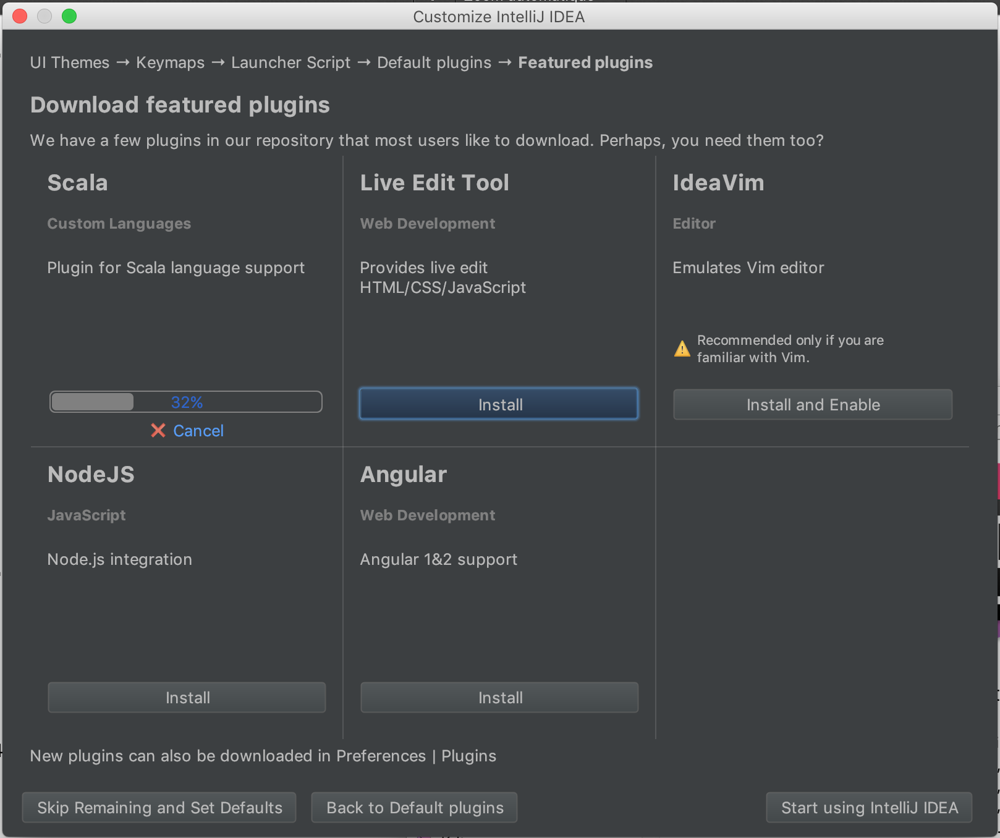
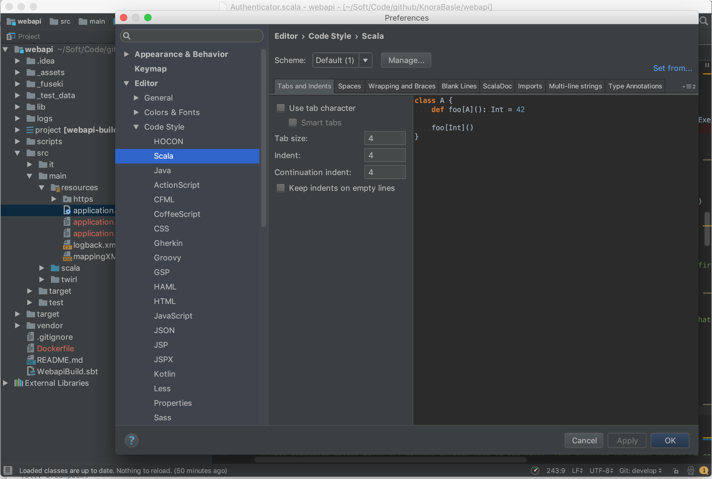
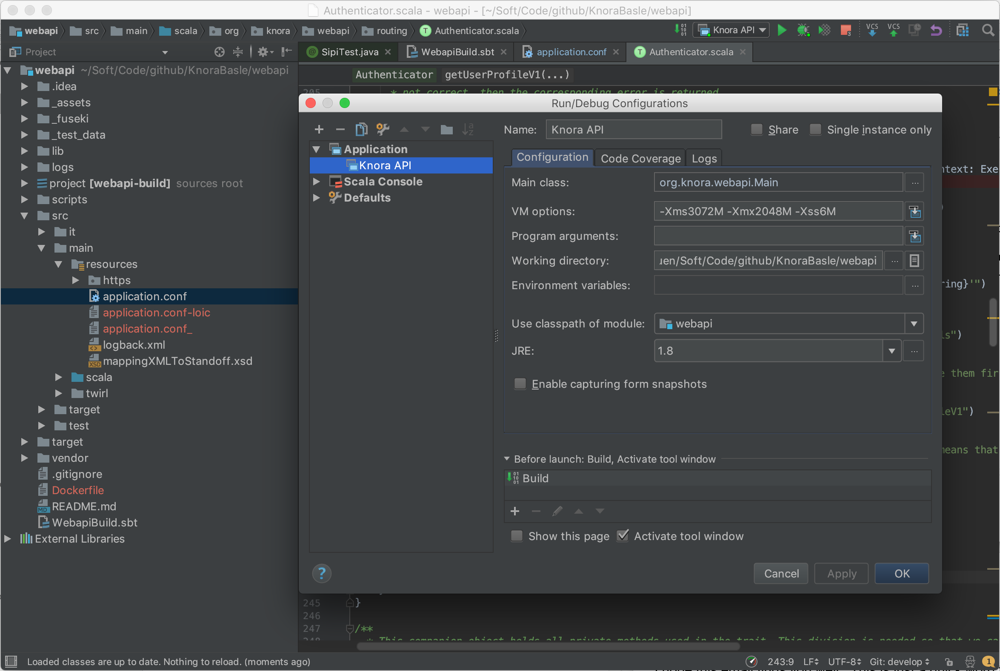
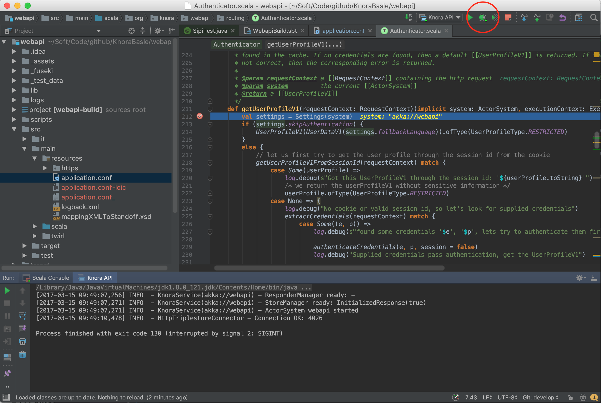

.. Copyright © 2015 Lukas Rosenthaler, Benjamin Geer, Ivan Subotic,
   Tobias Schweizer, André Kilchenmann, and Sepideh Alassi.

   This file is part of Knora.

   Knora is free software: you can redistribute it and/or modify
   it under the terms of the GNU Affero General Public License as published
   by the Free Software Foundation, either version 3 of the License, or
   (at your option) any later version.

   Knora is distributed in the hope that it will be useful,
   but WITHOUT ANY WARRANTY; without even the implied warranty of
   MERCHANTABILITY or FITNESS FOR A PARTICULAR PURPOSE.  See the
   GNU Affero General Public License for more details.

   You should have received a copy of the GNU Affero General Public
   License along with Knora.  If not, see <http://www.gnu.org/licenses/>.

.. _intellij-config:

Setup IntelliJ for development of Knora
=======================================

-  Download and install `IntelliJ <https://www.jetbrains.com/idea/>`__
-  Follow the installation procedure and install the  ``Scala plugin``

   screenshot 'Install Scala Plugin'

-  Import Knora's project: ``Import Project`` -> Choose the option ``module SBT``

.. figure:: figures/import-from-sbt.png
   :alt: screenshot 'import existing SBT project'

   screenshot 'import existing SBT project'

-  make sure that the tab size is set correctly to **4 spaces** (so you can use automatic code reformatting): ``Preferences -> Code Style -> Scala``:

   screenshot 'setting tab size'

Twirl
-----

By default, Intellij excludes some folders like the twirl template files. To include them, go to ``Project Structure`` and remove ``target/scala-2.1*/twirl`` from excluded folders.
Then Intellij will correctly resolve the references to the template files.

How to use IntelliJ IDEA's Debugger with the Knora API Server
-------------------------------------------------------------

-  Create an application configuration:

.. figure:: figures/edit-config.png
   :alt: screenshot 'edit application config'

   screenshot 'edit application config'

.. figure:: figures/create-app.png
   :alt: screenshot 'create application configuration'

   screenshot 'create application configuration'

   Fill in the configuration details, increase the default memory settings in the ``VM options`` to avoid errors like:

::

    Information:15.03.17 11:33 - Compilation completed with 1 error and 2 warnings in 1m 8s 286ms
    Error:scalac: Error while emitting org/knora/webapi/responders/v1/ResourcesResponderV1SpecContextData$
    Java heap space
    Warning:scalac: java.lang.OutOfMemoryError: Java heap space

   screenshot 'change application configuration'

-  Click on the debugging symbol to start the application with a
   debugger attached

   screenshot 'debug'

-  Click on a line-number to add a breakpoint

.. figure:: figures/breakpoint.png
   :alt: screenshot 'set a breakpoint'

   screenshot 'set a breakpoint'
