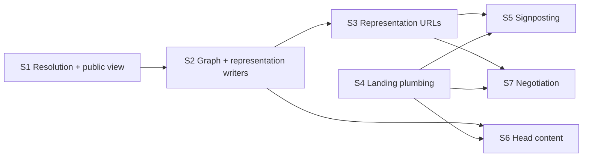

# feat: FAIR metadata and Signposting for the resource pages ARKs resolve to

This is the index of the plan. The design shared by every slice is in the design doc; each slice has its own
plan file and ships as one PR.

## Contents

| File | What |
| --- | --- |
| [02 Design](02-resource-fair-landing-metadata-design.md) | Decisions, field mapping, output shapes, access rules, alternatives |
| [03 S1 Public view](03-feat-resource-public-view-plan.md) | Resolution and the anonymous public view |
| [04 S2 Graph](04-feat-resource-fair-graph-plan.md) | The resource graph and the representation writers |
| [05 S3 Representations](05-feat-resource-metadata-representations-plan.md) | The three representation URLs |
| [06 S4 Landing plumbing](06-feat-resource-landing-plumbing-plan.md) | dsp-api behind the resource route, serving the shell unchanged |
| [07 S5 Signposting](07-feat-resource-landing-signposting-plan.md) | `Link` header and `<link>` mirror |
| [08 S6 Head content](08-feat-resource-landing-head-metadata-plan.md) | JSON-LD block and Dublin Core meta in the served head |
| [09 S7 Negotiation](09-feat-resource-landing-negotiation-plan.md) | `303` and `Vary: Accept` |

## Overview

Resource and value ARKs resolve to dsp-app's `/resource/{shortcode}/{resourceId}` route, which serves the
same Angular shell for every request: no JSON-LD, no Dublin Core, no `Link` header. This plan makes dsp-api
the source of everything a FAIR landing page needs for a resource: one resolved metadata graph per resource,
read as the anonymous user, projected into schema.org JSON-LD, DataCite JSON, Turtle, Dublin Core `<meta>`
tags, the Signposting link set and the HTML head.

S1–S3 build the graph and the representation URLs. S4 puts dsp-api behind the resource route, serving the
shell unchanged. S5–S7 each add one visible behaviour on top of S4 and are independent of each other.

## Problem Statement / Motivation

Project ARKs land on the DPE project page, which carries machine-readable metadata since DEV-7268 (F-UJI
3 → 16–21 of 24). Resource ARKs land on a client-rendered SPA. An assessor or harvester following one finds
nothing it can read (checked 2026-09-26: `https://app.dasch.swiss/resource/0803/lklK7rVuVOmpBZYWrF8o-g`
answers `200 text/html`, Angular shell, identical for `Accept: application/ld+json`). DaSCH's FAIR claim
therefore holds for projects only. ADR-0005 (dsp-repository) makes these obligations binding for every page
an ARK resolves to.

## Slices and their dependencies

| Slice | Needs | Visible change |
| --- | --- | --- |
| S1 Resolution and the anonymous public view | — | none |
| S2 Graph and representation writers | S1 | none |
| S3 Representation URLs | S2 | three new public API URLs |
| S4 Landing plumbing | — | none: the shell, now served through dsp-api |
| S5 Signposting | S3, S4 | `Link` header and `<link>` mirror |
| S6 Head content | S2, S4 | JSON-LD block and DC meta in the served head |
| S7 Negotiation | S3, S4 | `303` and `Vary: Accept` |

S4 needs nothing from S1–S3 and can run in parallel with them. S5, S6 and S7 can land in any order.
`describedby` (S5) and the `303` targets (S7) both need S3, so no link or redirect ever points at a URL that does
not exist yet.

Every slice is safe to deploy before the ops-deploy settings exist: with `app.dsp-app.url` unset the feature is
off (no metadata, representations `404`), and without the nginx route (H4) nobody reaches the landing endpoint.
Visible behaviour therefore starts when H3 and H4 are done, and each slice deployed after that is visible at once.

## Human Actions

| Id | Action | Who | When | Why not the agent |
| --- | --- | --- | --- | --- |
| H2 | Short design review of this plan with the issue author (endpoint paths, `Dataset` root, access table, license split, slicing) | Raitis Veinbahs + issue author | before start | The issue asks for a review before building |
| H3 | Set `KNORA_WEBAPI_DSP_APP_URL=https://{{ DSP_APP_HOST }}` on the `api` service per environment in ops-deploy | ops | after ship (of S1; until set, the feature stays off) | Deploy configuration lives in ops-deploy |
| H4 | Deploy the S4 ops-deploy and dsp-app changes per environment (DEV, then STAGE, then PROD) | ops + Raitis Veinbahs | after ship (of S4) | Deployments are human-run |
| H5 | After each of S5, S6 and S7 is live, run F-UJI 3.5.0 on the two baseline ARKs; after the last, run FAIR Champion by hand; record all in the docs results table | Raitis Veinbahs | after ship | Needs the deployed environment; FAIR Champion is manual |

H1 (the edge) was decided on 2026-10-06: dsp-app's nginx proxies the resource route to dsp-api, which fetches the
shell itself. See the design's Edge section.

## Acceptance Criteria

- [ ] Each representation URL serves the resource's metadata in its media type, with `Link: rel="describes"`
    back to the page, identical on `GET` and `HEAD`
- [ ] JSON-LD `identifier`, `license` and `distribution` match DPE's shapes exactly
- [ ] All representations and the head are projections of one graph and agree (tested)
- [ ] `?version=` yields the versioned ARK as `cite-as` and that version's state
- [ ] `?highlightValue=` yields the unchanged resource metadata
- [ ] The resource's `license` is the project's data license and the download's is the file value's; neither
    is emitted when not recorded
- [ ] No placeholder value and no invented fact: no `DataDownload` for an external, ambiguous or non-open file
- [ ] A resource not visible to anonymous emits nothing beyond what is public, a file that is not fully open
    is never advertised, and the output does not depend on request credentials
- [ ] The landing response carries the `Link` header and its `<link>` mirror (S5), the JSON-LD block and DC
    meta (S6), and `Vary: Accept` with a `303` to the matching representation (S7)
- [ ] A person always gets the app: the landing endpoint never answers `4xx`, and any dsp-api failure serves
    the plain shell
- [ ] A permission change or deletion is visible on the next request (`Cache-Control: no-cache` throughout)
- [ ] With `app.dsp-app.url` unset, nothing is published
- [ ] (after ship) F-UJI before/after recorded for a 0803 and a 0868 resource, per slice; FAIR Champion run
    recorded

## Dependencies & Risks

- **Nothing visible before H3 + H4:** until the setting and the nginx route are live, assessors still see the
  bare shell. S1–S3 alone move no F-UJI score.
- **Tapir and the landing route:** the global not-acceptable interceptor and typed path decoding would both
  answer `4xx` before server logic; S4 exempts the route and takes raw inputs.
- **Hot path (S4):** every resource page view goes through dsp-api. nginx resolves dsp-api per request and
  falls back to the static shell, so dsp-api being down never takes the app down. S4 ships alone so latency
  and the fallback are proven before any metadata depends on them.
- **Shell coupling (S4):** dsp-api fetches the shell from the app container. A short cache TTL picks up app
  releases; the last good copy and nginx's fallback keep a failure on either side from breaking the page.
- **0868 is not a dsp-api fixture:** tests use incunabula (0803). Its pages and books are resource-level `RV`
  for anonymous, so they get metadata but no download; sidebands are fully open. 0868 is covered only by the
  F-UJI runs.
- **Few projects have a data license yet:** the project data license is new (legal-metadata PRD v4), so most
  resources emit no `license` until their project sets one. That costs F-UJI's license point; nothing is
  invented to earn it.
- **No ORCID data exists:** `author` links will be rare until authorship records ORCIDs. That is a data gap,
  not something to work around.
- **Description source is a per-project hardcoded property map** (`ExportService`). It is reused as-is;
  generic `kb:hasDescription` is separate work (resource-description project).

## Success Metrics

- F-UJI 3.5.0 baseline (S1, 2026-10-06, image `sha256:3cde9d30bc14…`, against production):
    - 0803 resource `https://ark.dasch.swiss/ark:/72163/1/0803/lklK7rVuVOmpBZYWrF8o=gh`: **3 of 24**
    - 0868 resource with a CSV file `https://ark.dasch.swiss/ark:/72163/1/0868/0sKCU=ILTt=rl0IpTYQ0mwP`: **3 of 24**
    - Both pass only `F1-01D`, `F1-02D` and `A1-02M`; every other metric fails on the bare shell.
- After each of S5, S6 and S7: F-UJI for the same two ARKs, with the metrics that moved attributed to that
  slice. Target: toward the DPE project page's 16–21/24, with every unearned point explained in the results
  table.

## References

- Issue: DEV-7420; related DEV-7268 (DPE project page), DEV-7336 (file metadata access rights)
- dsp-repository: `docs/adr/0005-fair-landing-pages-in-the-access-area.md`,
  `docs/src/dpe/machine-readable-metadata.md`,
  `shared/fair/src/{graph.rs,record_datacite.rs,record_dublin_core.rs,signposting.rs,negotiate.rs}`,
  `justfile` (`fair-check`)
- ARK building: `StringFormatter.resourceIriToArkUrl` (`modules/webapi/src/main/scala/org/knora/webapi/messages/StringFormatter.scala`)
- Anonymous read: `ReadResourcesService.getResourcesWithDeletedResource` (`slice/resources/service/ReadResourcesServiceLive.scala`),
  `KnoraSystemInstances.Users.AnonymousUser`
- Export mapping to reuse: `ExportService.exportResourcesOai`, `fileLinkOf`, `findDescriptionProperty`
  (`slice/export/api/service/ExportService.scala`)
- Legal info: project `dataLicense` / `dataCopyrightHolder` / `defaultDataAuthorship` on `KnoraProject`; file
  legal info on `FileValueV2`; `License.uri` in `slice/admin/domain/model/LegalInfoModel.scala`; dasch-specs
  `specs/2026-05-08-legal-metadata-on-resources/04-legal-metadata-on-resources-PRD.md`
- Tapir interceptor: `PassthroughAwareNotAcceptableInterceptor` in `core/DspApiServer.scala`
- dsp-app shell and route: `dsp-app/nginx/default.conf.template`, `dsp-app/apps/dsp-app/src/app/app.routes.ts:186`,
  `libs/vre/core/config/src/lib/app-config/app-constants.ts:80`
- Edge precedent: `ops-deploy/roles/dsp-deploy/templates/docker-compose-svc.yml.j2` (api-docs, robots routers)
- Learnings (dasch-specs): `learnings/best-practices/shared-tapir-error-envelope-leaks-exception-messages.md`,
  `learnings/logic-errors/sipi-cache-auto-creation-head-request-empty-response.md`,
  `learnings/design-decisions/security-logic-authenticates-body-buffering-precedes-it.md`,
  `learnings/logic-errors/jsonld-single-value-scalar-not-array.md`
