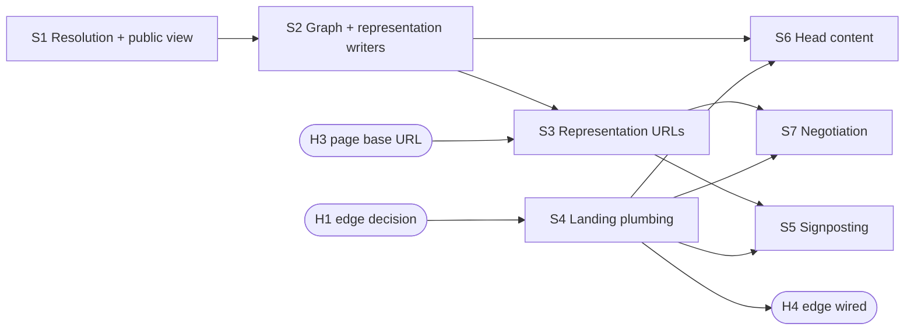

# feat: FAIR metadata and Signposting for the resource pages ARKs resolve to

This is the index of the plan. The design shared by every slice is in the design doc; each slice has its own
plan file and ships as one PR.

## Contents

| File | What |
| --- | --- |
| [02 Design](02-resource-fair-landing-metadata-design.md) | Decisions, field mapping, output shapes, access rules, alternatives |
| [03 S1 Public view](03-feat-resource-public-view-plan.md) | Resolution and the anonymous public view |
| [04 S2 Graph](04-feat-resource-fair-graph-plan.md) | The resource graph and the representation writers |
| [05 S3 Representations](05-feat-resource-metadata-representations-plan.md) | The three representation URLs |
| [06 S4 Landing plumbing](06-feat-resource-landing-plumbing-plan.md) | dsp-api behind the resource route, serving the shell unchanged |
| [07 S5 Signposting](07-feat-resource-landing-signposting-plan.md) | `Link` header and `<link>` mirror |
| [08 S6 Head content](08-feat-resource-landing-head-metadata-plan.md) | JSON-LD block and Dublin Core meta in the served head |
| [09 S7 Negotiation](09-feat-resource-landing-negotiation-plan.md) | `303` and `Vary: Accept` |

## Overview

Resource and value ARKs resolve to dsp-app's `/resource/{shortcode}/{resourceId}` route, which serves the
same Angular shell for every request: no JSON-LD, no Dublin Core, no `Link` header. This plan makes dsp-api
the source of everything a FAIR landing page needs for a resource: one resolved metadata graph per resource,
read as the anonymous user, projected into schema.org JSON-LD, DataCite JSON, Turtle, Dublin Core `<meta>`
tags, the Signposting link set and the HTML head.

S1–S3 build the graph and the representation URLs. S4 puts dsp-api behind the resource route, serving the
shell unchanged. S5–S7 each add one visible behaviour on top of S4 and are independent of each other.

## Problem Statement / Motivation

Project ARKs land on the DPE project page, which carries machine-readable metadata since DEV-7268 (F-UJI
3 → 16–21 of 24). Resource ARKs land on a client-rendered SPA. An assessor or harvester following one finds
nothing it can read (checked 2026-09-26: `https://app.dasch.swiss/resource/0803/lklK7rVuVOmpBZYWrF8o-g`
answers `200 text/html`, Angular shell, identical for `Accept: application/ld+json`). DaSCH's FAIR claim
therefore holds for projects only. ADR-0005 (dsp-repository) makes these obligations binding for every page
an ARK resolves to.

## Slices and their dependencies

| Slice | Needs | Visible change |
| --- | --- | --- |
| S1 Resolution and the anonymous public view | — | none |
| S2 Graph and representation writers | S1 | none |
| S3 Representation URLs | S2, H3 | three new public API URLs |
| S4 Landing plumbing | H1 | none: the shell, now served through dsp-api |
| S5 Signposting | S3, S4 | `Link` header and `<link>` mirror |
| S6 Head content | S2, S4 | JSON-LD block and DC meta in the served head |
| S7 Negotiation | S3, S4 | `303` and `Vary: Accept` |

S4 needs nothing from S1–S3 and can run in parallel with them once H1 is decided. S5, S6 and S7 can land in
any order. `describedby` (S5) and the `303` targets (S7) both need S3, so no link or redirect ever points at
a URL that does not exist yet.

## Human Actions

| Id | Action | Who | When | Why not the agent |
| --- | --- | --- | --- | --- |
| H2 | Short design review of this plan with the issue author (endpoint paths, `Dataset` root, access table, slicing) | Raitis Veinbahs + issue author | before S1 | The issue asks for a review before building |
| H1 | Decide the edge (dsp-app nginx `location /resource/` proxy or Traefik router on the app host), the landing endpoint path, and how dsp-api obtains the shell | Raitis Veinbahs + issue author | before S4 (deferred by the owner on 2026-10-06; S1–S3 do not depend on it) | Architecture decision |
| H3 | Set `KNORA_WEBAPI_FAIR_DSP_APP_BASE_URL` per environment in ops-deploy | ops | before S3 deploys | Deploy configuration lives in ops-deploy |
| H4 | Wire the chosen edge per environment in ops-deploy | ops + Raitis Veinbahs | after S4 ships | Deploy configuration lives in ops-deploy |
| H5 | After each of S5, S6 and S7 deploys, run F-UJI 3.5.0 on the two baseline ARKs; after the last, run FAIR Champion by hand; record all in the docs results table | Raitis Veinbahs | after each deploy | Needs the deployed environment; FAIR Champion is manual |

## Acceptance Criteria

- [ ] Each representation URL serves the resource's metadata in its media type, with `Link: rel="describes"`
    back to the page, identical on `GET` and `HEAD`
- [ ] JSON-LD `identifier`, `license` and `distribution` match DPE's shapes exactly
- [ ] All representations and the head are projections of one graph and agree (tested)
- [ ] `?version=` yields the versioned ARK as `cite-as` and that version's state
- [ ] `?highlightValue=` yields the unchanged resource metadata
- [ ] No placeholder value and no invented fact: no `license` without a file-value license, no
    `DataDownload` for an external or ambiguous file
- [ ] A resource not visible to anonymous emits nothing beyond what is public, a file that is not fully open
    is never advertised, and the output does not depend on request credentials
- [ ] The landing response carries the `Link` header and its `<link>` mirror (S5), the JSON-LD block and DC
    meta (S6), and `Vary: Accept` with a `303` to the matching representation (S7)
- [ ] A failure in dsp-api never breaks a resource page for a person: the plain shell is served
- [ ] (after ship) F-UJI before/after recorded for a 0803 and a 0868 resource, per slice; FAIR Champion run
    recorded

## Dependencies & Risks

- **Edge undecided (H1):** until S4 and H4 land, assessors still see the bare shell. S1–S3 alone move no
  F-UJI score.
- **Hot path (S4):** every resource page view goes through dsp-api. S4 ships alone so latency and the
  fallback are proven before any metadata depends on them.
- **Shell coupling (S4):** dsp-api serving the app shell couples it to dsp-app releases. H1 must cover how
  the shell is obtained and cached.
- **0868 is not a dsp-api fixture:** tests use incunabula (0803), which has `V` and `RV` file values. 0868 is
  covered only by the F-UJI runs.
- **No ORCID data exists:** `author` links will be rare until authorship records ORCIDs. That is a data gap,
  not something to work around.
- **Description source is a per-project hardcoded property map** (`ExportService`). It is reused as-is;
  generic `kb:hasDescription` is separate work (resource-description project).

## Success Metrics

- F-UJI 3.5.0 baseline (S1): 0803 resource *to record*; 0868 resource *to record* (expected ≈ 3/24, the bare
  shell).
- After each of S5, S6 and S7: F-UJI for the same two ARKs, with the metrics that moved attributed to that
  slice. Target: toward the DPE project page's 16–21/24, with every unearned point explained in the results
  table.

## References

- Issue: DEV-7420; related DEV-7268 (DPE project page), DEV-7336 (file metadata access rights)
- dsp-repository: `docs/adr/0005-fair-landing-pages-in-the-access-area.md`,
  `docs/src/dpe/machine-readable-metadata.md`,
  `shared/fair/src/{graph.rs,record_datacite.rs,record_dublin_core.rs,signposting.rs,negotiate.rs}`,
  `justfile` (`fair-check`)
- ARK building: `modules/webapi/src/main/scala/org/knora/webapi/messages/StringFormatter.scala:1419`
- Anonymous read: `modules/webapi/src/main/scala/org/knora/webapi/slice/resources/service/ReadResourcesServiceLive.scala:39`
- Export mapping to reuse:
  `modules/webapi/src/main/scala/org/knora/webapi/slice/export/api/service/ExportService.scala:102`
- File legal info: `FileValueV2` in `messages/v2/responder/valuemessages/ValueMessagesV2.scala`
- dsp-app shell and route: `dsp-app/nginx/default.conf.template`, `dsp-app/apps/dsp-app/src/app/app.routes.ts:186`,
  `libs/vre/core/config/src/lib/app-config/app-constants.ts:80`
- Edge precedent: `ops-deploy/roles/dsp-deploy/templates/docker-compose-svc.yml.j2` (api-docs, robots routers)
- Learnings (dasch-specs): `learnings/best-practices/shared-tapir-error-envelope-leaks-exception-messages.md`,
  `learnings/logic-errors/sipi-cache-auto-creation-head-request-empty-response.md`,
  `learnings/design-decisions/security-logic-authenticates-body-buffering-precedes-it.md`
