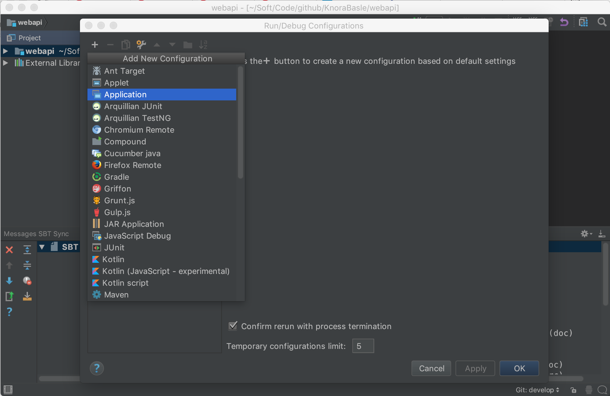

<!---
Copyright © 2015-2018 the contributors (see Contributors.md).

This file is part of Knora.

Knora is free software: you can redistribute it and/or modify
it under the terms of the GNU Affero General Public License as published
by the Free Software Foundation, either version 3 of the License, or
(at your option) any later version.

Knora is distributed in the hope that it will be useful,
but WITHOUT ANY WARRANTY; without even the implied warranty of
MERCHANTABILITY or FITNESS FOR A PARTICULAR PURPOSE.  See the
GNU Affero General Public License for more details.

You should have received a copy of the GNU Affero General Public
License along with Knora.  If not, see <http://www.gnu.org/licenses/>.
-->

# Setup IntelliJ for development of Knora

@@toc

## Create an IntelliJ Project for the Knora API Server

  - Download and install [IntelliJ
    IDEA](https://www.jetbrains.com/idea/).
  - Follow the installation procedure and install the `Scala plugin`

  - Import the `webapi` directory in the Knora source tree: `Import
    Project` -\> Choose the option `module SBT`

  - make sure that the tab size is set correctly to **4 spaces** (so you
    can use automatic code reformatting): `Preferences -> Code Style ->
    Scala`:

## Twirl

By default, Intellij excludes some folders like the twirl template
files. To include them, go to `Project Structure` and remove
`target/scala-2.1*/twirl` from excluded folders. Then Intellij will
correctly resolve the references to the template files.

## Use IntelliJ IDEA's Debugger with the Knora API Server

  - Create an application configuration:

Fill in the configuration details:

  - Click on the debugging symbol to start the application with a
    debugger attached

  - Click on a line-number to add a breakpoint

## Profile Knora Using VisualVM in IntelliJ

First, download and install [VisualVM](https://visualvm.github.io/).

Then, in IntelliJ, under Preferences -\> Plugins, search for the
[VisualVM
Launcher](https://plugins.jetbrains.com/plugin/7115-visualvm-launcher),
click on "Search in repositories", install the plugin, and restart
IntelliJ. IntelliJ's toolbar should now contain a button with a green
triangle on an orange circle, with the tooltip "Run with VisualVM":

You can use this button to run the class `org.knora.webapi.Main` and
profile it in VisualVM. The first time you do this, IntelliJ will ask
you for the path to the VisualVM executable. On macOS this is
`/Applications/VisualVM.app/Contents/MacOS/visualvm`.

When VisualVM starts, it will open a window like this:

To use the profiler, click on the "Sampler" tab, then on the "CPU"
button:

Now run some Knora API operations that you're interested in profiling,
preferably several times to allow the sampler to collect enough data.
Then click on the "Snapshot" button:

In the snapshot, you'll see a list of threads that were profiled:

You can then browse the call tree for each thread, looking for Knora
method calls, to see the total time spent in each method:

