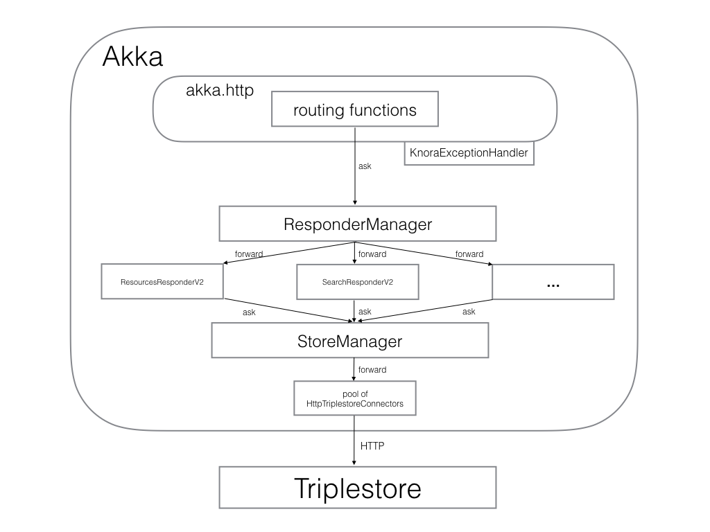

<!---
Copyright © 2015-2019 the contributors (see Contributors.md).

This file is part of Knora.

Knora is free software: you can redistribute it and/or modify
it under the terms of the GNU Affero General Public License as published
by the Free Software Foundation, either version 3 of the License, or
(at your option) any later version.

Knora is distributed in the hope that it will be useful,
but WITHOUT ANY WARRANTY; without even the implied warranty of
MERCHANTABILITY or FITNESS FOR A PARTICULAR PURPOSE.  See the
GNU Affero General Public License for more details.

You should have received a copy of the GNU Affero General Public
License along with Knora.  If not, see <http://www.gnu.org/licenses/>.
-->

# Knora API Server Design Overview

@@toc

## Introduction

Knora's responsibilities include:

- Receiving, validating, authenticating, and authorising HTTP requests from
  clients (which may be web browsers or other software) to query or update
  data in a Knora repository.
- Querying and updating the repository on behalf of clients.
- Filtering query results according to the user's permissions.
- Transforming query results into Knora API responses.
- Ensuring that ontologies and data in the triplestore are consistent and
  conform to the requirements of the
  @ref:[knora-base](../../../02-knora-ontologies/knora-base.md) ontology.
- Managing the versioning of data in the triplestore.
- Working with [Sipi](http://sipi.io) to store files that cannot be stored
  as RDF data.

Knora is written in [Scala](http://www.scala-lang.org/), using the
[Akka](http://akka.io/) framework for message-based concurrency. It is
designed to work with any standards-compliant triplestore via
the [SPARQL 1.1 Protocol](http://www.w3.org/TR/sparql11-protocol/), but is currently
tested only with [Ontotext GraphDB](http://graphdb.ontotext.com/) (with support
for other triplestores coming soon).

## Knora APIs

Knora supports different versions of its API for working with humanities data:

- @ref:[Knora API v2](../../../03-apis/api-v2/index.md), a standards-based
  API currently under development.
- @ref:[Knora API v1](../../../03-apis/api-v1/index.md), a stable, legacy API
  that focuses on maintaining compatibility with applications that used
  Knora's prototype software.

There is also a @ref:[Knora admin API](../../../03-apis/api-admin/index.md) for
administering Knora repositories.

The Knora code base includes some functionality that is shared by these different
APIs, as well as separate packages for each API. Internally, Knora APIs v1 and v2 both
use functionality in the admin API. Knora API v1 uses some functionality from
API v2, but API v2 does not depend on API v1.

## Design Diagram

## Modules

### HTTP Module

- `org.knora.webapi.routing`: Knora's [Akka HTTP](https://akka.io/akka-http/) routes.
  Each routing class matches URL patterns for requests involving some particular
  type of data in the repository. Routes are API-specific. For example,
  `ResourcesRouteV2` matches URL paths starting with `/v2/resources`, which
  represent requests involving Knora resources.
- `org.knora.webapi.http`: a few HTTP-related constants and utilities.

### Responders Module

- `org.knora.webapi.responders`: Each responder is an actor that is responsible for managing
  some particular type of data in the repository. A responder receives messages from
  a route, does some work (e.g. querying the triplestore), and returns a reply
  message. Responders are API-specific and can communicate with other responders
  via messages. For example, in API v2, `ResourcesResponderV2` handles requests
  involving resources, and delegates some of its tasks to `ValuesResponderV2`,
  which is responsible for requests involving values.

### Store Module

- `org.knora.webapi.store`: Contains actors that connect to triplestores. The
  most important one is `HttpTriplestoreConnector`, which communicates with
  triplestores via the
  [SPARQL 1.1 Protocol](http://www.w3.org/TR/sparql11-protocol/).

### Shared Between Modules

- `org.knora.webapi`: Contains core classes such as `Main`, which starts the
  Knora server, and `SettingsImpl`, which represents the application settings
  that are loaded using the [Typesafe Config](https://github.com/lightbend/config)
  library.
- `org.knora.webapi.util`: Utilities needed by different parts of the application,
  such as parsing and formatting tools.
- `org.knora.webapi.messages`: The Akka messages used by each responder.
- `org.knora.webapi.twirl`: Text-generation templates for use with
  [the Twirl template engine](https://github.com/playframework/twirl). Knora
  uses Twirl to generate SPARQL requests and other types of text documents.

## Actor Supervision and Creation

At system start, the supervisor actors are created in
`KnoraService.scala`:

@@snip [KnoraService.scala]($src$/org/knora/webapi/KnoraService.scala) { #supervisors }

In most cases, there is only one instance of each supervised actor; such
actors do their work asynchronously in futures, so there would be no
advantage in using an actor pool. A few actors do have pools of instances,
because they do their work synchronously; this allows concurrency to be controlled
by setting the size of each pool. These pools are configured in `application.conf`
under `akka.actor.deployment`.

`KnoraService` also starts the HTTP service after which the startup sequence is initiated:

@@snip [KnoraService.scala]($src$/org/knora/webapi/KnoraService.scala) { #startService }

## Coordinated Application Startup

To coordinate necessary startup tasks, the application goes through a few states at startup:

  - Stopped: Application starting. Http layer is still not started.
  - StartingUp: Http layer is started. Only '/health' and monitoring routes are working.
  - WaitingForRepository: Repository check is initiated but not yet finished.
  - RepositoryReady: Repository check has finished and repository is available.
  - CreatingCaches: Creating caches is initiated but not yet finished.
  - CachesReady: Caches are created and ready for use.
  - LoadingOntologies: Loading of ontologies is initiated but not yet finished.
  - OntologiesReady: Ontologies are loaded.
  - MaintenanceMode: During backup or other maintenance tasks, so that access to the API is closed
  - Running: Running state. All APIs are open.

The startup sequence coordination is done by the `org.knora.webapi.app.ApplicationStateActor`. During
the `WaitingForRepository` state, if the repository is not configured or available, the system will
indefinitely retry to access it. This allows for prolonged startup times of the repository.

## Concurrency

In general, Knora is written in a functional style, avoiding shared mutable
state. This makes it easier to reason about concurrency, and
eliminates an important potential source of bugs (see [Out of the Tar Pit](http://curtclifton.net/papers/MoseleyMarks06a.pdf)).

The routes and actors in Knora use Akka's `ask` pattern,
rather than the `tell` pattern, to send messages and receive responses,
because this simplifies the code considerably (using `tell` would
require actors to maintain complex mutable state), with no apparent
reduction in performance.

To manage asynchronous communication between actors, the Knora API
server uses Scala's `Future` monad extensively. See
@ref:[Futures with Akka](futures-with-akka.md) for details.

We use Akka's asynchronous logging interface (see [Akka Logging](http://doc.akka.io/docs/akka/current/scala/logging.html)).

## What the Responders Do

In Knora, a responder is an actor that receives a
request message (a Scala case class) in the `ask` pattern, does some work
(e.g. getting data from the triplestore), and returns a reply message (another
case class). These reply messages are are defined in `org.knora.webapi.messages`.
A responder can produce a reply representing a complete API
response, or part of a response that will be used by another responder.
If it's a complete API response, there is an API-specific mechanism for
converting it into the response format that the client expects.

## Store Module (org.knora.webapi.store package)

The store module is used for accessing the triplestore and other
external storage providers.

All access to the Store module goes through the `StoreManager`
supervisor actor. The `StoreManager` creates pools of actors, such as
`HttpTriplestoreActor`, that interface with the storage providers.

The contents of the `store` package are not used directly by other
packages, which interact with the `store` package only by sending
messages to `StoreManager`.

Parsing of SPARQL query results is handled by this module.

See @ref:[Store Module](store-module.md) for a more detailed discussion.

## Triplestore Access

SPARQL queries are generated from templates, using the
[Twirl](https://github.com/playframework/twirl) template engine. For
example, if we're querying a resource, the template will contain a
placeholder for the resource's IRI. The templates can be found under
`src/main/twirl/queries/sparql`. In many cases, different SPARQL must
be generated for different triplestores; the Twirl template function
then takes the name of the triplestore as a parameter, and may delegate
to triplestore-specific templates.

Responders are not expected to know which triplestore is being used or how it
is accessed. To perform a SPARQL SELECT query, a responder sends a `SparqlSelectRequest`
message to the `storeManager` actor, like this:

@@snip [OntologyResponderV2.scala]($src$/org/knora/webapi/responders/v2/OntologyResponderV2.scala) { #sparql-select }

The reply message, `SparqlSelectResponse`, is a data structure containing the rows
that were returned as the query result.

To perform a SPARQL CONSTRUCT query, you can use `SparqlExtendedConstructRequest`,
and the response will be a `SparqlExtendedConstructResponse`.

## Error Handling

The error-handling design has these aims:

1.  Simplify the error-handling code in actors as much as possible.
2.  Produce error messages that clearly indicate the context in which
    the error occurred (i.e. what the application was trying to do).
3.  Ensure that clients receive an appropriate error message when an
    error occurs.
4.  Ensure that `ask` requests are properly terminated with an
    `akka.actor.Status.Failure` message in the event of an error,
    without which they will simply time out (see
    [Ask: Send and Receive Future](https://doc.akka.io/docs/akka/current/actors.html?language=scala#ask-send-and-receive-future)).
5.  When a actor encounters an error that isn't the client's fault (e.g.
    a triplestore failure), log it, but don't do this with errors caused
    by bad input.
6.  When logging errors, include the full JVM stack trace.

The design does not yet include, but could easily accommodate,
translations of error messages into different languages.

A hierarchy of exception classes is defined in `Exceptions.scala`,
representing different sorts of errors that could occur. The hierarchy
has two main branches:

  - `RequestRejectedException`, an abstract class for errors that are
    the client's fault. These errors are not logged.
  - `InternalServerException`, an abstract class for errors that are not
    the client's fault. These errors are logged.

Exception classes in this hierarchy can be defined to include a wrapped
`cause` exception. When an exception is logged, its stack trace will be
logged along with the stack trace of its `cause`. It is therefore
recommended that low-level code should catch low-level exceptions, and
wrap them in one of our higher-level exceptions, in order to clarify the
context in which the error occurred.

To simplify error-handling in responders, a utility method called
`future2Message` is provided in `ActorUtils`. It is intended to be used
in an actor's `receive` method to respond to messages in the `ask`
pattern. If the responder's computation is successful, it is sent to the
requesting actor as a response to the `ask`. If the computation fails,
the exception representing the failure is wrapped in a `Status.Failure`,
which is sent as a response to the `ask`. If the error is a subclass of
`RequestRejectedException`, only the sender is notified of the error;
otherwise, the error is also logged and rethrown (so that the
`KnoraExceptionHandler` can handle the exception).

In many cases, we transform data from the triplestore into a `Map`
object. To simplify checking for required values in these collections,
the class `ErrorHandlingMap` is provided. You can wrap any `Map` in an
`ErrorHandlingMap`. You must provide a function that will generate an
error message when a required value is missing, and optionally a
function that throws a particular exception. Rows of SPARQL query
results are already returned in `ErrorHandlingMap` objects.

If you want to add a new exception class, see the comments in
`Exceptions.scala` for instructions.

### Transformation of Exception to Client Responses

The `org.knora.webapi.KnoraExceptionHandler` is brought implicitly into
scope of `akka-http`, and by doing so registered and used to handle the
transformation of all `KnoraExceptions` into `HttpResponses`. This
handler handles only exceptions thrown inside the route and not the
actors. However, the design of reply message passing from actors (by
using `future2Message`), makes sure that any exceptions thrown inside
actors, will reach the route, where they will be handled.

See also @ref:[Fuures with Akka](futures-with-akka.md).

## API Routing

The API routes in the `routing` package are defined using the DSL
provided by the
[akka-http](http://doc.akka.io/docs/akka/current/scala/http/routing-dsl/index.html)
library. A routing function has to do the following:

1.  Authenticate the client.
2.  Figure out what the client is asking for.
3.  Construct an appropriate request message and send it to
    `ResponderManagerV1`, using the `ask` pattern.
4.  Return a result to the client.

To simplify the coding of routing functions, they are contained in
objects that extend `org.knora.webapi.routing.Authenticator`. Each
routing function performs the following operations:

1.  `Authenticator.getUserADM` is called to authenticate the user.
2.  The request parameters are interpreted and validated, and a request
    message is constructed to send to the responder. If the request is
    invalid, `BadRequestException` is thrown. If the request message is
    requesting an update operation, it must include a UUID generated by
    `UUID.randomUUID`, so the responder can obtain a write lock on the
    resource being updated.

The routing function then passes the message to a function in an API-specific
routing utility: `RouteUtilV1`, `RouteUtilV2`, or `RouteUtilADM`.
This utility function sends the message to `ResponderManager` (which
forwards it to the relevant responder), returns a response to the client
in the appropriate format, and handles any errors.
